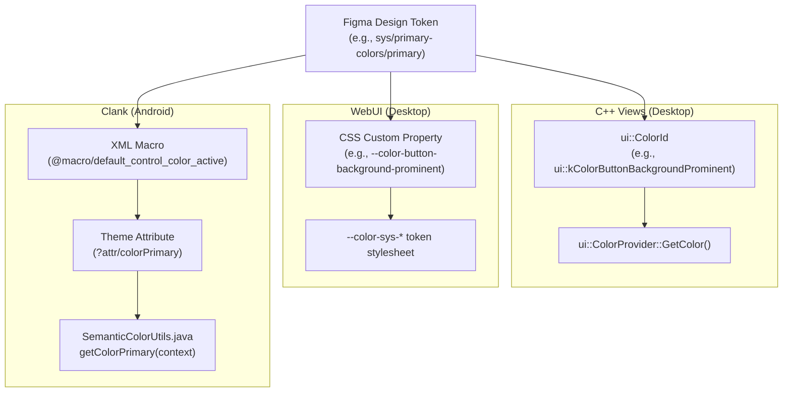

# Chrome Design System Token Mappings (Figma to C++, CSS & Clank Android)

This document maps all 143 Figma design tokens cataloged in
[figma-variables.md](./figma-variables.md) to their equivalent C++ identifiers
(Views), CSS variables (WebUI), and Android attributes/macros/resolvers (Clank)
in Chromium.

## Tokens

### 1. System & Surface Colors

Defined in `ui/color/color_id.h`, exposed in WebUI as CSS variables, and
resolved in Clank via `semantic_colors_dynamic.xml` / `SemanticColorUtils.java`:

| Figma Variable Name                                  | Value / Definition | C++ Equivalent Identifier                                 | CSS Equivalent Identifier             | Clank (Android) Equivalent                                                                                                         |
| :--------------------------------------------------- | :----------------- | :-------------------------------------------------------- | :------------------------------------ | :--------------------------------------------------------------------------------------------------------------------------------- |
| `desktop/sys/base-colors/base`                       | `#ffffff`          | `ui::kColorSysBase`                                       | `--color-sys-base`                    | `?attr/colorSurface` / `SemanticColorUtils.getDefaultBgColor(context)`                                                             |
| `desktop/sys/base-colors/base-container`             | `#edf2fa`          | `ui::kColorSysBaseContainer`                              | `--color-sys-base-container`          | `?attr/colorSurfaceContainer` / `SemanticColorUtils.getColorSurfaceContainer(context)`                                             |
| `desktop/sys/base-colors/base-container-elevated`    | `#ffffff`          | `ui::kColorSysBaseContainerElevated`                      | `--color-sys-base-container-elevated` | `?attr/colorSurfaceContainerHigh` / `SemanticColorUtils.getColorSurfaceContainerHigh(context)`                                     |
| `desktop/sys/surface-colors/inverse-on-surface`      | `#f2f2f2`          | `ui::kColorSysInverseOnSurface`                           | `--color-sys-inverse-on-surface`      | `?attr/colorOnSurfaceInverse` / `SemanticColorUtils.getColorOnSurfaceInverse(context)`                                             |
| `desktop/sys/surface-colors/inverse-primary`         | `#a8c7fa`          | `ui::kColorSysInversePrimary`                             | `--color-sys-inverse-primary`         | `?attr/colorOnPrimary` / `SemanticColorUtils.getColorOnPrimary(context)`                                                           |
| `desktop/sys/surface-colors/inverse-surface`         | `#303030`          | `ui::kColorSysInverseSurface`                             | `--color-sys-inverse-surface`         | `?attr/colorSurfaceInverse` / `SemanticColorUtils.getColorSurfaceInverse(context)`                                                 |
| `desktop/sys/surface-colors/inverse-surface-primary` | `#062e6f`          | `ui::kColorSysInverseSurfacePrimary`                      | `--color-sys-inverse-surface-primary` | `?attr/colorPrimary` / `SemanticColorUtils.getColorPrimary(context)`                                                               |
| `desktop/sys/surface-colors/on-surface`              | `#1f1f1f`          | `ui::kColorSysOnSurface`                                  | `--color-sys-on-surface`              | `@macro/default_text_color` / `?attr/colorOnSurface` / `SemanticColorUtils.getDefaultTextColor(context)`                           |
| `desktop/sys/surface-colors/on-surface-subtle`       | `#474747`          | `ui::kColorSysOnSurfaceSubtle`                            | `--color-sys-on-surface-subtle`       | `@macro/default_text_color_secondary` / `?attr/colorOnSurfaceVariant` / `SemanticColorUtils.getDefaultTextColorSecondary(context)` |
| `desktop/sys/surface-colors/surface`                 | `#ffffff`          | `ui::kColorSysSurface`                                    | `--color-sys-surface`                 | `@macro/default_bg_color` / `?attr/colorSurface` / `SemanticColorUtils.getColorSurface(context)`                                   |
| `desktop/sys/surface-colors/surface-1`               | `#f8fafd`          | `ui::kColorSysSurface1`                                   | `--color-sys-surface-1`               | `?attr/colorSurfaceContainerLow` / `SemanticColorUtils.getColorSurfaceContainerLow(context)`                                       |
| `desktop/sys/surface-colors/surface-5`               | `#eaf0f9`          | `ui::kColorSysSurface5`                                   | `--color-sys-surface-5`               | `?attr/colorSurfaceContainerHighest` / `SemanticColorUtils.getColorSurfaceContainerHighest(context)`                               |
| `desktop/sys/surface-colors/surface-variant`         | `#e1e3e1`          | `ui::kColorSysSurfaceVariant`                             | `--color-sys-surface-variant`         | `?attr/colorSurfaceVariant` / `SemanticColorUtils.getColorSurfaceVariant(context)`                                                 |
| `gem/sys/surface-colors/on-surface`                  | `#1f1f1f`          | `ui::kColorSysOnSurface` (or `kColorGlicModalForeground`) | `--color-sys-on-surface`              | `@macro/default_text_color` / `?attr/colorOnSurface`                                                                               |

______________________________________________________________________

### 2. Primary, Tertiary & Container Colors

Defined in `ui/color/color_id.h`, exposed in WebUI as CSS variables, and
resolved in Clank via `semantic_colors_dynamic.xml` / `SemanticColorUtils.java`:

| Figma Variable Name                                 | Value / Definition | C++ Equivalent Identifier          | CSS Equivalent Identifier           | Clank (Android) Equivalent                                                                                        |
| :-------------------------------------------------- | :----------------- | :--------------------------------- | :---------------------------------- | :---------------------------------------------------------------------------------------------------------------- |
| `desktop/sys/container-colors/neutral-container`    | `#f2f2f2`          | `ui::kColorSysNeutralContainer`    | `--color-sys-neutral-container`     | `?attr/colorSurfaceContainer` / `SemanticColorUtils.getColorSurfaceContainer(context)`                            |
| `desktop/sys/container-colors/on-tonal-container`   | `#041e49`          | `ui::kColorSysOnTonalContainer`    | `--color-sys-on-tonal-container`    | `?attr/colorOnSecondaryContainer` / `SemanticColorUtils.getColorOnSecondaryContainer(context)`                    |
| `desktop/sys/container-colors/tonal-container`      | `#d3e3fd`          | `ui::kColorSysTonalContainer`      | `--color-sys-tonal-container`       | `?attr/colorSecondaryContainer` / `SemanticColorUtils.getColorSecondaryContainer(context)`                        |
| `desktop/sys/primary-colors/on-primary`             | `#ffffff`          | `ui::kColorSysOnPrimary`           | `--color-sys-on-primary`            | `@macro/default_text_color_on_accent1` / `?attr/colorOnPrimary` / `SemanticColorUtils.getColorOnPrimary(context)` |
| `desktop/sys/primary-colors/primary`                | `#0b57d0`          | `ui::kColorSysPrimary`             | `--color-sys-primary`               | `@macro/default_control_color_active` / `?attr/colorPrimary` / `SemanticColorUtils.getColorPrimary(context)`      |
| `desktop/sys/tertiary-colors/on-tertiary`           | `#ffffff`          | `ui::kColorSysOnTertiary`          | `--color-sys-on-tertiary`           | `?attr/colorOnTertiary` / `SemanticColorUtils.getColorOnTertiary(context)`                                        |
| `desktop/sys/tertiary-colors/on-tertiary-container` | `#072711`          | `ui::kColorSysOnTertiaryContainer` | `--color-sys-on-tertiary-container` | `?attr/colorOnTertiaryContainer` / `SemanticColorUtils.getColorOnTertiaryContainer(context)`                      |
| `desktop/sys/tertiary-colors/tertiary`              | `#146c2e`          | `ui::kColorSysTertiary`            | `--color-sys-tertiary`              | `?attr/colorTertiary` / `SemanticColorUtils.getColorTertiary(context)`                                            |
| `desktop/sys/tertiary-colors/tertiary-container`    | `#c4eed0`          | `ui::kColorSysTertiaryContainer`   | `--color-sys-tertiary-container`    | `?attr/colorTertiaryContainer` / `SemanticColorUtils.getColorTertiaryContainer(context)`                          |

______________________________________________________________________

### 3. State, Ripple & Interaction Colors

Defined in `ui/color/color_id.h`, exposed in WebUI as CSS variables, and
resolved in Clank via `dimens.xml`, drawables, and color state lists:

| Figma Variable Name                                          | Value / Definition | C++ Equivalent Identifier                    | CSS Equivalent Identifier                                   | Clank (Android) Equivalent                                                           |
| :----------------------------------------------------------- | :----------------- | :------------------------------------------- | :---------------------------------------------------------- | :----------------------------------------------------------------------------------- |
| `desktop/sys/state-colors/state-disabled`                    | `#1f1f1f61`        | `ui::kColorSysStateDisabled`                 | `--color-sys-state-disabled`                                | `@dimen/default_disabled_alpha` (`0.38`) / `@color/default_text_color_disabled_list` |
| `desktop/sys/state-colors/state-disabled-container`          | `#1f1f1f1f`        | `ui::kColorSysStateDisabledContainer`        | `--color-sys-state-disabled-container`                      | `@dimen/filled_button_bg_disabled_alpha` (`0.12`)                                    |
| `desktop/sys/state-colors/state-focus-ring`                  | `#0b57d0`          | `ui::kColorSysStateFocusRing`                | `--color-sys-state-focus-ring` / `--cr-focus-outline-color` | `?attr/colorPrimary` / `@macro/chip_outline_focused_color` (`?attr/colorOnSurface`)  |
| `desktop/sys/state-colors/state-header-hover`                | `#a8c7fa`          | `ui::kColorSysStateHeaderHover`              | `--color-sys-state-header-hover`                            | `?attr/colorSurfaceContainerHigh`                                                    |
| `desktop/sys/state-colors/state-hover-dim-blend-protection`  | `#062e6f2e`        | `ui::kColorSysStateHoverDimBlendProtection`  | `--color-sys-state-hover-dim-blend-protection`              | `@dimen/default_hovered_alpha` (`0.04`)                                              |
| `desktop/sys/state-colors/state-hover-on-prominent`          | `#fdfcfb1a`        | `ui::kColorSysStateHoverOnProminent`         | `--color-sys-state-hover-on-prominent`                      | `@color/filled_button_ripple_color`                                                  |
| `desktop/sys/state-colors/state-hover-on-subtle`             | `#1f1f1f0f`        | `ui::kColorSysStateHoverOnSubtle`            | `--color-sys-state-hover-on-subtle`                         | `@color/control_highlight_color` / `@macro/chip_state_layer_color`                   |
| `desktop/sys/state-colors/state-inactive-ring`               | `#062e6f8c`        | `ui::kColorSysStateInactiveRing`             | `--color-sys-state-inactive-ring`                           | `@macro/hairline_stroke_color` / `?attr/colorOutline`                                |
| `desktop/sys/state-colors/state-on-header-hover`             | `#062e6f`          | `ui::kColorSysStateOnHeaderHover`            | `--color-sys-state-on-header-hover`                         | `?attr/colorOnSurface`                                                               |
| `desktop/sys/state-colors/state-ripple-neutral-on-prominent` | `#fdfcfb29`        | `ui::kColorSysStateRippleNeutralOnProminent` | `--color-sys-state-ripple-neutral-on-prominent`             | `@color/filled_button_ripple_color`                                                  |
| `desktop/sys/state-colors/state-ripple-neutral-on-subtle`    | `#1f1f1f14`        | `ui::kColorSysStateRippleNeutralOnSubtle`    | `--color-sys-state-ripple-neutral-on-subtle`                | `@color/text_button_ripple_color_list_baseline`                                      |
| `desktop/sys/state-colors/state-ripple-primary`              | `#7cacf852`        | `ui::kColorSysStateRipplePrimary`            | `--color-sys-state-ripple-primary`                          | `?attr/globalTextButtonRippleColor`                                                  |

______________________________________________________________________

### 4. Outline, Divider & Component Colors

Defined in `ui/color/color_id.h`, exposed in WebUI as CSS variables, and
resolved in Clank via `styles/android/`:

| Figma Variable Name                              | Value / Definition | C++ Equivalent Identifier         | CSS Equivalent Identifier          | Clank (Android) Equivalent                                                                                   |
| :----------------------------------------------- | :----------------- | :-------------------------------- | :--------------------------------- | :----------------------------------------------------------------------------------------------------------- |
| `desktop/sys/component-colors/divider`           | `#d3e3fd`          | `ui::kColorSysDivider`            | `--color-sys-divider`              | `@macro/drag_handle_color` / `@color/divider_color` / `SemanticColorUtils.getDividerColor(context)`          |
| `desktop/sys/component-colors/header`            | `#d3e3fd`          | `ui::kColorSysHeader`             | `--color-sys-header`               | `@macro/toolbar_background_primary` / `SemanticColorUtils.getToolbarBackgroundPrimary(context)`              |
| `desktop/sys/component-colors/omnibox-container` | `#edf2fa`          | `ui::kColorSysOmniboxContainer`   | `--color-sys-omnibox-container`    | `@color/toolbar_text_box_bg_color`                                                                           |
| `desktop/sys/component-colors/on-header-divider` | `#a8c7fa`          | `ui::kColorSysOnHeaderDivider`    | `--color-sys-on-header-divider`    | `@color/divider_color`                                                                                       |
| `desktop/sys/component-colors/on-header-primary` | `#0b57d0`          | `ui::kColorSysOnHeaderPrimary`    | `--color-sys-on-header-primary`    | `@macro/default_control_color_active` / `?attr/colorPrimary`                                                 |
| `desktop/sys/doNotUse/on-surface-secondary`      | `#474747`          | `ui::kColorSysOnSurfaceSecondary` | `--color-sys-on-surface-secondary` | `@macro/default_text_color_secondary` / `?attr/colorOnSurfaceVariant`                                        |
| `desktop/sys/doNotUse/surface-variant`           | `#e1e3e1`          | `ui::kColorSysSurfaceVariant`     | `--color-sys-surface-variant`      | `?attr/colorSurfaceVariant` / `SemanticColorUtils.getColorSurfaceVariant(context)`                           |
| `desktop/sys/error-colors/error`                 | `#b3261e`          | `ui::kColorSysError`              | `--color-sys-error`                | `?attr/colorError` / `SemanticColorUtils.getColorError(context)`                                             |
| `desktop/sys/error-colors/on-error`              | `#ffffff`          | `ui::kColorSysOnError`            | `--color-sys-on-error`             | `?attr/colorOnError` / `SemanticColorUtils.getColorOnError(context)`                                         |
| `desktop/sys/outline-colors/neutral-outline`     | `#c7c7c7`          | `ui::kColorSysNeutralOutline`     | `--color-sys-neutral-outline`      | `?attr/colorOutlineVariant` / `SemanticColorUtils.getColorOutlineVariant(context)`                           |
| `desktop/sys/outline-colors/outline`             | `#747775`          | `ui::kColorSysOutline`            | `--color-sys-outline`              | `@macro/hairline_stroke_color` / `?attr/colorOutline` / `SemanticColorUtils.getHairlineStrokeColor(context)` |
| `desktop/sys/outline-colors/tonal-outline`       | `#a8c7fa`          | `ui::kColorSysTonalOutline`       | `--color-sys-tonal-outline`        | `@macro/chip_outline_color` / `?attr/colorOutline`                                                           |

______________________________________________________________________

### 5. Reference & Static Colors

Defined in `ui/color/color_id.h`, exposed in WebUI as CSS variables, and
resolved in Clank:

| Figma Variable Name                             | Value / Definition | C++ Equivalent Identifier                          | CSS Equivalent Identifier | Clank (Android) Equivalent                      |
| :---------------------------------------------- | :----------------- | :------------------------------------------------- | :------------------------ | :---------------------------------------------- |
| `CDDS/sys/light/surface`                        | `#FFFFFF`          | `ui::kColorSysSurface` / `ui::kColorRefNeutral100` | `--color-sys-surface`     | `@android:color/white` / `?attr/colorSurface`   |
| `desktop/ref/neutral-surface/neutral-surface-2` | `#f3f6fc`          | `ui::kColorSysSurface2` / `ui::kColorRefNeutral96` | `--color-sys-surface-2`   | `?attr/colorSurfaceContainerLow`                |
| `desktop/ref/neutral-surface/neutral-surface-3` | `#eff3fa`          | `ui::kColorSysSurface3` / `ui::kColorRefNeutral94` | `--color-sys-surface-3`   | `?attr/colorSurfaceContainer`                   |
| `desktop/ref/neutral/neutral-0`                 | `#000000`          | `ui::kColorRefNeutral0`                            | `--color-ref-neutral-0`   | `@android:color/black`                          |
| `desktop/ref/neutral/neutral-100`               | `#ffffff`          | `ui::kColorRefNeutral100`                          | `--color-ref-neutral-100` | `@android:color/white`                          |
| `desktop/ref/neutral/neutral-60`                | `#8f8f8f`          | `ui::kColorRefNeutral60`                           | `--color-ref-neutral-60`  | `@color/default_icon_color_secondary_tint_list` |
| `desktop/ref/tertiary/tertiary-95`              | `#e7f8ed`          | `ui::kColorRefTertiary95`                          | `--color-ref-tertiary-95` | `?attr/colorTertiaryContainer`                  |
| `desktop/sys/static-colors/black`               | `#000000`          | `ui::kColorSysBlack`                               | `--color-sys-black`       | `@android:color/black`                          |
| `desktop/sys/static-colors/white`               | `#ffffff`          | `ui::kColorSysWhite`                               | `--color-sys-white`       | `@android:color/white`                          |

______________________________________________________________________

### 6. Typography (Fonts, Sizes, Weights, Line Heights)

Implemented via `views::TypographyProvider` in C++, CSS font properties in
WebUI, and `dimens.xml`/`styles.xml` in Clank:

| Figma Variable Name                  | Value / Definition | C++ Equivalent Identifier   | CSS Equivalent Identifier  | Clank (Android) Equivalent                                                     |
| :----------------------------------- | :----------------- | :-------------------------- | :------------------------- | :----------------------------------------------------------------------------- |
| `GIC Icon Scale/Icon M`              | `Font(...)`        | **(none)**                  | `--cr-icon-size`           | `@dimen/default_favicon_size` (`16dp`)                                         |
| `Icon M`                             | `16`               | **(none)**                  | `--cr-icon-size`           | `16dp`                                                                         |
| `desktop/font/body`                  | `Google Sans Text` | **(none)**                  | `--cr-primary-font-family` | `sans-serif` / `@style/TextAppearance`                                         |
| `desktop/font/headline`              | `Google Sans`      | **(none)**                  | **(none)**                 | `@font/accent_font` / `sans-serif-medium`                                      |
| `desktop/font_size/body-five`        | `11`               | **(none)**                  | **(none)**                 | `@dimen/text_size_xsmall` (`11sp`)                                             |
| `desktop/font_size/body-four`        | `12`               | **(none)**                  | **(none)**                 | `@dimen/text_size_small` (`12sp`)                                              |
| `desktop/font_size/body-three`       | `13`               | **(none)**                  | **(none)**                 | `@dimen/text_size_medium` (`14sp`)                                             |
| `desktop/font_size/body-two`         | `14`               | **(none)**                  | **(none)**                 | `@dimen/text_size_large_desktop` (`14sp`) / `@dimen/text_size_medium` (`14sp`) |
| `desktop/font_size/button`           | `13`               | **(none)**                  | **(none)**                 | `@dimen/text_size_medium` (`14sp`)                                             |
| `desktop/font_size/headline-five`    | `14`               | **(none)**                  | **(none)**                 | `@dimen/text_size_large` (`16sp`)                                              |
| `desktop/font_size/headline-four`    | `16`               | **(none)**                  | **(none)**                 | `@dimen/text_size_large` (`16sp`)                                              |
| `desktop/font_size/headline-three`   | `18`               | **(none)**                  | **(none)**                 | `@dimen/headline2_size` (`18sp`)                                               |
| `desktop/font_size/label`            | `9`                | **(none)**                  | **(none)**                 | `@dimen/default_favicon_icon_text_size` (`10dp`)                               |
| `desktop/font_weight/bold`           | `Bold`             | `gfx::Font::Weight::BOLD`   | **(none)**                 | `android:textStyle="bold"`                                                     |
| `desktop/font_weight/medium`         | `Medium`           | `gfx::Font::Weight::MEDIUM` | **(none)**                 | `android:fontFamily="sans-serif-medium"` / `@style/TextAppearance.MediumStyle` |
| `desktop/font_weight/regular`        | `Regular`          | `gfx::Font::Weight::NORMAL` | **(none)**                 | `android:fontFamily="sans-serif"` / `@style/TextAppearance`                    |
| `desktop/line_height/body-five`      | `16`               | **(none)**                  | **(none)**                 | `@dimen/text_size_xsmall_leading` (`13sp`)                                     |
| `desktop/line_height/body-four`      | `18`               | **(none)**                  | **(none)**                 | `@dimen/text_size_small_leading` (`16sp`)                                      |
| `desktop/line_height/body-three`     | `20`               | **(none)**                  | **(none)**                 | `@dimen/text_size_medium_leading` (`20sp`)                                     |
| `desktop/line_height/body-two`       | `20`               | **(none)**                  | **(none)**                 | `@dimen/text_size_medium_leading` (`20sp`)                                     |
| `desktop/line_height/button`         | `20`               | **(none)**                  | **(none)**                 | `@dimen/text_size_medium_leading` (`20sp`)                                     |
| `desktop/line_height/headline-five`  | `20`               | **(none)**                  | **(none)**                 | `@dimen/text_size_large_leading` (`24sp`)                                      |
| `desktop/line_height/headline-four`  | `24`               | **(none)**                  | **(none)**                 | `@dimen/text_size_large_leading` (`24sp`)                                      |
| `desktop/line_height/headline-three` | `24`               | **(none)**                  | **(none)**                 | `@dimen/headline2_size_leading` (`24sp`)                                       |
| `desktop/line_height/label`          | `9`                | **(none)**                  | **(none)**                 | **(none)**                                                                     |
| `gem/icon-size/icon-M`               | `16`               | **(none)**                  | `--cr-icon-size`           | `@dimen/default_favicon_size` (`16dp`)                                         |
| `gem/letter-spacing/regular`         | `0`                | **(none)**                  | **(none)**                 | `android:letterSpacing="0"`                                                    |

______________________________________________________________________

### 7. Typography (Composite Text Styles)

Defined in `ui/views/style/typography.h` in C++ and `styles.xml` in Clank:

| Figma Variable Name            | Value / Definition | C++ Equivalent Identifier                                          | CSS Equivalent Identifier | Clank (Android) Equivalent                                                            |
| :----------------------------- | :----------------- | :----------------------------------------------------------------- | :------------------------ | :------------------------------------------------------------------------------------ |
| `desktop/body/five (medium)`   | `Font(...)`        | `views::style::STYLE_BODY_5_MEDIUM`                                | **(none)**                | `@style/TextAppearance.TextSmall.Secondary`                                           |
| `desktop/body/five (regular)`  | `Font(...)`        | `views::style::STYLE_BODY_5`                                       | **(none)**                | `@style/TextAppearance.TextSmall.Secondary`                                           |
| `desktop/body/four (medium)`   | `Font(...)`        | `views::style::STYLE_BODY_4_MEDIUM`                                | **(none)**                | `@style/TextAppearance.TextSmall`                                                     |
| `desktop/body/four (regular)`  | `Font(...)`        | `views::style::STYLE_BODY_4`                                       | **(none)**                | `@style/TextAppearance.TextSmall`                                                     |
| `desktop/body/three (bold)`    | `Font(...)`        | `views::style::STYLE_BODY_3_BOLD`                                  | **(none)**                | `@style/TextAppearance.TextMedium` with bold                                          |
| `desktop/body/three (medium)`  | `Font(...)`        | `views::style::STYLE_BODY_3_MEDIUM`                                | **(none)**                | `@style/TextAppearance.TextMedium`                                                    |
| `desktop/body/three (regular)` | `Font(...)`        | `views::style::STYLE_BODY_3`                                       | **(none)**                | `@style/TextAppearance.TextMedium`                                                    |
| `desktop/body/two (medium)`    | `Font(...)`        | `views::style::STYLE_BODY_2_MEDIUM`                                | **(none)**                | `@style/TextAppearance.TextLarge`                                                     |
| `desktop/body/two (regular)`   | `Font(...)`        | `views::style::STYLE_BODY_2`                                       | **(none)**                | `@style/TextAppearance.TextLarge`                                                     |
| `desktop/headline/five`        | `Font(...)`        | `views::style::STYLE_HEADLINE_5`                                   | **(none)**                | `@style/TextAppearance.Headline2`                                                     |
| `desktop/headline/four`        | `Font(...)`        | `views::style::STYLE_HEADLINE_4`                                   | **(none)**                | `@style/TextAppearance.Headline2`                                                     |
| `desktop/headline/three`       | `Font(...)`        | `views::style::STYLE_HEADLINE_3`                                   | **(none)**                | `@style/TextAppearance.Headline`                                                      |
| `desktop/special/button`       | `Font(...)`        | `views::style::CONTEXT_BUTTON_MD`                                  | **(none)**                | `@style/TextAppearance.Button.Text.Filled` / `@style/TextAppearance.Button.Text.Blue` |
| `desktop/special/label`        | `Font(...)`        | `views::style::STYLE_CAPTION_BOLD` / `views::style::CONTEXT_BADGE` | **(none)**                | `@style/TextAppearance.TextSmall.Accent1`                                             |

______________________________________________________________________

### 8. Spacing Tokens

Represented in `views::LayoutProvider` in C++, CSS spacing variables in WebUI,
and `dimens.xml` in Clank:

| Figma Variable Name  | Value / Definition | C++ Equivalent Identifier | CSS Equivalent Identifier        | Clank (Android) Equivalent                                                                                     |
| :------------------- | :----------------- | :------------------------ | :------------------------------- | :------------------------------------------------------------------------------------------------------------- |
| `desktop/spacing/2`  | `2`                | **(none)**                | **(none)**                       | `2dp`                                                                                                          |
| `desktop/spacing/3`  | `3`                | **(none)**                | **(none)**                       | `3dp`                                                                                                          |
| `desktop/spacing/4`  | `4`                | **(none)**                | **(none)**                       | `4dp` / `@dimen/button_bg_vertical_inset`                                                                      |
| `desktop/spacing/5`  | `5`                | **(none)**                | **(none)**                       | `5dp`                                                                                                          |
| `desktop/spacing/6`  | `6`                | **(none)**                | **(none)**                       | `6dp` / `@dimen/fusebox_popover_plus_button_start_margin`                                                      |
| `desktop/spacing/7`  | `7`                | **(none)**                | **(none)**                       | `7dp`                                                                                                          |
| `desktop/spacing/8`  | `8`                | **(none)**                | **(none)**                       | `8dp` / `@dimen/button_bar_stacked_margin` / `@dimen/menu_footer_chip_end_padding`                             |
| `desktop/spacing/9`  | `9`                | **(none)**                | **(none)**                       | `9dp`                                                                                                          |
| `desktop/spacing/10` | `10`               | **(none)**                | **(none)**                       | `10dp` / `@dimen/dropdown_item_label_margin`                                                                   |
| `desktop/spacing/12` | `12`               | **(none)**                | `--cr-button-edge-spacing`       | `12dp` / `@dimen/chrome_bullet_gap`                                                                            |
| `desktop/spacing/13` | `13`               | **(none)**                | **(none)**                       | `13dp`                                                                                                         |
| `desktop/spacing/14` | `14`               | **(none)**                | **(none)**                       | `14dp`                                                                                                         |
| `desktop/spacing/16` | `16`               | **(none)**                | `--cr-form-field-bottom-spacing` | `16dp` / `@dimen/modal_dialog_control_horizontal_padding_filled` / `@dimen/overflow_menu_item_lateral_padding` |
| `desktop/spacing/18` | `18`               | **(none)**                | **(none)**                       | `18dp`                                                                                                         |
| `desktop/spacing/20` | `20`               | **(none)**                | `--cr-section-padding`           | `20dp` (paddingStart in `@style/ButtonCompatBase`)                                                             |
| `desktop/spacing/24` | `24`               | **(none)**                | `--cr-controlled-by-spacing`     | `24dp` (paddingStart in `@style/FilledButton` / `@dimen/ntp_search_box_top_margin_if_no_logo`)                 |
| `desktop/spacing/32` | `32`               | **(none)**                | **(none)**                       | `32dp`                                                                                                         |

______________________________________________________________________

### 9. Corner Radius Tokens

Defined in `views::LayoutProvider` in C++, CSS `border-radius` in WebUI, and
`dimens.xml` / drawables in Clank:

| Figma Variable Name                   | Value / Definition | C++ Equivalent Identifier                                    | CSS Equivalent Identifier | Clank (Android) Equivalent                                                                   |
| :------------------------------------ | :----------------- | :----------------------------------------------------------- | :------------------------ | :------------------------------------------------------------------------------------------- |
| `desktop/corner-radius/2`             | `2`                | **(none)**                                                   | **(none)**                | `2dp`                                                                                        |
| `desktop/corner-radius/4`             | `4`                | `views::ShapeSysTokens::kXSmall` / `views::Emphasis::kLow`   | **(none)**                | `4dp` / `@dimen/default_favicon_corner_radius`                                               |
| `desktop/corner-radius/6`             | `6`                | **(none)**                                                   | **(none)**                | `6dp`                                                                                        |
| `desktop/corner-radius/8`             | `8`                | `views::ShapeSysTokens::kSmall` / `views::Emphasis::kHigh`   | `--cr-card-border-radius` | `8dp` / `@dimen/bookmark_bar_chip_corner_radius` / `@dimen/drag_shadow_border_corner_radius` |
| `desktop/corner-radius/10`            | `10`               | **(none)**                                                   | **(none)**                | `10dp`                                                                                       |
| `desktop/corner-radius/12`            | `12`               | `views::ShapeSysTokens::kMediumSmall`                        | **(none)**                | `12dp`                                                                                       |
| `desktop/corner-radius/16`            | `16`               | `views::ShapeSysTokens::kMedium`                             | **(none)**                | `16dp` / `@dimen/popup_bg_corner_radius_16dp` / `@drawable/card_background_corners_16dp`     |
| `desktop/corner-radius/20`            | `20`               | **(none)**                                                   | **(none)**                | `20dp`                                                                                       |
| `desktop/corner-radius/fully-rounded` | `999`              | `views::ShapeSysTokens::kFull` / `views::Emphasis::kMaximum` | **(none)**                | `@dimen/button_compat_corner_radius` (`500dp` pill shape)                                    |
| `gem/corner-radius/fully-rounded`     | `100`              | `views::ShapeSysTokens::kFull` / `views::Emphasis::kMaximum` | **(none)**                | `@dimen/button_compat_corner_radius` (`500dp` pill shape)                                    |

______________________________________________________________________

### 10. Elevation & Shadows

Represented via `gfx::ShadowValue` in C++, `--cr-elevation-*` in WebUI, and
`@dimen/default_elevation_*` in Clank:

| Figma Variable Name                  | Value / Definition | C++ Equivalent Identifier                                           | CSS Equivalent Identifier | Clank (Android) Equivalent           |
| :----------------------------------- | :----------------- | :------------------------------------------------------------------ | :------------------------ | :----------------------------------- |
| `desktop/elevation/3`                | `Effect(...)`      | `views::Emphasis::kHigh` / `ui::kColorShadowValue...ElevationThree` | `--cr-elevation-3`        | `@dimen/default_elevation_3` (`3dp`) |
| `desktop/elevation/3/ambient/Blur`   | `3`                | **(none)**                                                          | **(none)**                | **(none)**                           |
| `desktop/elevation/3/ambient/Spread` | `0`                | **(none)**                                                          | **(none)**                | **(none)**                           |
| `desktop/elevation/3/ambient/X`      | `0`                | **(none)**                                                          | **(none)**                | **(none)**                           |
| `desktop/elevation/3/ambient/Y`      | `1`                | **(none)**                                                          | **(none)**                | **(none)**                           |
| `desktop/elevation/3/key/Blur`       | `8`                | **(none)**                                                          | **(none)**                | **(none)**                           |
| `desktop/elevation/3/key/Spread`     | `3`                | **(none)**                                                          | **(none)**                | **(none)**                           |
| `desktop/elevation/3/key/X`          | `0`                | **(none)**                                                          | **(none)**                | **(none)**                           |
| `desktop/elevation/3/key/Y`          | `4`                | **(none)**                                                          | **(none)**                | **(none)**                           |
| `desktop/elevation/4`                | `Effect(...)`      | `ui::kColorShadowValue...ElevationFour`                             | `--cr-elevation-4`        | `@dimen/default_elevation_4` (`4dp`) |
| `desktop/elevation/4/ambient/Blur`   | `3`                | **(none)**                                                          | **(none)**                | **(none)**                           |
| `desktop/elevation/4/ambient/Spread` | `0`                | **(none)**                                                          | **(none)**                | **(none)**                           |
| `desktop/elevation/4/ambient/X`      | `0`                | **(none)**                                                          | **(none)**                | **(none)**                           |
| `desktop/elevation/4/ambient/Y`      | `2`                | **(none)**                                                          | **(none)**                | **(none)**                           |
| `desktop/elevation/4/key/Blur`       | `10`               | **(none)**                                                          | **(none)**                | **(none)**                           |
| `desktop/elevation/4/key/Spread`     | `4`                | **(none)**                                                          | **(none)**                | **(none)**                           |
| `desktop/elevation/4/key/X`          | `0`                | **(none)**                                                          | **(none)**                | **(none)**                           |
| `desktop/elevation/4/key/Y`          | `6`                | **(none)**                                                          | **(none)**                | **(none)**                           |

______________________________________________________________________

### 11. Miscellaneous & Gem Tokens

Defined in `ui/gfx/color_palette.h`, WebUI CSS, and Android `@color/*`:

| Figma Variable Name                           | Value / Definition | C++ Equivalent Identifier                                                    | CSS Equivalent Identifier                        | Clank (Android) Equivalent |
| :-------------------------------------------- | :----------------- | :--------------------------------------------------------------------------- | :----------------------------------------------- | :------------------------- |
| `desktop/admin/g/blue`                        | `#4285f4`          | `gfx::kGoogleBlue500`                                                        | `--google-blue-500`                              | `@color/google_blue_500`   |
| `desktop/admin/g/green`                       | `#34a853`          | `gfx::kGoogleGreen500`                                                       | `--google-green-500`                             | `@color/google_green_500`  |
| `desktop/admin/g/red`                         | `#ea4335`          | `gfx::kGoogleRed500`                                                         | `--google-red-500`                               | `@color/google_red_500`    |
| `desktop/admin/g/yellow`                      | `#fbbc05`          | `gfx::kGoogleYellow500`                                                      | `--google-yellow-500`                            | `@color/google_yellow_500` |
| `desktop/admin/tab-groups/bookmarks-bar/blue` | `#e8f0fe`          | `kColorTabGroupBookmarkBarBlue` / `kColorSavedTabGroupForegroundBlue`        | `--color-tab-group-bookmark-bar-blue`            | **(none)**                 |
| `desktop/admin/tab-groups/tab-strip/blue`     | `#1a73e8`          | `kColorTabGroupTabStripFrameActiveBlue` / `kColorSavedTabGroupOutlineBlue`   | `--color-tab-group-tab-strip-frame-active-blue`  | **(none)**                 |
| `desktop/admin/tab-groups/tab-strip/green`    | `#188038`          | `kColorTabGroupTabStripFrameActiveGreen` / `kColorSavedTabGroupOutlineGreen` | `--color-tab-group-tab-strip-frame-active-green` | **(none)**                 |
| `gem/gradients/angular`                       | `""`               | **(none)**                                                                   | **(none)**                                       | **(none)**                 |
| `gem/gradients/tab-strip`                     | `""`               | **(none)**                                                                   | **(none)**                                       | **(none)**                 |

______________________________________________________________________

## Token Resolution Pipelines

