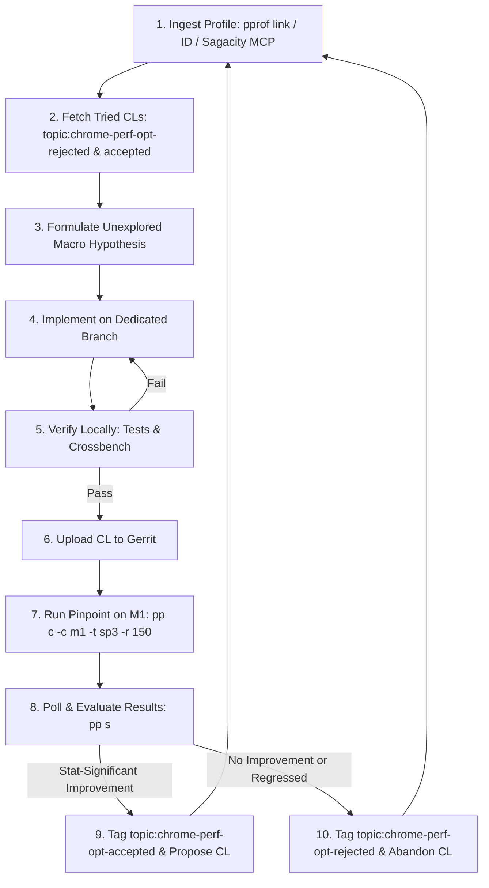

# Chrome & V8 Autonomous Performance Optimization Loop

This skill provides an autonomous agent loop that ingests performance profiles
(from web pprof links, profile IDs, Sagacity MCP, or Crossbench logs), designs
macro-optimizations in Blink or V8, validates correctness locally, tests on
Pinpoint hardware bots, and manages CL lifecycles based on statistical
confidence.

______________________________________________________________________

## 🔁 The Optimization Loop Workflow



______________________________________________________________________

## Step 1: Ingest & Analyze Performance Profiles

You can provide one or multiple profile sources:

- **Web pprof link(s)**: `pprof/?id=XYZ` or
  `https://pprof.corp.google.com/?id=XYZ`
- **Native pprof ID(s)**: `id:XYZ` or raw ID `XYZ`
- **Sagacity MCP Tools**: `fetch_uploaded_profile(profileKey="XYZ")`
- **Local Benchmark Profiles**: Crossbench CSV, Linux perf, or `v8.log`

### Profile Analysis Commands:

1. **Top Cumulative Call Stacks (identify caller subtrees)**:

   ```bash
   vpython3 agents/skills/chrome-performance-optimizer/scripts/analyze_profile.py "pprof/?id=XYZ" --mode=cum --nodecount=30
   ```

2. **Top Flat Functions (identify hot leaf loops)**:

   ```bash
   vpython3 agents/skills/chrome-performance-optimizer/scripts/analyze_profile.py "pprof/?id=XYZ" --mode=flat --nodecount=30
   ```

3. **Inspect Callers & Callees for a Specific Symbol**:

   ```bash
   vpython3 agents/skills/chrome-performance-optimizer/scripts/analyze_profile.py "pprof/?id=XYZ" --mode=peek --symbol="*HasOwnProperty*"
   ```

4. **Compare Two Profiles (Diff Mode)**:

   ```bash
   vpython3 agents/skills/chrome-performance-optimizer/scripts/analyze_profile.py "pprof/?id=EXP_ID" --base="pprof/?id=BASE_ID" --mode=cum
   ```

5. **Fetch & Exclude Previously Attempted CLs**: Before formulating any new
   optimization hypothesis, you **MUST** query all previously attempted CLs on
   Gerrit to avoid repeating rejected ideas and to build upon accepted ones:

   ```bash
   vpython3 agents/skills/chrome-performance-optimizer/scripts/fetch_tried_cls.py
   ```

   - **`topic:chrome-perf-opt-rejected`**: CLs that failed Pinpoint evaluation
     ($p > 0.05$). You **MUST NOT** repeat or re-propose any of these changes or
     micro-variations of them.
   - **`topic:chrome-perf-opt-accepted`**: Validated benchmark winners. You may
     use these as reference implementations.

6. **Classify the Bottleneck Pattern & Search for High-Impact Levers**: You
   **MUST** thoroughly study
   [Macro-Optimization Patterns](references/optimization_patterns.md) before
   formulating optimizations or writing code. Examine the historical top 20 CL
   wins (+0.5% to +2.0% total score) to design changes of comparable structural
   impact:

   - **Blink Style & Cascade**:
     - *RuleSet deduplication* in `MatchRequest` (+1.5% SP3).
     - *Matched Properties Cache (MPC)* by-value inherited property comparison &
       multi-candidate full entries (+1.0%, +0.71%).
     - *Selector Bucketing Maps* for frequent tag/attribute rules like
       `input[type="..."]` (+0.9%).
     - *UA stylesheet pruning* & replacing global rule walks with direct bit
       flags (+0.5%).
   - **Blink Layout, Text & Font Shaping**:
     - *HarfBuzz AAT shaping* state machine pruning & ligature pair caching
       (+1.2%, +0.7%).
     - *Global/thread-local `ShapeCache` (`NSShapeCache`)* for short repeated
       text (+0.8%).
     - *`LazyLineBreakIterator`* ICU iterator reset on min-max & Latin-1 table
       extension (+1.2%).
     - *Devirtualizing `LayoutObject`/`Node` type checks* into base class
       bitfields (+1.1%).
   - **Blink DOM Parsing, Construction & Mutation**:
     - *`HTMLFastPathParser` routing* for `DOMParser.parseFromString` (+1.0%).
     - *Lazy initialization* of `DocumentToken`, `VisitedLinkState`, and Form
       `Editor`s (+1.0%).
     - *Vector-backed `HeapObserverSet`* to optimize synchronous DOM mutation
       loops (+0.5%).
     - *SVG Path parsing LRU cache* (+0.4%).
   - **V8 & Memory Management (GC / Oilpan)**:
     - *Oilpan (cppgc) idle & concurrent sweeping* to clear allocation blocking
       (+2.0%).
     - *Minor GC on context disposal* & embedder marking speed normalization
       (+1.0%).
     - *Sparkplug+ Embedded Feedback (EFB)* in bytecode operands (+0.7%).
     - *Darwin `absl::Mutex`* replacing `std::shared_mutex` (+0.6%).
     - *MicrotaskQueue copy-on-write* for completion callbacks (+0.4%).
   - **2D Canvas, Graphics & Memory Primitives**:
     - *Dedicated `PaintOp`s / `SkPath` bypass* for primitive shapes (arcs,
       ovals, line segments) (+0.53%).
     - *High-performance SIMD / `rapidhash`* string and token hashing (+0.5%).
     - *Eliminating `HeapVector` inline storage zeroing* in constructors
       (+0.5%).
   - **Toolchain & PGO**:
     - *LLVM Clang `-vp-counters-per-site`* value profiling on macOS (+0.8%).
     - *Speedometer 3 iteration weighting* on PGO profile builders (+0.7%).

______________________________________________________________________

## Step 2: Formulate Macro Hypothesis & Create Isolated Branch

> [!IMPORTANT] **Mandatory High-Impact & Non-Duplication Standard**:
>
> 1. **No Duplication**: Check `fetch_tried_cls.py` output. NEVER repeat changes
>    listed under `topic:chrome-perf-opt-rejected` or
>    `topic:chrome-perf-opt-accepted`.
> 2. **No Micro-Tweaks**: Do NOT propose trivial micro-tweaks (such as isolated
>    bounds checks, micro-inlining of small helpers, or single variable renames)
>    that produce `< 0.1%` change and vanish in Pinpoint noise.
>
> Every optimization hypothesis MUST aim for **architectural leverage**:
>
> - **Allocation Elimination**: Eliminate heap / GC allocations in hot
>   per-element or per-token loops.
> - **Invariant Caching**: Cache expensive cross-iteration computations (e.g.
>   style match trees, parsed SVG/path byte streams, shaped word glyphs).
> - **Fast-Path Short-Circuits**: Bypass heavy multi-layer framework code (e.g.
>   ICU, HarfBuzz, SkPath, full CSS cascade) for common-case inputs.
> - **Concurrency / Deferral**: Defer non-critical work to idle tasks or worker
>   threads (e.g. sweeping, lazy state initialization).
>
> Continue iterating through candidate profiles and patterns autonomously until
> a statistically significant win ($p < 0.05$) is confirmed on Pinpoint.
>
> Every optimization hypothesis MUST aim for **architectural leverage**:
>
> - **Allocation Elimination**: Eliminate heap / GC allocations in hot
>   per-element or per-token loops.
> - **Invariant Caching**: Cache expensive cross-iteration computations (e.g.
>   style match trees, parsed SVG/path byte streams, shaped word glyphs).
> - **Fast-Path Short-Circuits**: Bypass heavy multi-layer framework code (e.g.
>   ICU, HarfBuzz, SkPath, full CSS cascade) for common-case inputs.
> - **Concurrency / Deferral**: Defer non-critical work to idle tasks or worker
>   threads (e.g. sweeping, lazy state initialization).
>
> Continue iterating through candidate profiles and patterns autonomously until
> a statistically significant win ($p < 0.05$) is confirmed on Pinpoint.

1. Create a dedicated branch for the optimization:
   ```bash
   # For Blink / Chromium root changes:
   git checkout -b perf_<feature_name> origin/main

   # For V8 engine submodule changes:
   git -C v8 checkout -b perf_<feature_name> origin/main
   ```
2. Implement the macro-optimization cleanly, adhering to codebase conventions.

______________________________________________________________________

## Step 3: Local Verification & Correctness Testing

Always verify correctness before uploading to avoid wasting Pinpoint bot
resources:

1. **Unit Tests**:

   ```bash
   # For Blink changes:
   autoninja -C out/release blink_unittests
   ./out/release/blink_unittests --gtest_filter="<RelevantTestPattern>"

   # For V8 changes:
   autoninja -C out/release v8:d8
   ./out/release/d8 v8/test/mjsunit/mjsunit.js <path_to_test.js>
   ```

2. **Web Tests (Layout / Rendering / Canvas)**:

   ```bash
   autoninja -C out/release content_shell
   ./third_party/blink/tools/run_web_tests.py -t release <path_to_web_test.html>
   ```

3. **Crossbench Benchmark Smoke Test**:

   ```bash
   autoninja -C out/release chrome chromedriver
   ./third_party/crossbench/cb.py speedometer_3.1 --browser=out/release/chrome --driver-path=out/release/chromedriver --stories=<TargetStory> --headless
   ```

______________________________________________________________________

## Step 4: Submit CL to Gerrit

1. Commit all modified files with descriptive rationale:
   ```bash
   git commit -m "[<Subsystem>] <Title>

   <Detailed architectural explanation and expected benchmark impact>

   TAG=agy
   CONV=<conversation_id>"
   ```
2. Upload the CL to Gerrit:
   ```bash
   git cl upload -m "Performance optimization for Speedometer 3" --cq-dry-run
   ```
3. Retrieve the Gerrit Issue ID:
   ```bash
   git cl issue
   ```

______________________________________________________________________

## Step 5: Run Pinpoint Try Job on M1 Hardware

Launch a 150-iteration try job on Apple Silicon M1 bots:

```bash
pp c -c m1 -t sp3 -r 150
```

- `-c m1`: Target M1 hardware bot.
- `-t sp3`: Target Speedometer 3 benchmark template.
- `-r 150`: 150 repetitions per variant for high statistical confidence.

______________________________________________________________________

## Step 6: Evaluate Results & Autonomous Decision

1. Inspect results once the job completes:

   ```bash
   vpython3 agents/skills/chrome-performance-optimizer/scripts/pinpoint_evaluator.py --action evaluate --job-id <JOB_ID>
   ```

   Or directly view the comparison table:

   ```bash
   pp s <JOB_ID>
   ```

2. **Decision Rules**:

   - ✅ **Statistically Significant Improvement ($p < 0.05$)**:
     - Set Gerrit topic to `chrome-perf-opt-accepted`:
       ```bash
       vpython3 -c "import sys; sys.path.insert(0, 'third_party/depot_tools'); import gerrit_util; gerrit_util.CallGerritApi('chromium-review.googlesource.com', f'/changes/{$(git cl issue)}/topic', reqtype='PUT', body={'topic': 'chrome-perf-opt-accepted'})"
       ```
     - Add the Pinpoint benchmark results to the CL description:
       ```bash
       git cl upload -m "Add Pinpoint M1 benchmark results (+X.X% improvement)"
       ```
     - Propose the change to the user and reviewers.
   - ❌ **Neutral or Regressed**:
     - Set Gerrit topic to `chrome-perf-opt-rejected` before abandoning:
       ```bash
       vpython3 -c "import sys; sys.path.insert(0, 'third_party/depot_tools'); import gerrit_util; gerrit_util.CallGerritApi('chromium-review.googlesource.com', f'/changes/{$(git cl issue)}/topic', reqtype='PUT', body={'topic': 'chrome-perf-opt-rejected'})"
       ```
     - Abandon the CL immediately:
       ```bash
       git cl abandon -m "Pinpoint try job (150 iterations on M1) showed no statistically significant speedup."
       ```
     - Switch back to `origin/main` and iterate to the next candidate
       profile/bottleneck.

______________________________________________________________________

## References & Utilities

- [Macro-Optimization Patterns](references/optimization_patterns.md)
- [Pinpoint & Gerrit Workflow Guide](references/pinpoint_workflow.md)
- [Fetch Previously Tried CLs Script](scripts/fetch_tried_cls.py)
- [Profile Analyzer Script](scripts/analyze_profile.py)
- [Pinpoint Evaluator Script](scripts/pinpoint_evaluator.py)
