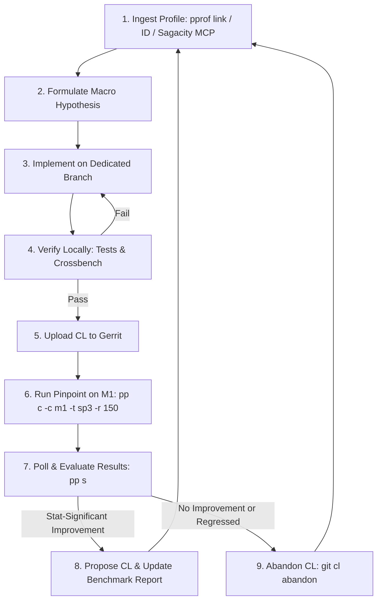

# Chrome & V8 Autonomous Performance Optimization Loop

This skill provides an autonomous agent loop that ingests performance profiles
(from web pprof links, profile IDs, Sagacity MCP, or Crossbench logs), designs
macro-optimizations in Blink or V8, validates correctness locally, tests on
Pinpoint hardware bots, and manages CL lifecycles based on statistical
confidence.

______________________________________________________________________

## 🔁 The Optimization Loop Workflow



______________________________________________________________________

## Step 1: Ingest & Analyze Performance Profiles

You can provide one or multiple profile sources:

- **Web pprof link(s)**: `pprof/?id=XYZ` or
  `https://pprof.corp.google.com/?id=XYZ`
- **Native pprof ID(s)**: `id:XYZ` or raw ID `XYZ`
- **Sagacity MCP Tools**: `fetch_uploaded_profile(profileKey="XYZ")`
- **Local Benchmark Profiles**: Crossbench CSV, Linux perf, or `v8.log`

### Profile Analysis Commands:

1. **Top Cumulative Call Stacks (identify caller subtrees)**:

   ```bash
   vpython3 agents/skills/chrome-performance-optimizer/scripts/analyze_profile.py "pprof/?id=XYZ" --mode=cum --nodecount=30
   ```

2. **Top Flat Functions (identify hot leaf loops)**:

   ```bash
   vpython3 agents/skills/chrome-performance-optimizer/scripts/analyze_profile.py "pprof/?id=XYZ" --mode=flat --nodecount=30
   ```

3. **Inspect Callers & Callees for a Specific Symbol**:

   ```bash
   vpython3 agents/skills/chrome-performance-optimizer/scripts/analyze_profile.py "pprof/?id=XYZ" --mode=peek --symbol="*HasOwnProperty*"
   ```

4. **Compare Two Profiles (Diff Mode)**:

   ```bash
   vpython3 agents/skills/chrome-performance-optimizer/scripts/analyze_profile.py "pprof/?id=EXP_ID" --base="pprof/?id=BASE_ID" --mode=cum
   ```

5. **Classify the Bottleneck Pattern**: Consult
   [Macro-Optimization Patterns](references/optimization_patterns.md) for proven
   solutions:

   - **DOM / Layout**: FlatTree iteration, slot distribution, style recalc tree
     walks.
   - **Canvas 2D**: API call dispatch overhead, `SkPathBuilder` allocations,
     disconnected strokes.
   - **V8 ICs**: StubCache evictions, megamorphic dispatch thrashing.
   - **Compiler**: Maglev/Turboshaft loop unrolling for dense high-order array
     callbacks.
   - consider other places based on the profile provided.

______________________________________________________________________

## Step 2: Formulate Hypothesis & Create Isolated Branch

1. Create a dedicated branch for the optimization:
   ```bash
   # For Blink / Chromium root changes:
   git checkout -b perf_<feature_name> origin/main

   # For V8 engine submodule changes:
   git -C v8 checkout -b perf_<feature_name> origin/main
   ```
2. Implement the macro-optimization cleanly, adhering to codebase conventions.

______________________________________________________________________

## Step 3: Local Verification & Correctness Testing

Always verify correctness before uploading to avoid wasting Pinpoint bot
resources:

1. **Unit Tests**:

   ```bash
   # For Blink changes:
   autoninja -C out/release blink_unittests
   ./out/release/blink_unittests --gtest_filter="<RelevantTestPattern>"

   # For V8 changes:
   autoninja -C out/release v8:d8
   ./out/release/d8 v8/test/mjsunit/mjsunit.js <path_to_test.js>
   ```

2. **Web Tests (Layout / Rendering / Canvas)**:

   ```bash
   autoninja -C out/release content_shell
   ./third_party/blink/tools/run_web_tests.py -t release <path_to_web_test.html>
   ```

3. **Crossbench Benchmark Smoke Test**:

   ```bash
   autoninja -C out/release chrome chromedriver
   ./third_party/crossbench/cb.py speedometer_3.1 --browser=out/release/chrome --driver-path=out/release/chromedriver --stories=<TargetStory> --headless
   ```

______________________________________________________________________

## Step 4: Submit CL to Gerrit

1. Commit all modified files with descriptive rationale:
   ```bash
   git commit -m "[<Subsystem>] <Title>

   <Detailed architectural explanation and expected benchmark impact>

   TAG=agy
   CONV=<conversation_id>"
   ```
2. Upload the CL to Gerrit:
   ```bash
   git cl upload -m "Performance optimization for Speedometer 3" --cq-dry-run
   ```
3. Retrieve the Gerrit Issue ID:
   ```bash
   git cl issue
   ```

______________________________________________________________________

## Step 5: Run Pinpoint Try Job on M1 Hardware

Launch a 150-iteration try job on Apple Silicon M1 bots:

```bash
pp c -c m1 -t sp3 -r 150
```

- `-c m1`: Target M1 hardware bot.
- `-t sp3`: Target Speedometer 3 benchmark template.
- `-r 150`: 150 repetitions per variant for high statistical confidence.

______________________________________________________________________

## Step 6: Evaluate Results & Autonomous Decision

1. Inspect results once the job completes:

   ```bash
   vpython3 agents/skills/chrome-performance-optimizer/scripts/pinpoint_evaluator.py --action evaluate --job-id <JOB_ID>
   ```

   Or directly view the comparison table:

   ```bash
   pp s <JOB_ID>
   ```

2. **Decision Rules**:

   - ✅ **Statistically Significant Improvement ($p < 0.05$)**:
     - Keep the CL.
     - Add the Pinpoint benchmark results to the CL description:
       ```bash
       git cl upload -m "Add Pinpoint M1 benchmark results (+X.X% improvement)"
       ```
     - Propose the change to the user and reviewers.
   - ❌ **Neutral or Regressed**:
     - Abandon the CL immediately:
       ```bash
       git cl abandon -m "Pinpoint try job (150 iterations on M1) showed no statistically significant speedup."
       ```
     - Switch back to `origin/main` and iterate to the next candidate
       profile/bottleneck.

______________________________________________________________________

## References & Utilities

- [Macro-Optimization Patterns](references/optimization_patterns.md)
- [Pinpoint & Gerrit Workflow Guide](references/pinpoint_workflow.md)
- [Profile Analyzer Script](scripts/analyze_profile.py)
- [Pinpoint Evaluator Script](scripts/pinpoint_evaluator.py)
