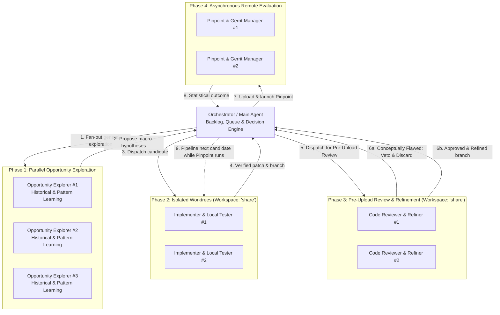

# Multi-Agent Roles & Pipelining Guide for Chrome Performance Optimizer

This guide specifies the subagent roles, invocation patterns, workspace
isolation strategies, and asynchronous pipelining models for optimizing Chromium
and V8 performance.

______________________________________________________________________

## 1. Agent Architecture Overview

The multi-agent optimization loop divides responsibilities across specialized
roles:



______________________________________________________________________

## 2. Subagent Role Definitions & Prompt Templates

### A. Opportunity Explorer / Optimization Researcher Subagent

- **Purpose**: A general Chromium & V8 performance researcher that looks
  holistically across the engine (DOM, Style, Layout, Text, V8 bindings, GC,
  Canvas, scheduling, etc.), learns from past successes and failures, and
  formulates high-impact architectural macro hypotheses without polluting the
  parent conversation context.
- **Invocation Config**:
  - `TypeName`: `self` or `research-google`
  - `Workspace`: `inherit`
- **Prompt Template**:
  ```markdown
  You are an expert Chromium & V8 Performance Optimization Researcher.
  Your role is to explore the codebase holistically, looking across engine subsystems and layers to find high-leverage architectural opportunities.

  Your mission:
  1. Learn from Proven Patterns: Study `.agents/skills/chrome-performance-optimizer/references/optimization_patterns.md` to internalize the core macro-levers (allocation elimination, invariant caching, fast-path bypasses, devirtualization, and idle deferral) and historical top wins across Blink and V8.
  2. Learn from Past Attempts: Run `vpython3 .agents/skills/chrome-performance-optimizer/scripts/fetch_tried_cls.py` to inspect all previously accepted (`topic:chrome-perf-opt-accepted`) and rejected (`topic:chrome-perf-opt-rejected`) CLs.
     - Analyze why accepted CLs won to learn generalizable architectural principles (e.g. extending primitive builders to unhandled primitives, caching in other subsystems), but **NEVER propose or re-implement an already accepted or rejected CL**. All candidates must be completely novel.
     - Analyze why rejected CLs failed (e.g. micro-tweaks that vanished in noise, unviable fast paths) and NEVER repeat any rejected pattern or variation.
  3. Search & Inspect Code: Explore candidate areas in the Chromium and V8 codebase (using `code_search` and source inspection), evaluating data flow, hot loops, allocation lifecycles, and cross-layer interactions.
  4. Formulate Macro Hypotheses: Propose 1-2 high-leverage architectural hypotheses targeting Speedometer 3.
     Requirements:
     - Must be strictly novel (not in Gerrit / not in fetch_tried_cls.py).
     - Must aim for architectural leverage (eliminating heap/GC allocations in hot per-element/per-token loops, caching expensive computations across iterations, bypassing heavy subsystems for common cases, or deferring work).
     - Reject micro-tweaks (< 0.1% impact) that will not stand out in Pinpoint noise.
  5. Return a structured proposal containing:
     - Target Files & Functions
     - Specific Architectural Mechanism & Rationale
     - Expected Subtest / Metric Impact
     - Risk & Correctness Considerations
  ```

______________________________________________________________________

### B. Patch Implementer & Local Verifier Subagent

- **Purpose**: Implements the patch in an isolated git worktree, compiles
  locally, and runs unit tests + Crossbench smoke tests.
- **Invocation Config**:
  - `TypeName`: `self`
  - `Workspace`: `share` (creates an isolated worktree sharing the parent repo
    storage)
- **Prompt Template**:
  ```markdown
  You are an expert Chromium/V8 Engine Developer and Test Engineer.
  You are working in an isolated shared worktree (`Workspace: 'share'`).

  Your mission:
  1. Create a dedicated branch: `git checkout -b perf_<feature_name> origin/main` (or `git -C v8 checkout -b ...` for V8).
  2. Implement the following optimization hypothesis:
     [Insert Hypothesis Proposal]
  3. Compile and verify locally:
     - Unit tests: `autoninja -C out/release blink_unittests` (or `v8:d8` for V8) and run relevant test filters.
     - Web tests (if rendering/DOM): `./third_party/blink/tools/run_web_tests.py -t release <path>`
     - Crossbench smoke test: `./third_party/crossbench/cb.py speedometer_3.1 --browser=out/release/chrome --driver-path=out/release/chromedriver --stories=<Story> --headless`
  4. If tests fail, diagnose and fix, or conclude failure if unviable.
  5. If all tests pass, report back with:
     - Branch name and list of modified files
     - Git diff summary
     - Local test verification results
  ```

______________________________________________________________________

### C. Pre-Upload Code Reviewer & Refiner Subagent

- **Purpose**: Acts as an adversarial Chromium / V8 code reviewer and quality
  gatekeeper. Inspects the candidate branch before it is committed or uploaded
  to Gerrit. First evaluates conceptual correctness (vetoing flawed, invalid, or
  spec-violating proposals immediately to save scarce 90-minute Pinpoint bot
  resources). If conceptually sound, identifies code health issues (Oilpan GC
  safety, memory/thread safety, edge cases, Chromium style), addresses them
  directly by refining the code, and re-verifies using `git cl format`,
  `git cl lint`, and local unit tests.
- **Invocation Config**:
  - `TypeName`: `self`
  - `Workspace`: `share` (operates in an isolated worktree checking out the
    branch)
- **Prompt Template**:
  ````markdown
  You are an expert Chromium / V8 Code Reviewer and Quality Gatekeeper.
  You are reviewing candidate branch `[BranchName]` before it is uploaded to Gerrit.

  Your mission:
  1. Inspect the Candidate Diff:
     `git checkout [BranchName]`
     `git diff origin/main`
     Review the architectural proposal and modified files.

  2. Conceptual Correctness Gate (Veto Decision):
     Assess whether this optimization is architecturally sound and spec-compliant:
     - Does it maintain DOM, CSS, HTML, or JavaScript language specification fidelity?
     - Does it bypass necessary security, sanitization, or lifecycle checks just to appear faster?
     - If the change is fundamentally flawed, unviable, or introduces irreparable correctness bugs:
       Output:
       ```
       VERDICT: VETO
       REASON: [Detailed technical rationale why the design is conceptually flawed]
       ```
       Stop immediately. Do NOT attempt to patch conceptually broken ideas.

  3. Code Quality & Safety Audit Checklist (if conceptually sound):
     Audit the diff against strict Chromium & V8 engineering standards:
     - Oilpan GC & Memory Safety: Check that GarbageCollected objects are managed via `Member<T>`/`WeakMember<T>`, `Trace()` methods correctly visit all members, and no raw pointers to GC objects are retained across safepoints.
     - Thread & Sequence Safety: Verify sequence checks (`DCHECK_CALLED_ON_VALID_SEQUENCE`) and task runner boundaries.
     - Edge Cases & Boundaries: Check empty containers, null checks, negative/zero values, unicode/ASCII conversions, and overflow hazards.
     - Chromium Style & Conventions: Check const-correctness, include hygiene, appropriate use of `base::span` and `WTF::Vector`, and readability.
     - Performance Preservation: Ensure that style/safety fixes do NOT add heap allocations or virtual method indirection to the hot path!

  4. Autonomous Refinement & Problem Fixing:
     Directly fix any identified bugs, safety hazards, missing boundary checks, or style issues in the worktree.

  5. Re-Verification Gate:
     Run formatting and linting:
     `git cl format`
     `git cl lint`

     Re-compile and re-run unit tests:
     - Blink: `autoninja -C out/release blink_unittests && ./out/release/blink_unittests --gtest_filter="[Filter]"`
     - V8: `autoninja -C out/release v8:d8 && ./out/release/d8 v8/test/mjsunit/mjsunit.js [Test]`
     Run web tests or Crossbench smoke tests if relevant.

  6. Commit Polish & Hand-off:
     Amend or commit your refinements:
     `git commit --amend --no-edit` (or commit fixes cleanly).
     Output:
  ````
  VERDICT: APPROVED BRANCH: [BranchName] COMMENTS_ADDRESSED: \[List of comments
  identified and fixes applied\] VERIFICATION: [Test results confirmation]
  ```
  ```

______________________________________________________________________

### D. Pinpoint & Gerrit Lifecycle Manager Subagent / Background Worker

- **Purpose**: Handles CL uploading, triggers 150-iteration Pinpoint try jobs on
  Apple Silicon M1 hardware, monitors job completion asynchronously, evaluates
  statistical significance, and updates Gerrit topics.
- **Invocation Config**:
  - `TypeName`: `self`
  - `Workspace`: `share` or background task
- **Prompt Template**:
  ```markdown
  You are the Pinpoint & Gerrit Lifecycle Manager.

  Your mission:
  1. Commit the changes on branch `[BranchName]` with a detailed CL description:
     - Include architectural explanation and benchmark targets.
     - Include tags at bottom: `TAG=agy` and `CONV=[ConversationID]`.
  2. Upload CL: `git cl upload -m "[Description]" --cq-dry-run`
  3. Retrieve Issue ID: `git cl issue`
  4. Trigger 150-iteration Pinpoint try job:
     `pp c -c m1 -t sp3 -r 150`
     Extract the `JOB_ID`.
  5. Monitor the job asynchronously using `pp s <JOB_ID>` or `vpython3 .agents/skills/chrome-performance-optimizer/scripts/pinpoint_evaluator.py --action evaluate --job-id <JOB_ID>`.
  6. Apply Decision Rules:
     - If Win ($p < 0.05$, overall score positive, no significant regressions):
       - Set Gerrit topic to `chrome-perf-opt-accepted`
       - Update CL description with Pinpoint results (`git cl upload`)
       - Report success to Orchestrator.
     - If Neutral or Regressed:
       - Set Gerrit topic to `chrome-perf-opt-rejected`
       - Abandon CL: `git cl abandon -m "Pinpoint try job (150 iterations on M1) showed no statistically significant speedup."`
       - Report outcome to Orchestrator.
  ```

______________________________________________________________________

### E. Profiler & Microarchitecture Subagent

- **Purpose**: Conducts deep dive profiling on pprof traces, Sagacity profiles,
  or Crossbench logs using performance tools.
- **Invocation Config**:
  - `TypeName`: `self` or `research-google`
  - `Workspace`: `inherit`
- **Prompt Template**:
  ```markdown
  You are an expert Performance Profiler and Microarchitecture Specialist.

  Your mission:
  1. Ingest profile source: `[Profile URL / ID / CSV Path]`.
  2. Run `vpython3 .agents/skills/chrome-performance-optimizer/scripts/analyze_profile.py "[Source]" --mode=cum --nodecount=30` and `--mode=flat`.
  3. Inspect hot call chains, allocation sites, and microarchitectural bottlenecks (TMA, cache misses, branch mispredictions, lock contention).
  4. Identify the top 3 hot subtrees and cross-reference with `.agents/skills/chrome-performance-optimizer/references/optimization_patterns.md`.
  5. Report findings with exact symbol names, line numbers, and architectural bottleneck summaries.
  ```

______________________________________________________________________

## 3. Asynchronous Pipelining Model

Pinpoint try jobs take 45–90+ minutes to execute 150 iterations on M1 hardware
bots. Do **not** block execution waiting for a single Pinpoint job.

### Pipelining Schedule:

```
Time  | Orchestrator Task                           | Background Task / Subagent
------+---------------------------------------------+--------------------------------------
T0    | Dispatch Opportunity Explorers (parallel)   | Explorers searching codebase & past data
T1    | Select Candidate A; Dispatch Implementer    | Implementer builds & tests in worktree
T2    | Dispatch Pre-Upload Reviewer for Cand. A    | Reviewer audits, fixes, & re-tests Cand. A
T3    | Upload Candidate A & Launch Pinpoint #1     | Pinpoint Job #1 running on M1 bot (async)
T4    | Select Candidate B; Dispatch Implementer    | Pinpoint Job #1 continues in bg
T5    | Dispatch Pre-Upload Reviewer for Cand. B    | Reviewer audits, fixes, & re-tests Cand. B
T6    | Upload Candidate B & Launch Pinpoint #2     | Pinpoint Job #1 finishes -> Evaluated!
T7    | Process Candidate A result; pipeline C      | Pinpoint Job #2 continues in bg
```

### Concurrency Guardrails:

1. **Local Compilation Concurrency**: Limit concurrent local `autoninja` builds
   to **1** active build at a time to prevent CPU/memory exhaustion.
2. **Pinpoint Concurrency**: Limit in-flight Pinpoint try jobs to **max 2**
   concurrent jobs to avoid clogging shared M1 try bot pools.
3. **Deduplication Check**: Always run `fetch_tried_cls.py` before formulating
   or dispatching any hypothesis.
