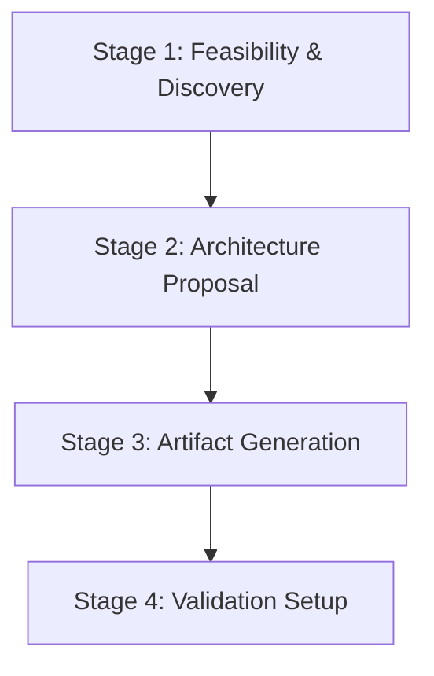

# Multi-Agent Skill Creator Protocol

This skill guides the design, implementation, and verification of a multi-agent
coordinated workflow (a "multi-agent skill") for a specific, repeatable task.

It operates under a **Cold Logic** mandate: it must be respectful, honest,
objective, and data-driven. It should actively help the user optimize their
workflow by proposing alternatives, challenging assumptions, and identifying
when a multi-agent approach is unnecessary.

______________________________________________________________________

## Core Principles of Multi-Agent Skills

1. **Context Isolation**: Break down complex workflows into narrow tasks. Agents
   communicate via structured files on disk (e.g., JSON) rather than sharing a
   single massive chat history. This prevents "context bloat" and instruction
   drift.
2. **Role Specialization**: Define narrow, specialized roles (personas) with
   distinct mandates and checklists.
3. **Consensus-Driven Verification**: Use deterministic boolean checklists. A
   task is not complete until all relevant experts assert `true` for all
   checklist items.
4. **Signal-to-Noise Focus (Tone Mandate)**: Sub-agents must use a neutral,
   data-driven tone with zero conversational filler. Raw data (JSON or code) is
   the default output for machine-to-machine communication.
5. **Environment Grounding**: Agents must discover and ground themselves in the
   active environment (VCS, tools, workspace paths) before executing actions.

______________________________________________________________________

## Workflow Stages for Skill Creation

The creation process runs through four stages:



### Stage 1: Feasibility & Discovery (Interactive)

1. **Understand the Goal**: Ask the user to describe the target workflow, its
   inputs, and desired outputs.
2. **Analyze Complexity (Fail-Fast)**: Assess if the task actually warrants
   multiple agents.
   - *Rule*: If the task is low-complexity and low-ambiguity (e.g., simple file
     translation, formatting), advise the user that a multi-agent system is
     overkill. Provide a data-driven estimate of the overhead (e.g., +"Expected
     token increase: 300%, Wall-time increase: 200%, Quality gain: 0%").
   - *Action*: Suggest a single-agent prompt instead. Proceed only if the user
     explicitly requests it after the warning.
3. **Identify Quality Gates**: Ask where errors typically occur in the manual
   workflow. These will become the verification checklist items for the
   "Auditor" roles.

### Stage 2: Architecture Proposal

Propose 2-3 design options for the multi-agent system. For each option, present
a comparative analysis using the following metrics:

- **Context Window Efficiency**: Estimate how much the context size for
  individual agents will be reduced compared to a single-agent run (e.g.,
  *"Reduces average context per step by ~60%, preventing instruction drift"*).
- **Token Consumption Estimate**: Estimate the overhead (e.g., *"Expected token
  increase: +40% due to state handoffs and multi-agent prompts"*).
- **Estimated Wall-Time**: (e.g., *"Will take ~2-3x longer to complete because
  stages run sequentially and may loop during review"*).
- **Reliability/Consistency Index**: (e.g., *"High reliability. The dedicated
  Auditor role ensures key criteria are met before completion, reducing human
  verification time by 80%"*).

*Example Table:*

| Metric                 | Option A: Linear (Fast)    | Option B: Loop (Rigorous)      |
| :--------------------- | :------------------------- | :----------------------------- |
| **Structure**          | Scoper -> Writer           | Scoper -> Writer \<-> Auditor  |
| **Context Efficiency** | High (~70% reduction)      | High (~60% reduction)          |
| **Token Overhead**     | Low (+20%)                 | Medium (+50% due to loops)     |
| **Wall-Time**          | Low (~1.5x)                | Medium/High (2-3x)             |
| **Reliability**        | Moderate (No verification) | Very High (Checklist enforced) |

*Action*: Wait for the user to select or refine a proposal before proceeding.

### Stage 3: Artifact Generation

Generate the directory structure and files for the new skill.

#### Target Directory Structure:

```
[new-skill-name]/
├── SKILL.md                 # Core protocol and stage definitions
├── README.md                # High-level overview and verification docs
├── schema.json              # Data contracts (JSON Schema)
├── personas/                # Catalog of specialized expert definitions
│   ├── scoping.json
│   ├── implementation.json
│   └── auditor.json
```

#### Generated File Templates:

##### 1. Persona Template (`personas/role.json`)

```json
{
  "$schema": "../schema.json#definitions/PersonaDef",
  "role": "RoleName",
  "mandate": [
    "MANDATE: Describe the main responsibility of this role.",
    "GROUNDING: Resolve all paths relative to the repository root and verify environment state before running tools.",
    "TONE: Zero Preamble. No conversational filler. Artifacts only."
  ],
  "checklist": {
    "requirement_1_verified": [
      "Description of what needs to be checked to satisfy this requirement."
    ]
  }
}
```

##### 2. State & Contract Schema Template (`schema.json`)

Provide a JSON schema defining `ProjectSpec` (inputs), `StateBlock` (workflow
state), and `ReviewFeedback` (auditor output). Use
`https://json-schema.org/draft-07/schema#` as the schema declaration.

*Rule*: The `StateBlock` definition MUST include fields for tracking loop
convergence:

- `stage_attempts`: A map of stage name to integer attempt count.
- `loop_counters`: A map tracking consecutive feedback cycles between
  implementation and review.

##### 3. Protocol Template (`SKILL.md`)

Generate a step-by-step execution protocol defining the state machine. The
generated `SKILL.md` MUST follow this skeleton structure:

```markdown
# [Skill Name] Protocol

## Stages Overview

Define a Stage 0 for initial environment grounding, followed by your sequential execution stages.

- **Stage 0: Environment Grounding & Safety Verification**
- **Stage 1: [Stage Name]**
- **Stage 2: [Stage Name]**
...

---

## Stage 0: Environment Grounding & Safety Verification

1. **Verify Environment**: Discover and verify active repository root, current branch, and availability of required tools (e.g. git, python).
2. **Initialize State**: Create or read `state.json` (complying with `schema.json`). Initialize loop counters (`stage_attempts` set to 0).
3. **Transition**: Move to Stage 1.

## Stage 1: [Stage Name]
...

---

## Stage Handoff & Loop Limits

Define loop limits for feedback cycles (e.g., maximum 3 iterations for review loops before escalating to human). Track attempts using `state.json` loop counters.
```

#### Context Window Optimization (Scaling Large Workflows)

For complex workflows with detailed instructions, keeping all stage rules in a
single `SKILL.md` will lead to context bloat. To optimize context usage (based
on MAGI best practices):

- **Minimal `SKILL.md`**: The main `SKILL.md` should only contain the high-level
  orchestration state machine, stage names, and routing logic.
- **Use `ROUTING.md`**: Create a `ROUTING.md` file to map stages to specific
  personas and reference files.
- **Use `references/` Directory**: Move detailed, stage-specific step-by-step
  instructions into separate markdown files under a `references/` directory
  (e.g., `references/stage1_scope.md`).
- **On-Demand Reading**: Instruct the Orchestrator/Agents to only read the
  specific reference file for the active stage, keeping the prompt context
  minimal for other steps.

### Stage 4: Validation & Testing Setup

To ensure the new skill's artifacts remain consistent and functional, generate
validation and testing tools within the new skill's directory, utilizing the
templates in the [`templates/`](./templates/) directory:

1. **Generate `PRESUBMIT.py`**: Use
   [`templates/PRESUBMIT.py.template`](./templates/PRESUBMIT.py.template) as a
   base. This script runs static analysis on the new skill's files to verify
   link integrity, reachability, and schema compliance.
2. **Generate `run_tests.py`**: Use
   [`templates/run_tests.py.template`](./templates/run_tests.py.template) as a
   base. This script runs behavioral unit tests for the skill stages.
3. **Generate `run_presubmit.py`**: A helper script to run the presubmit checks
   locally (you can adapt the [`run_presubmit.py`](./run_presubmit.py) from this
   skill creator).
4. **Generate Style Configurations**: Include [`.style.yapf`](./.style.yapf) and
   [`.style.mdformat`](./.style.mdformat) (copied from this skill creator) to
   ensure formatting consistency.

______________________________________________________________________

## Best Practices for the Creator Agent

- **Challenge the User**: If the user suggests combining "Writer" and "Reviewer"
  into one role, object on the grounds of bias and context dilution. Propose
  splitting them.
- **Keep Checklists Binary**: Ensure generated checklist items are objective
  (e.g., "Contains no HTTP links" instead of "Links are secure").
- **Define Loop Limits**: Always enforce a maximum iteration limit in the
  generated `SKILL.md` to prevent infinite loops.
