# Chrome Extensions Identity API

Freshness: 2026-09-10

## Overview

This directory implements the browser-side backend for the `chrome.identity` extension API. The API provides extensions with OAuth2 authorization mechanisms to authenticate users and obtain access tokens:

1. **Google OAuth2 Access Tokens (`getAuthToken`)**: Directly exchanges the user's primary signed-in Google identity (or ChromeOS device robot account) for a scoped access token without exposing account refresh tokens or credentials to the extension.
2. **Third-Party Identity Web Flows (`launchWebAuthFlow`)**: Executes generic OAuth2 / OpenID Connect web-based authorization flows with arbitrary identity providers (e.g., GitHub, Microsoft, Slack) via a browser popup or hidden web view, intercepting a dedicated loopback redirect URI.
3. **Profile User Information (`getProfileUserInfo`)**: Returns the primary signed-in account's email and unique Gaia ID (gated by the `identity.email` permission).
4. **Token Cache Management (`removeCachedAuthToken`, `clearAllCachedAuthTokens`)**: Maintains an in-memory token cache to minimize network round-trips to Gaia while handling token invalidation.
5. **Account State Observation (`onSignInChanged`, `getAccounts`)**: Broadcasts sign-in and sign-out transitions and allows querying profile accounts (dev channel).

### Public API Specification & Documentation

* **Canonical API Schema**: [`chrome/common/extensions/api/identity.webidl`](../../../../common/extensions/api/identity.webidl). This WebIDL definition is the canonical source of truth for the public interface, parameters, return types, and inline API documentation in Chromium.
* **Legacy Compiler Fixture**: The file `tools/json_schema_compiler/test/converted_schemas/identity.idl` is merely a compiler test fixture used to validate the schema conversion tooling; it is not the production API definition.
* **Public Documentation**: Published externally at [developer.chrome.com/docs/extensions/reference/api/identity](https://developer.chrome.com/docs/extensions/reference/api/identity).

The public methods and events exposed to extensions include:

| Function | Signature | Description |
| :--- | :--- | :--- |
| `getAuthToken` | `Promise<GetAuthTokenResult> getAuthToken(optional TokenDetails details)` | Fetches an OAuth2 access token for the extension using client ID and scopes from `manifest.json` or `details`. |
| `getProfileUserInfo` | `Promise<ProfileUserInfo> getProfileUserInfo(optional ProfileDetails details)` | Returns the email address and Gaia ID of the primary signed-in account (requires `identity.email` manifest permission). |
| `removeCachedAuthToken` | `Promise<undefined> removeCachedAuthToken(InvalidTokenDetails details)` | Evicts an invalid or revoked access token from the local in-memory token cache. |
| `clearAllCachedAuthTokens` | `Promise<undefined> clearAllCachedAuthTokens()` | Purges all cached tokens, account preferences, and resets API state. |
| `launchWebAuthFlow` | `Promise<DOMString?> launchWebAuthFlow(WebAuthFlowDetails details)` | Launches an interactive popup or silent web view for third-party OAuth2 flows, resolving with the final redirect URL. |
| `getRedirectURL` | `[nocompile] DOMString getRedirectURL(optional DOMString path)` | Generates the canonical redirect URL (`https://<extension-id>.chromiumapp.org/<path>`) for third-party providers. |
| `getAccounts` | `Promise<sequence<AccountInfo>> getAccounts()` | Lists all accounts present on the profile with refresh tokens (restricted to Dev channel). |
| `onSignInChanged` | `OnSignInChangedEvent onSignInChanged` | Event fired when sign-in state or accounts change for the user's profile. |

### Google Account Authentication (`getAuthToken`)

When an extension calls `chrome.identity.getAuthToken()`, Chrome goes through up to three stages: **choosing and signing in to an account**, **minting a scoped token from Gaia**, and (if required) **prompting the user for OAuth consent**.

#### 1. Choosing an Account & Signing In to Chrome

Extensions can only access Google accounts when the user is signed in to Chrome itself (i.e., Chrome has a primary account). If the user is only signed in on the web (in the Google cookie jar) but not signed in to the browser, extensions cannot silently use those accounts.

To decide which Google account to use for `getAuthToken()`, Chrome checks three sources in order:
1. **Explicitly requested account**: If the extension passed an account ID in `details.account`, Chrome looks for that account among the profile's signed-in accounts.
2. **Previously consented account**: If no account was specified, Chrome checks `ExtensionPrefs` to see if the user previously approved a consent prompt for this extension using a specific account.
3. **Chrome's primary account**: Otherwise, Chrome defaults to the profile's primary account.

When no signed-in account is available (or the account's credentials have expired):
* If `interactive` is `false` (the default), the call fails immediately without showing any UI.
* If `interactive` is `true`, Chrome prompts the user to sign in:
  * If the user is already signed in on the web (just not to Chrome), Chrome shows a lightweight confirmation dialog asking if they want to continue with their web account.
  * Otherwise, Chrome opens a Gaia sign-in tab.

#### 2. Rate Limiting & Sign-In Throttling

To prevent background extensions or automated scripts from spamming sign-in tabs and stealing focus from the user, Chromium applies two safeguards when `getAuthToken` is called with `interactive: true`:

1. **User Activity Check**:
   Interactive `getAuthToken` requests require either an explicit user gesture or recent user activity. If the call was not triggered by a user gesture, Chrome checks the system idle state. If the user has been inactive for **10 minutes or longer**, the request is immediately rejected without displaying any UI.
2. **Sign-In Tab Focus Suppression (`SigninViewController`)**:
   Under normal browser-initiated sign-in flows, trying to open a sign-in tab when one is already open brings the existing sign-in tab into focus. For extensions, Chrome opens and focuses the first sign-in tab, but if a sign-in tab is **already open**, Chrome does not re-activate it. The existing tab remains in the background without repeatedly stealing focus, and no duplicate sign-in tab is opened.

#### 3. Token Side-Scoping & Privileged Consumer (`kExtensionsIdentityAPI`)

Extensions specify an OAuth2 client ID and requested scopes in their `manifest.json` under the `"oauth2"` section (or override scopes via `TokenDetails.scopes`). Extensions are untrusted third-party or enterprise code. Chromium never provides the user's primary refresh token or Gaia credentials to an extension, nor does it allow an extension to act with the browser's own full privileges.

Chromium solves this through token side-scoping (minting a downstream, tightly-scoped access token for a child client ID using the parent user's primary login token):

```
┌─────────────────────────────────────────────────────────────────────────────────┐
│ Chrome Browser                                                                  │
│                                                                                 │
│  IdentityManager                                                                │
│         │                                                                       │
│         │ 1. Request access token for OAuthConsumerId::kExtensionsIdentityAPI   │
│         ▼    with scope: GaiaConstants::kAnyApiOAuth2Scope                      │
│  [Privileged Login Access Token]                                                │
│         │                                                                       │
│         │ 2. OAuth2MintTokenFlow::Start(login_access_token)                     │
│         ▼    Parameters: extension_id, client_id, requested_scopes              │
└─────────┼───────────────────────────────────────────────────────────────────────┘
          │
          │ 3. HTTPS POST /oauth2/v4/token (or IssueToken)
          │    Authorization: Bearer <Privileged Login Access Token>
          │    Body: client_id=<ext_client_id>&scope=<ext_scopes>&origin=<ext_id>
          ▼
┌─────────────────────────────────────────────────────────────────────────────────┐
│ Google Gaia / OAuth Service                                                     │
│                                                                                 │
│  - Verifies Chrome primary user session                                         │
│  - Validates extension origin matches client_id configuration                   │
│  - Mints downstream access token bound strictly to <ext_client_id> and scopes   │
└─────────────────────────────────────────────────────────────────────────────────┘
```

To make this request, Chrome first fetches an access token of its own with the special `https://www.googleapis.com/auth/any-api` scope (`GaiaConstants::kAnyApiOAuth2Scope`). Because an `any-api` token can be used to mint tokens for other OAuth clients, `components/signin` restricts this scope to privileged internal consumers:
* `signin::OAuthConsumerId::kExtensionsIdentityAPI` is the privileged consumer identity authorized to request this scope from `IdentityManager`.
* The returned `any-api` access token is used strictly as the bearer credential for `OAuth2MintTokenFlow` to request the downstream token for the extension from Gaia.

#### 4. In-Memory Caching & Request Serialization

To avoid frequent round-trips to Gaia and provide fast response times, `IdentityTokenCache` caches minted tokens and short-lived intermediate consent states in memory:

* **Superset Scope Matching**:
  Minted tokens are indexed by extension ID and account. When looking up a token, the cache searches for any cached token whose granted scopes form a **superset** of the requested scopes. Because cached tokens are sorted in ascending order of scope count, the cache returns the smallest superset that satisfies the request, prioritizing exact scope matches.
* **Expiration & Invalidation**:
  `IdentityAPI` observes `IdentityManager` and distinguishes between full account removal and token-only cache invalidation:
  * **Account Removal**: When an account is removed from Chrome (its refresh token is revoked) or when the user signs out of Chrome's primary account (which revokes extension access to all Chrome accounts), Chrome disassociates the account from extensions entirely: it clears any saved extension-to-account preferences, fires `chrome.identity.onSignInChanged` (`signedIn: false`), and evicts all cached tokens for the affected account(s).
  * **Token Cache Invalidation (Without Account Removal)**: Cached tokens are evicted while keeping the account itself associated with the extension when:
    * A token reaches its TTL expiration (purged lazily on lookup).
    * An extension explicitly calls `removeCachedAuthToken` or `clearAllCachedAuthTokens`.
    * An account's refresh token enters a persistent authentication error state (for example, when credentials become invalid after a web sign-out or password change). The account remains signed in to Chrome and bound to the extension (`onSignInChanged` is not fired), but its cached tokens are immediately evicted so extensions do not repeatedly receive stale, rejected tokens.
* **Request Queueing (`IdentityMintRequestQueue`)**:
  If an extension makes multiple concurrent calls to `getAuthToken` for the same extension, account, and scopes, `IdentityMintRequestQueue` places them into FIFO queues (separate queues for non-interactive and interactive steps). This prevents redundant parallel requests to Gaia and ensures only a single interactive consent dialog is shown at a time; once the first request populates the cache, queued requests behind it reuse the cached token.

#### 5. OAuth Consent Flow (`GaiaRemoteConsentFlow`)

When an extension requests scopes that the user has not yet consented to (or when granular permissions are requested), Gaia cannot issue an access token silently:

1. **Remote Consent Advice**:
   Gaia responds to the initial non-interactive mint request with `issueAdvice: "remoteConsent"`, returning the URL of the Google consent page and session cookies (`RemoteConsentResolutionData`).
2. **Interactive vs. Non-Interactive Handling**:
   * If `interactive` is `false` (or omitted), `getAuthToken` fails immediately with an interaction-required error.
   * If `interactive` is `true`, Chrome launches `GaiaRemoteConsentFlow`.
3. **Displaying the Consent Page**:
   `GaiaRemoteConsentFlow` seeds the cookies provided by Gaia into the profile's default cookie jar and opens an interactive popup window (using `WebAuthFlow`) to display the Google consent page.
4. **Capturing Approval & Minting the Token**:
   When the user clicks "Allow", the consent page sends a signed approval string back to Chrome through a private JavaScript API bridge (`GoogleAccountsPrivateApiHost`). Chrome caches this approval result, records the consented account in `ExtensionPrefs`, and re-runs `OAuth2MintTokenFlow` with the `consent_result` string so Gaia issues the final access token.

#### 6. Detailed `getAuthToken` Call Flow

The flowchart below illustrates how the stages above map to the methods and cache states in [`IdentityGetAuthTokenFunction`](./identity_get_auth_token_function.h):

```mermaid
flowchart TD
  Run(["Run()"]) --> WaitRefresh{"AreRefreshTokensLoaded()?"}
  WaitRefresh -->|"No"| RefreshWaiter["RefreshTokensLoadedWaiter"]
  RefreshWaiter --> GetAuthTokenForAccount["GetAuthTokenForAccount(gaia_id)"]
  WaitRefresh -->|"Yes"| GetAuthTokenForAccount

  subgraph DetermineAccount ["Determine an Account"]
    GetAuthTokenForAccount --> HasGaiaId{"gaia_id in details.account\nor saved in ExtensionPrefs?"}
    HasGaiaId -->|"Yes"| LookupExtensionAccounts["Look up account in\nGetAccountsWithRefreshTokensForExtensions()"]
    HasGaiaId -->|"No"| GetPrimaryAccount["GetSigninPrimaryAccount()"]
    LookupExtensionAccounts --> HasSelectedAccount{"Has selected_account\nwith refresh token?"}
    GetPrimaryAccount --> HasSelectedAccount

    HasSelectedAccount -->|"No (if interactive allowed)"| StartSigninFlow["StartSigninFlow()"]

    subgraph AccountSignin ["Account Sign-In"]
      StartSigninFlow --> HasWebAccount{"Has web-signed-in account\nwithout primary account?"}
      HasWebAccount -->|"Yes (DICE)"| MaybeShowSigninDialog["IdentityAPI::MaybeShowChromeSigninDialog()"]
      HasWebAccount -->|"No"| ShowExtensionLoginPrompt["ShowExtensionLoginPrompt()\n-> ShowExtensionSigninPrompt()"]
      ShowExtensionLoginPrompt --> WaitingForPrimary{"Waiting for a new\nprimary account?"}
      MaybeShowSigninDialog --> OnPrimaryAccountChanged["OnPrimaryAccountChanged(kSet)"]
      WaitingForPrimary -->|"Yes"| OnPrimaryAccountChanged
      WaitingForPrimary -->|"No"| OnRefreshTokenUpdated["OnRefreshTokenUpdatedForAccount()"]
    end
  end

  HasSelectedAccount -->|"Yes (or ChromeOS Kiosk)"| StartMintFlowNI["StartMintTokenFlow(NON_INTERACTIVE)"]
  OnPrimaryAccountChanged --> StartMintFlowNI
  OnRefreshTokenUpdated --> StartMintFlowNI

  StartMintFlowNI --> RequestStartNI["IdentityMintRequestQueue::RequestStart()"]
  RequestStartNI --> RunRequestNI["IdentityMintRequestQueue::RunRequest()"]
  RunRequestNI --> StartMintTokenNI["StartMintToken(NON_INTERACTIVE)"]
  StartMintTokenNI --> CacheStatusNI{"cache status"}

  CacheStatusNI -->|"CACHE_STATUS_TOKEN"| CompleteMintFlowSuccess["CompleteMintTokenFlow()"]
  CacheStatusNI -->|"CACHE_STATUS_NOTFOUND or\nCACHE_STATUS_REMOTE_CONSENT_APPROVED"| StartAccessTokenRequest["StartTokenKeyAccountAccessTokenRequest()\n(or StartDeviceAccessTokenRequest() on Kiosk)"]
  CacheStatusNI -->|"CACHE_STATUS_REMOTE_CONSENT"| CompleteMintFlowToInteractive["CompleteMintTokenFlow()"]

  StartAccessTokenRequest --> OnGetAccessTokenComplete["OnGetAccessTokenComplete()"]
  OnGetAccessTokenComplete --> StartGaiaRequest["StartGaiaRequest()"]
  StartGaiaRequest -->|"request issueToken"| OAuth2MintTokenFlowStart["OAuth2MintTokenFlow::Start()"]
  OAuth2MintTokenFlowStart --> IssueAdviceValue{"issueAdvice value"}

  IssueAdviceValue -->|"auto"| OnMintTokenSuccess["OnMintTokenSuccess()\nsets CACHE_STATUS_TOKEN"]
  IssueAdviceValue -->|"remoteConsent"| OnRemoteConsentSuccess["OnRemoteConsentSuccess()\nsets CACHE_STATUS_REMOTE_CONSENT"]

  OnMintTokenSuccess --> CompleteMintFlowSuccess
  OnRemoteConsentSuccess --> CompleteMintFlowToInteractive

  CompleteMintFlowToInteractive -.-> StartMintFlowInt["StartMintTokenFlow(INTERACTIVE)"]

  StartMintFlowInt --> RequestStartInt["IdentityMintRequestQueue::RequestStart()"]
  RequestStartInt --> RunRequestInt["IdentityMintRequestQueue::RunRequest()"]
  RunRequestInt --> StartMintTokenInt["StartMintToken(INTERACTIVE)"]
  StartMintTokenInt --> CacheStatusInt{"cache status"}

  CacheStatusInt -->|"CACHE_STATUS_TOKEN"| CompleteMintFlowSuccess
  CacheStatusInt -->|"CACHE_STATUS_REMOTE_CONSENT or\nCACHE_STATUS_NOTFOUND"| ShowRemoteConsentDialog["ShowRemoteConsentDialog()"]
  CacheStatusInt -.->|"CACHE_STATUS_REMOTE_CONSENT_APPROVED"| StartAccessTokenRequest

  ShowRemoteConsentDialog --> GaiaRemoteConsentStart["GaiaRemoteConsentFlow::Start()"]
  GaiaRemoteConsentStart --> OnRemoteConsentApproved["OnGaiaRemoteConsentFlowApproved()\nsets CACHE_STATUS_REMOTE_CONSENT_APPROVED"]
  OnRemoteConsentApproved --> CompleteMintFlowAfterConsent["CompleteMintTokenFlow()"]
  CompleteMintFlowAfterConsent --> StartMintFlowNI

  CompleteMintFlowSuccess --> CompleteFunctionWithResult(["CompleteFunctionWithResult()"])
```



### WebAuthFlow & Redirect URL Interception

`WebAuthFlow` and `IdentityLaunchWebAuthFlowFunction` implement generic web-based authentication for non-Google third-party OAuth2/OIDC providers:

Third-party OAuth providers require registering a callback redirect URL. The extension generates this using `chrome.identity.getRedirectURL(path)`:
```
https://<extension-id>.chromiumapp.org/<path>
```
The host `<extension-id>.chromiumapp.org` is a synthetic domain managed by Chromium for loopback detection.

1. **Background Loading & Window Display**:
   * `WebAuthFlow` always creates its `content::WebContents` in the background and begins loading the target URL before creating any visible window, regardless of the `interactive` argument.
   * **Immediate Redirect (No Popup)**: Because the `WebContents` shares the profile's default cookie jar, if the user is already signed in to the identity provider's website and has previously granted consent, the provider often redirects immediately to the loopback URL before the page finishes loading. In that case, the redirect is intercepted in the background and no popup window is created at all.
   * **When User Interaction Is Needed**: If the page finishes loading without redirecting to the callback URL:
     * **Silent mode (`interactive: false`)**: The flow aborts with `kInteractionRequired` (or waits up to `timeout_ms_for_non_interactive`, max 1 minute, for asynchronous redirects before failing).
     * **Interactive mode (`interactive: true`)**: Chrome creates a browser popup window (which behaves like a regular tab without special sandboxing) to display the loaded `WebContents`, attaching an infobar (`WebAuthFlowInfoBarDelegate`) that informs the user which extension initiated the authentication prompt.
2. **Navigation Interception**:
   * `WebAuthFlow` monitors every navigation and server redirect in the web view and checks whether the target URL matches `https://<extension-id>.chromiumapp.org/*` (or matches any custom redirect URL patterns configured by enterprise policy in `extensions::pref_names::kOAuthRedirectUrls`).
3. **Completion**:
   * When a matching redirect URL is detected, navigation is intercepted in-process before any network request is issued for `chromiumapp.org`.
   * The popup window/tab is closed immediately.
   * The complete redirect URL (including authorization code query parameters or access token fragments) is returned to the extension by resolving the `launchWebAuthFlow` Promise.

### ChromeOS Specifics: Robot Accounts & Enterprise Sessions

ChromeOS features shared and managed deployment modes where standard interactive user Gaia sign-in is either unavailable or restricted:

#### Managed Guest Sessions (Public Sessions)
* Because Managed Guest Sessions (`chromeos::IsManagedGuestSession()`) are unauthenticated temporary shared environments, `getAuthToken` requests are rejected with an error.

#### Kiosk Sessions & Device Robot Accounts
* In single-app or managed Kiosk sessions (`chromeos::IsKioskSession()`), there is no human user profile in `IdentityManager`; the device runs under an enterprise-enrolled **device robot account** (a service account associated with the enrolled ChromeOS device).
* When an extension calls `getAuthToken` in an enterprise-managed Kiosk session, Chrome fetches the robot account's `https://www.googleapis.com/auth/any-api` (`GaiaConstants::kAnyApiOAuth2Scope`) access token directly from `DeviceOAuth2TokenService` (via `DeviceOAuth2TokenFetcher`).
* It then runs `OAuth2MintTokenFlow` in force mode (`MODE_MINT_TOKEN_FORCE`), allowing Gaia to mint side-scoped access tokens for the kiosk extension silently without a user consent prompt.

#### Ash Window Management
* On ChromeOS Ash, `LaunchWebAuthFlowDelegateAsh` implements `LaunchWebAuthFlowDelegate` to calculate and supply optimal window bounds and screen placement for `launchWebAuthFlow` auth popups within the Ash window management environment.

## Interface

### Core API Singleton & Functions
- [`IdentityAPI`](./identity_api.h): Profile-keyed `BrowserContextKeyedAPI` singleton managing token request queues, token caching, active WebAuthFlow tracking, and sign-in lifecycle observation.
- [`IdentityGetAuthTokenFunction`](./identity_get_auth_token_function.h): Implements `chrome.identity.getAuthToken`. Coordinates cache lookup, request serialization, user sign-in dialogs, login token fetching via `OAuthConsumerId::kExtensionsIdentityAPI`, token side-scoping via `OAuth2MintTokenFlow`, remote consent triggering, and ChromeOS robot accounts.
- [`IdentityGetProfileUserInfoFunction`](./identity_get_profile_user_info_function.h): Implements `chrome.identity.getProfileUserInfo`. Extracts the email address and obfuscated Gaia ID of the primary account from `signin::IdentityManager`.
- [`IdentityRemoveCachedAuthTokenFunction`](./identity_remove_cached_auth_token_function.h): Implements `chrome.identity.removeCachedAuthToken`. Evicts a specific access token string from `IdentityTokenCache`.
- [`IdentityClearAllCachedAuthTokensFunction`](./identity_clear_all_cached_auth_tokens_function.h): Implements `chrome.identity.clearAllCachedAuthTokens`. Purges all cached tokens and resets API state.
- [`IdentityLaunchWebAuthFlowFunction`](./identity_launch_web_auth_flow_function.h): Implements `chrome.identity.launchWebAuthFlow`. Configures redirect URL targets, manages interactive vs. silent execution modes, tracks active flows, and intercepts redirect navigations.
- [`IdentityGetAccountsFunction`](./identity_get_accounts_function.h): Implements `chrome.identity.getAccounts` (dev-channel only). Lists all accounts with active refresh tokens in the profile.

### Web Authentication & Consent Controllers
- [`WebAuthFlow`](./web_auth_flow.h): Controller managing the web view lifecycle for third-party web authentication. Hosts a `content::WebContents`, monitors navigation events, enforces timeouts, and notifies delegates upon URL changes.
- [`WebAuthFlow::Delegate`](./web_auth_flow.h): Callback interface implemented by consumers (`IdentityLaunchWebAuthFlowFunction`, `GaiaRemoteConsentFlow`) for redirect detection, load failures, and navigation completion.
- [`GaiaRemoteConsentFlow`](./gaia_remote_consent_flow.h): Manages the web-based remote OAuth consent dialog flow for Google accounts. Seeds partition cookies, launches `WebAuthFlow`, and binds to `GoogleAccountsPrivateApiHost` to receive user consent approval.
- [`GaiaRemoteConsentFlow::Delegate`](./gaia_remote_consent_flow.h): Delegate interface notifying `IdentityGetAuthTokenFunction` upon consent approval or flow failure.
- [`LaunchWebAuthFlowDelegate`](./launch_web_auth_flow_delegate.h): Interface for platform-specific window placement and bounds resolution for `WebAuthFlow` popups.
- [`LaunchWebAuthFlowDelegateAsh`](./launch_web_auth_flow_delegate_ash.h): Ash-specific implementation of `LaunchWebAuthFlowDelegate`, calculating window bounds and screen positioning on ChromeOS.
- [`WebAuthFlowInfoBarDelegate`](./web_auth_flow_info_bar_delegate.h): `ConfirmInfoBarDelegate` that presents an infobar notification across web auth tabs, identifying which extension initiated the authentication prompt.

### Cache, Queue & Data Models
- [`IdentityTokenCache`](./identity_token_cache.h): In-memory cache for active access tokens, expiration timestamps, and short-lived remote consent states, utilizing superset scope sorting to prioritize exact scope matches.
- [`IdentityTokenCacheValue`](./identity_token_cache.h): Value variant holding an access token with granted scopes, a `RemoteConsentResolutionData` struct, or an approved consent string with TTL expiration tracking.
- [`IdentityMintRequestQueue`](./identity_mint_queue.h): FIFO request queue serializing concurrent token mint requests per `ExtensionTokenKey`.
- [`IdentityMintRequestQueue::Request`](./identity_mint_queue.h): Interface implemented by mint requests to receive `StartMintToken()` callbacks when reaching the head of the queue.
- [`ExtensionTokenKey`](./extension_token_key.h): Composite key struct (`extension_id`, `CoreAccountInfo`, `std::set<std::string> scopes`) uniquely identifying token cache and queue entries.
- [`IdentityGetAuthTokenError`](./identity_get_auth_token_error.h): Error state machine and error representations, mapping internal flow failures to external API error strings and UMA histogram enums.

## Invariants

- **Primary Credential Isolation**: Chrome never exposes the user's primary refresh token, Gaia cookies, or password to extensions. All tokens provided to extensions are downstream side-scoped access tokens minted specifically for the extension's client ID and requested scopes.
- **Scope Restriction**: `GaiaConstants::kAnyApiOAuth2Scope` (`https://www.googleapis.com/auth/any-api`) is classified as privileged and can only be requested by `signin::OAuthConsumerId::kExtensionsIdentityAPI`.
- **Chrome Sign-In Requirement**: Extensions can only access accounts in `IdentityManager` when Chrome has a primary account; web-only signed-in accounts are not exposed to extensions unless the user signs in to Chrome.
- **Request Serialization**: Multiple concurrent `getAuthToken` requests with the same `ExtensionTokenKey` are serialized through `IdentityMintRequestQueue` to prevent duplicate network traffic to Gaia and ensure only a single interactive sign-in or consent dialog is presented at a time.
- **Non-Interactive Execution**: When `interactive` is false, `getAuthToken` and `launchWebAuthFlow` must never display user-visible UI. If sign-in or consent is required, they fail immediately with interaction-required errors.
- **Interactivity & Idle Throttling**: Interactive `getAuthToken` requests require an active user gesture or recent user activity within `kGetAuthTokenInactivityTime` (10 minutes). Requests received during user inactivity without a gesture fail immediately with `kInteractivityDenied`.
- **Sign-In Focus Suppression**: Extensions triggering browser sign-in cannot repeatedly steal window or tab focus; if a Dice sign-in tab is already open, `SigninViewController` suppresses `ActivateTabAt` for `AccessPoint::kExtensions`.
- **Loopback Navigation Isolation**: Navigations to `https://<extension-id>.chromiumapp.org/*` are intercepted in-process by `WebAuthFlow` and never hit external networks.
- **Flow Exclusivity**: An extension may only have one active interactive `launchWebAuthFlow` running at any given time, tracked by `IdentityAPI::StartTrackingWebAuthFlow()`.
- **Cache Invalidation on Credential Invalidation**: Cached tokens in `IdentityTokenCache` are strictly bound to valid refresh tokens. When an account is removed (`OnExtendedAccountInfoRemoved`) or enters a persistent authentication error state (`OnErrorStateOfRefreshTokenUpdatedForAccount`), all cached tokens for that account are evicted immediately to prevent stale token reuse loops.
- **Lifecycle & Shutdown**: `IdentityAPI` is tied to the lifetime of the `Profile`. On profile shutdown, all pending requests in `IdentityMintRequestQueue`, active `GaiaRemoteConsentFlow` instances, and running `WebAuthFlow` controllers are canceled and destroyed.

## Side Effects

- **Background Network Requests**:
  - `IdentityGetAuthTokenFunction` issues HTTPS POST requests to Google Gaia endpoints (`oauth2/v4/token` / `IssueToken`) via `OAuth2MintTokenFlow`.
  - `DeviceOAuth2TokenFetcher` contacts DMServer and Gaia on ChromeOS via `DeviceOAuth2TokenService`.
- **Web Contents & UI**:
  - `WebAuthFlow` creates background `content::WebContents` and, when user interaction is needed after page load, displays browser popups or tabs.
  - Attaches infobar banners via `WebAuthFlowInfoBarDelegate` attributing the auth prompt to the calling extension.
  - `IdentityGetAuthTokenFunction` requests user sign-in or account re-authentication on non-ChromeOS platforms either by showing a Chrome sign-in confirmation dialog for existing web accounts (`IdentityAPI::MaybeShowChromeSigninDialog()`) or by calling `ShowExtensionSigninPrompt()`, which delegates to `SigninViewController` to open a sign-in tab with `signin_metrics::AccessPoint::kExtensions` (bypassing tab activation if an existing sign-in tab is already open).
- **Storage & Cookie Mutations**:
  - `GaiaRemoteConsentFlow` writes temporary authentication cookies into the profile storage partition cookie jar using `network::mojom::CookieManager`.
  - `IdentityTokenCache` stores access tokens in memory and lazily evicts them on expiration.
  - Updates extension preferences (`"identity_gaia_id"` in `ExtensionPrefs`) when persisting or clearing the account bound to an extension.
- **Observer Notifications**:
  - Dispatches `chrome.identity.onSignInChanged` events to extensions via `extensions::EventRouter`.
- **Metrics**:
  - Logs UMA histograms: `Signin.Extensions.LaunchWebAuthFlowResult`, `Signin.Extensions.GaiaRemoteConsentFlowResult`, and `Signin.Extensions.GetAuthTokenResult`.

## Verification

- **Build**: `autoninja -C out/Default unit_tests browser_tests`
- **Unit Tests**: `out/Default/unit_tests --gtest_filter="*Identity*Token*:*WebAuthFlow*"` _(Tests defined in `//chrome/test:unit_tests`)_
- **Browser Tests**: `testing/xvfb.py out/Default/browser_tests --gtest_filter="*IdentityApiTest*:*WebAuthFlowBrowserTest*"` _(Tests defined in `//chrome/test:browser_tests`)_
- **ChromeOS Ash Tests**: `testing/xvfb.py out/Default/browser_tests --gtest_filter="LaunchWebAuthFlowDelegateAshBrowserTest.*"` _(Requires `target_os = "chromeos"` in `args.gn`)_
