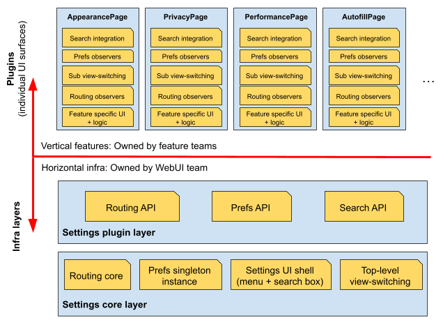
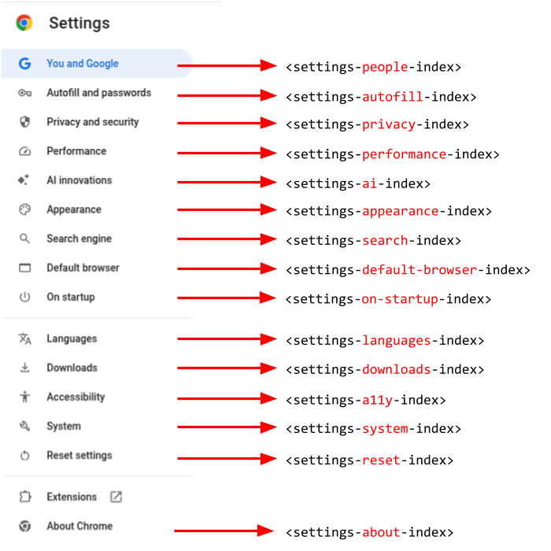
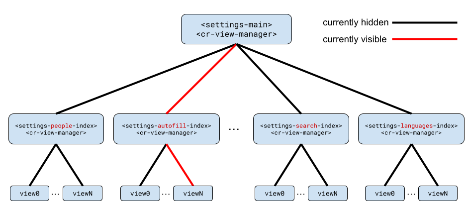

# Chromium Settings UI "Plugin" architecture

[TOC]

## Background

The Settings UI was heavily re-architected in 2025
([crbug.com/424223101](https://issues.chromium.org/issues/424223101)). This
document reflects the architecture after that work completed.

## Overview

The "Plugin" architecture is summarized as follows

_**Application logic is divided between independent plug-in modules and the basic
core system, providing extensibility, flexibility, and isolation of application
features and custom processing logic.**_

(quoted from University of Waterloo "Software Design and Architecture” class,
see
["Plugin architecture" PDF](https://cs.uwaterloo.ca/~m2nagapp/courses/CS446/1195/Arch_Design_Activity/PlugIn.pdf)).

The following diagram describes in abstract terms what this architecture looks
like for Settings.

Figure 1: Overview of Settings plugin architecture

where the **"Settings core" and "Settings plugin" layers are part of the
foundational horizontal infrastructure**, while **vertical features are built on
top of the infra layers**. Adding/removing/modifying plugins requires almost no
changes to the horizontal infrastructure parts.

Note that this architecture is an improvement over the previous monolithic
Settings architecture. Given that Settings is a collection of several different
UI surfaces owned by different teams across Chromium, having a way to properly
isolate areas owned by different feature teams is beneficial, making it possible
for such teams to add/modify their owned UIs without having to modify the
horizontal infrastructure layers.

## Plugin definition

A "plugin” is defined as 1:1 mapping between a sidenav menu entry and a
per-plugin `<settings-[pluginName]-index>` top-level web component (the entry
point to the plugin's UI) and referenced from `<settings-main>` (the entry point
to the Settings UI).

Figure 2: Mapping between sidenav menu entries and plugin entry points

The `-index` suffix is inspired from the convention of an `index.html` file
representing the top-level entry point of a webpage (see
["Web server directory index" wiki](https://en.wikipedia.org/wiki/Web_server_directory_index)),
where all other subpages are referenced.

Note: In simple cases where a plugin does not have any subpages, the `-index`
suffix is omitted (the name is just a recommendation, not a requirement).

Each plugin is expected to implement the `SettingsPlugin` interface (otherwise a
runtime error will be thrown), which holds a single `searchContents()` method
that is invoked when the user uses the searchbox in the top of the Settings UI.
See more details in the [Search integration](#search_integration) section below.

## View switching

The Settings UI consitsts of several plugins (also referred to as "pages"). A
plugin can have several layers of subpages (also referred to as "views"). For
example the "Search engine" plugin's top-level page is at
`chrome://settings/search` whereas a subpage exists at
`chrome://settings/searchEngines`.

In order to present the correct contents to the user for a given
`chrome://settings/[route]` URL, two different types of view-switching are
involved.

1. **Outer switching** (centralized): `<settings-main>` is responsible for
   displaying the plugin that corresponds to the current route. It does so by
   having all plugins top-level element `-index` element reside within a
   `<cr-view-manager>` instance. **It does not know anything about the internals
   of each plugin**. For example it has no knowledge about whether the currently
   displayed plugin has any subpages and if so, which subpage should be
   displayed.

2. **Inner switching** (distributed): Plugins are responsible for listening to
   route changes (by inheriting from the `RouteObserverMixin`) and updating
   their contents according to the current route, to display either their
   top-level page (like `chrome://settings/search`), or a subpage (like
   `chrome://settings/searcrhEngines`) or a sub-subpage or a navigable
   dialog (like `chrome://settings/clearBrowsingData`) when the current route
   changes.

In other words, **any part of the Settings UI can be displayed by flipping two
"switches"**, one for displaying the corresponding plugin (**outer switch**),
and one for displaying the corresponding content within the plugin
(**inner switch**). The following diagram illustrates the outer and inner view
switching.

Figure 3: Outer and inner view switching illustration.

This is a significant simplification of the previous monolithic design, where
there was no distributed view switching and coupled with the previous non-flat
DOM structure (see next section) a complex finite state machine with custom
logic was required to handle all possible transitions.

Plugin authors are free to implement view switching mechanism as they
please, but **a recommended plugin structure and baseline implementation is
provided and strongly recommended** for most cases. The next section describes
the typical Settings plugin structure.

## Plugin structure (recommended)

As mentioned earlier, plugins can have a landing page, multiple subpages, and
sub-subpages, all of which are collectively referred to as "views". **Regardless
of how hierarchical a plugin's views appear to users, they should be implemented
as sibling DOM nodes such that plugins have a flat DOM structure** (unlike how
subpages were implemented in the previous Settings architecture). This much
simpler DOM representation has lot of tangible benefits, such as less nesting,
less need for piping data through multiple layers, easier to implement subpage
searching and finer lazy-rendering granularity.

A plugin that has multiple views, should

1. Inherit from the `SearchableViewContainerMixin` and `RouteObserverMixin`.
2. Host all views within a `<cr-view-manager>` instance and call
   `switchView(...)` or `switchViews(...)` on it accordingly when the
   `currentRouteChanged()` observer method fires.

Each "view" should be implemented as its own dedicated web component which
inherits from `SettingsViewMixin`. See comments within
`settings_page/settings_view_mixin.ts` about which methods need to be overridden
and for what purpose.

Moreover, each child view should have a `data-parent-view-id=...` HTML attribute
pointing to the ID of its conceptual parent view (in most cases this is the
plugin's main view). This is leveraged from `SearchableViewContainerMixin`
during search.

### Multi-card views

In some cases a plugin needs to display multiple cards in its landing view (for
example see `chrome://settings/performance` or `chrome://settings/privacy`).
This can be achieved by leveraging `<cr-view-manager>`'s `switchViews(...)`
method which supports showing multiple views at the same time. Implementing each
card as its own view allows for being able to independently show/hide cards
during search. For example searching for "memory saver" (equivalent URL
`chrome://settings/?search=memory+saver`) only shows 1 out of the many cards of
the "Performance" plugin's landing page.

## Lazy-rendering

_Rendering_ in this context means adding (aka "stamping") a UI's DOM nodes into
the DOM tree. Regardless of whether the DOM nodes are visible to the user the UI
is considered "rendered" after that point.

**`<settings-main>` does not render plugins until they actually need to be
shown.** Given that Settings as a whole is fairly large UI surface, lazy
rendering significantly improves the initial rendering performance.

Moreover, **plugins with many views can also choose to lazy render them only
when they need to be shown**. This approach is already followed by the
`<settings-privacy-page-index>` plugin. The flat DOM structure described earlier
makes this fairly easy, as rendering a view does not require rendering its
conceptual "parent" view.

In all casses, after a lazy-rendered UI has been rendered, it stays in the
DOM even when no longer visible.

## Search integration

`<settings-main>` expects all of the elements slotted into its
`<cr-view-manager>` instance to implement the `SettingsPlugin` interface, and
therefore all plugins to implement the `searchContents()` method. This method is
called on all plugins once a search query is issued. **Each plugin is
responsible for handling the query and asynchronously returning a `SearchResult`
object which will determine whether the plugin should be visible in the search
results.**

For example opting a plugin completely out of the search results page is as easy
as returning a fixed response that indicates that no search hits were found. The
`<settings-about-page>` plugin uses this to purposefully not participate in
search results.

Before returning the `SearchResult` response plugins are also expected to have
highlighted the UI as needed to indicate search hits.

Similarly to the view-switching responsibilities, plugins are free to implement
searching and highlighting as they please, while the recommended
`searchContents()` implementation is provided as part of the
`SearchableViewContainerMixin`. Note that force-rendering lazy rendered views,
searching them, adding hit markers, highlighting entry points to child views is
a bit involved and therefore re-implementing `searchContents()` in a custom way
is not trivial and not recommended unless a solid rationale for it exists.
