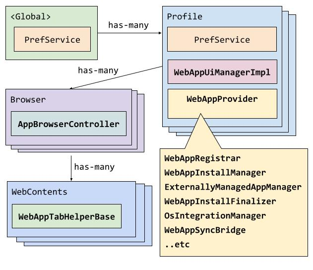

# Web Apps on Desktop

See [presentation slides](https://tinyurl.com/dpwa-architecture-public) about
the WebAppProvider system architecture.

## Debugging

Use `chrome://web-app-internals` (generated
[here](https://source.chromium.org/search?q=WebAppInternalsHandler::BuildDebugInfo))
to inspect internal web app state. Test failures will print this information out
automatically to help with debugging.

The codebase has a number of useful DVLOGs (like in `web_app_command_manager.cc`
and `web_app_lock_manager.cc`). Use the normal vmodule command line args to see
these (e.g. `--vmodule=web_app*=1`).

For developers wanting to test the behavior of the web app itself, Chrome
DevTools Protocol can be used. See
[Instruction of using PWA via CDP](docs/cdp-integration.md).

## Documentation Guidelines

- Markdown documentation (files like this):
  - Contains information that can't be documented in class-level documentation.
  - Answers questions like: What is the goal of a group of classes together? How
    does a group of classes work together?
  - Explains concepts that are used across different files.
  - Should be unlikely to become out-of-date.
    - Any source links should link to a codesearch 'search' page and not the
      specific line number.
    - Avoid implementation details.
- Class-level documentation (documentation in header files):
  - Answers questions like: Why does this class exist? What is the
    responsibility of this class? If this class involves a process with stages,
    what are those stages / steps?
  - Should be updated actively when that given file is changed.
- Documentation inside of methods should only be used to explain the "why" of
  code if it is not obvious.

## What makes up Chromium's implementation?

The task of turning websites into "apps" in the user's OS environment has many
parts to it. Before going into the parts, here is where they live:

See the drawing source
[here](https://docs.google.com/drawings/d/1TqUF2Pqh2S5qPGyA6njQWxOgSgKQBPePKPIH_srGeRk/edit?usp=sharing).

- The `WebAppProvider` core system lives on the `Profile` object.
- The `WebAppUiManager` interface lives on `WebAppProvider` (implemented by
  `WebAppUiManagerImpl` in `chrome/browser/ui/web_applications/` to prevent
  dependency cycles).
- The `AppBrowserController` (typically `WebAppBrowserController` for our
  interests) lives on the `Browser` object.
- The `WebAppTabHelper` lives on the `WebContents` object.

While most on-disk storage is done in the
[`WebAppSyncBridge`](#databases-and-sources-of-truth), the system also sometimes
uses the `PrefService`. Most of these prefs live on the `Profile`
(`profile->GetPrefs()`), but some prefs are in the global browser prefs
(`g_browser_process->local_state()`).

Presentation:
[https://tinyurl.com/dpwa-architecture-public](https://tinyurl.com/dpwa-architecture-public)

Older presentation:
[https://tinyurl.com/bmo-public](https://tinyurl.com/bmo-public)

## Architecture Philosophy

- Tests (especially browser tests / integration tests) should generally operate
  on the [public interface](#usage) as much as possible. Unit tests can touch
  internals where convenient to set up initial state, but generally still test
  the operations via the public interface.
- [External dependencies](#external-dependencies) should be behind fake-able
  interfaces, allowing unit & browser tests to swap these out. However, internal
  parts of our system should not be mocked out or faked - this tightly couples
  the internal implementation to our tests. If it is impossible to trigger a
  condition with the public interface, then that condition should be removed (or
  the public interface improved).
  - See [this presentation](https://www.youtube.com/watch?v=EZ05e7EMOLM) about
    testing that might clarify our approach.

## Usage

The safest way to use the WebAppProvider system is using the
`WebAppCommandScheduler` (via `WebAppProvider::scheduler()`), which serves as an
entry point for operations on the system for safely reading or writing state.
Unsafe state access is available via `WebAppProvider::registrar_unsafe()`, but
this is not guaranteed to be consistent as an async operation could be occurring
at any time (install, uninstall, update, etc).

For information about creating safe read/write operations on the system, see the
[commands README.md](commands/README.md).

## External Dependencies

The goal is to have all of these behind an abstraction that has a fake to allow
easy unit testing of our system. Some of these dependencies are behind a nice
fake-able interface, and some are not (yet).

- **Extensions** - Some of our code still talks to the extensions system,
  specifically the `PreinstalledWebAppManager`.
- **`content::WebContents`**: The WebAppProvider system interacts with
  `content::WebContents` for various tasks like loading URLs (via
  `WebAppUrlLoader`), retrieving web app manifest data and icons (via
  `WebAppDataRetriever` and `WebAppIconDownloader` respectively), and observing
  navigations and destruction. The `WebContentsManager` serves as a centralized
  point of dependency for these interactions and acts as a factory for these
  components, allowing for easier management and faking in tests via the
  `FakeWebContentsManager`.
- **OS Integration**: Each OS integration has fairly custom code on each OS to
  do the operation. The `OsIntegrationManager` and the respective sub-managers
  own this.
- **Sync system**: There is a tight coupling between our system and the sync
  system through the WebAppSyncBridge. Faking this is easy and is handled by the
  `FakeWebAppProvider`.
- **UI**: There are parts of the system that are coupled to UI, like showing
  dialogs, determining information about app windows, etc. These are put behind
  the `WebAppUiManager`, and faked by the `FakeWebAppUiManager`.
- **Policy**: Our code depends on the policy system setting its policies in
  appropriate prefs for us to read. Because we just look at prefs, we don't need
  a "fake" here.

## Databases and Sources of Truth

These store data for our system. Some of it is per-web-app, and some of it is
global.

- **`WebAppRegistrar`**: This attempts to unify the reading of much of this
  data, and also holds an in-memory copy of the database data (in WebApp
  objects).
- **`WebAppDatabase`** / **`WebAppSyncBridge`**: This stores the web_app.proto
  object in a database, which is the preferred place to store information about
  a web app.
- **Icons on disk**: These are managed by the `WebAppIconManager` and stored on
  disk in the user's profile.
- **Prefs**: The `PrefService` is used to store information that is either
  global, or needs to persist after a web app is uninstalled. Most of these
  prefs live on the `Profile` (`profile->GetPrefs()`), but some prefs are in the
  global browser prefs (`g_browser_process->local_state()`). Some users of
  prefs:
  - AppShimRegistry
  - UserUninstalledPreinstalledWebAppPrefs
- **OS Integration**: Various OS integration requires storing state on the
  operating system. Sometimes we are able to read this state back, sometimes
  not.

Accessing any of this information without an applicable 'lock' on the system is
considered unsafe.

## Subsystem Orchestration & Architecture

The **[`WebAppProvider`](web_app_provider.h)** is the per-profile coordinator
housing the desktop PWA engine. Subsystems interact through a unified lifecycle:

1. **Commands & Locks:** All state mutations and asynchronous reads execute as
   `WebAppCommand`s scheduled via `WebAppCommandScheduler`. Commands acquire
   fine-grained locks from `WebAppLockManager` to guarantee mutual exclusion and
   prevent race conditions.
2. **Resource Access:** Once granted a lock, commands access subsystem state
   exclusively via lock resource mixins (e.g. `WithAppResources`).
3. **Persistence & Synchronization:** Changes commit to disk and Chrome Sync via
   `WebAppSyncBridge` / `WebAppDatabase`, which maintains the in-memory
   `WebAppRegistrar` and broadcasts lifecycle events through
   `WebAppInstallManager`.
4. **External Boundaries & Fakes:** To maintain clean architectural layering and
   testability, external dependencies are isolated behind interfaces faked by
   `FakeWebAppProvider`:
   - **UI:** `WebAppUiManager` (implemented in
     `chrome/browser/ui/web_applications/`)
   - **WebContents / Network:** `WebContentsManager`
   - **OS Integration:** `OsIntegrationManager` (shortcuts, file handlers,
     protocol handlers)
   - **Extensions:** `ExtensionsManager` (decouples legacy extension
     dependencies)

## Deep Dives

- [Commands Architecture](commands/README.md)
- [Locking Hierarchy & Deadlock Prevention](locks/README.md)
- [Jobs Architecture](jobs/README.md)
- [Installation Pipeline](docs/installation_pipeline.md)
- [Manifest Representations in Code](docs/manifest_representations.md)
- [Integration Testing Framework](docs/integration-testing-framework.md)
- [OS Integration](docs/os_integration.md)
- [Manifest Update Process](docs/manifest_update_process.md)
- [Isolated Web Apps](docs/isolated_web_apps.md)
- [WebUI Web App](docs/webui_web_app.md)
- [Why is this test failing?](docs/why-is-this-test-failing.md)
- [How to create WebAppIntegration Tests](docs/how-to-create-webapp-integration-tests.md)
- [Navigation Capturing](docs/navigation_capturing.md)
- [Desktop UI Controllers](../ui/web_applications/README.md)
- [Desktop Views UI Dialogs](../ui/views/web_apps/README.md)

## Testing

Please see [testing.md](docs/testing.md).
