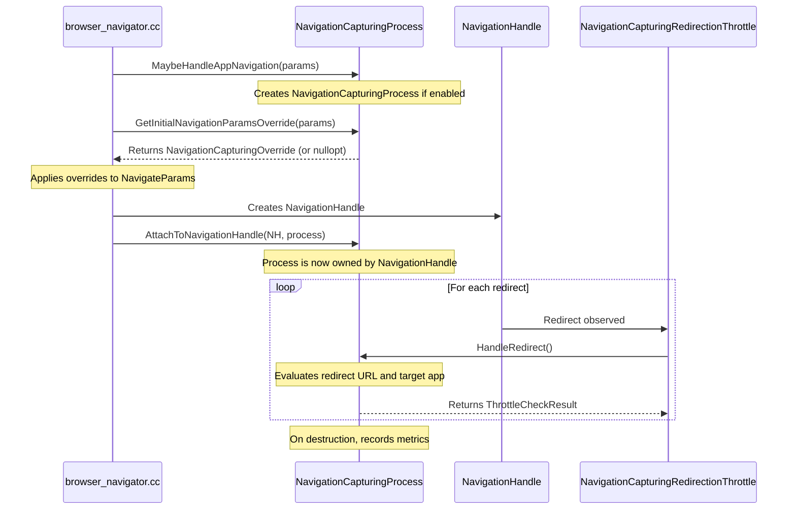

# Navigation Capturing

Navigation Capturing is a system in Chrome that allows web app links and
programmatically triggered navigations to be captured and opened inside an
installed Progressive Web App (PWA) window, instead of opening in a standard
browser tab. It can also focus or navigate existing app windows based on the
app's configuration.

## High-Level Flow

The lifecycle of a captured navigation spans across the navigation framework and
the web applications system:

### 1. Initiation

The process begins in `Navigate()` within
[browser_navigator.cc](https://source.chromium.org/search?q=file:browser_navigator.cc%20function:Navigate).
If the navigation capturing experiment is enabled, it calls
`NavigationCapturingProcess::MaybeHandleAppNavigation()` to determine if this
navigation is a candidate for capturing. If so, it creates a
`NavigationCapturingProcess` instance.

### 2. Initial Decision (`GetInitialNavigationParamsOverride`)

`browser_navigator.cc` calls `GetInitialNavigationParamsOverride()` on the
process. This method evaluates the source of the navigation, the destination
URL, and the target app's launch handler configuration (e.g., `client_mode`). It
returns a `NavigationCapturingOverride` which can specify:

- `NavigateNew`: Open a new app window.
- `NavigateExisting`: Navigate an existing tab in an app window.
- `FocusExisting`: Focus an existing tab/window and enqueue a launch event
  (cancelling the current navigation).
- `Cancel`: Abort the navigation.
- `nullopt`: Do not capture, proceed with normal browser navigation.

The overrides are applied to `NavigateParams`, modifying where the navigation
will land.

### 3. Attachment to Navigation

Once the target `WebContents` is determined (and possibly created), the
`NavigationCapturingProcess` is attached to the `NavigationHandle` using
`NavigationCapturingProcess::AttachToNavigationHandle()` or scheduled to attach
to the next navigation. The process is owned by the navigation handle for its
duration.

### 4. Redirect Handling (`NavigationCapturingRedirectionThrottle`)

During the navigation, the
[NavigationCapturingRedirectionThrottle](https://source.chromium.org/search?q=class:NavigationCapturingRedirectionThrottle)
intercepts redirects. It calls `HandleRedirect()` on the attached
`NavigationCapturingProcess`. Because redirects can change the origin of the
navigation (moving in or out of the app's scope), the process must re-evaluate
whether the navigation should still be captured by the initial app, a different
app, or not at all. It can return `PROCEED`, `DEFER`, or `CANCEL` (and initiate
a new navigation to the redirect target in an app window).

### 5. Completion and Post-Navigation

Upon successful navigation, the process sets up
`WebAppLaunchNavigationHandleUserData` on the navigation handle. This data is
used to:

- Trigger the Web App Launch Queue (`window.launchQueue`).
- Show In-Product Help (IPH).
- Record launch metrics.

On destruction of `NavigationCapturingProcess`, metrics are recorded detailing
the outcome of the initial capture and redirection.

## Key Classes

- **[NavigationCapturingProcess](https://source.chromium.org/search?q=class:NavigationCapturingProcess)**:
  Coordinates the capturing logic, stores state about the navigation, and makes
  decisions at the start and during redirects.
- **[NavigationCapturingSettings](https://source.chromium.org/search?q=class:NavigationCapturingSettings)**:
  Manages the settings and preferences (like user choices) that control whether
  capturing is enabled for specific apps/origins.
- **[WebAppLaunchNavigationHandleUserData](https://source.chromium.org/search?q=class:WebAppLaunchNavigationHandleUserData)**:
  Holds metadata about the launch to be used by the page after it loads.

## Navigation Throttles in Web Apps

Several `content::NavigationThrottle` implementations exist to route links and
navigations for web apps. Their enablement status on Stable varies by platform
and feature flags:

- **[NavigationCapturingRedirectionThrottle](https://source.chromium.org/search?q=class:NavigationCapturingRedirectionThrottle)**:
  Handles the redirection phase of the navigation capturing flow, working in
  tandem with `NavigationCapturingProcess`.

  - *Status*: **Enabled by default on Windows, Mac, and Linux** (via the
    `kPwaNavigationCapturing` flag). **Disabled by default on ChromeOS** (the
    default state is set to off, but can be enabled by user preference or
    settings).

- **[ChromeOsReimplNavigationCapturingThrottle](https://source.chromium.org/search?q=class:ChromeOsReimplNavigationCapturingThrottle)**:
  A ChromeOS-specific throttle that implements parts of the navigation capturing
  reimplementation that are not covered by `NavigationCapturingProcess`.

  - *Status*: **Enabled by default on ChromeOS** (when `kPwaNavigationCapturing`
    is active).

- **[TabbedWebAppNavigationThrottle](https://source.chromium.org/search?q=class:TabbedWebAppNavigationThrottle)**:
  Handles navigation routing specifically inside tabbed web apps (e.g., ensuring
  links clicked in a pinned home tab open in a new app tab instead of replacing
  the home tab).

  - *Status*: **Enabled by default on ChromeOS**. **Disabled by default on
    Windows, Mac, and Linux** (depends on the experimental
    `kDesktopPWAsTabStrip` feature).

- **[WebUIWebAppNavigationThrottle](https://source.chromium.org/search?q=class:WebUIWebAppNavigationThrottle)**:
  Assists WebUI-based web apps in routing navigations to the correct tabs.

  - *Status*: **Enabled by default on all platforms** (unconditional, runs for
    WebUI web apps).

## Testing

Browser tests for navigation capturing are located in:

- [web_app_navigation_capturing_browsertest_base.h/cc](https://source.chromium.org/search?q=file:web_app_navigation_capturing_browsertest_base.cc)
- Specific test suites like
  `navigation_capturing_browser_navigator_browsertest.cc`,
  `navigation_capturing_forced_off_browsertest.cc`,
  `web_app_link_capturing_parameterized_browsertest.cc`, etc., in
  `chrome/browser/web_applications/`.

These tests verify capturing behavior across various combinations of:

- Link click modifiers (e.g., Shift-Click, Ctrl-Click).
- `target` attributes (`_self`, `_blank`).
- Launch handler settings (`client_mode`).
- Redirects (same-origin, cross-origin).
