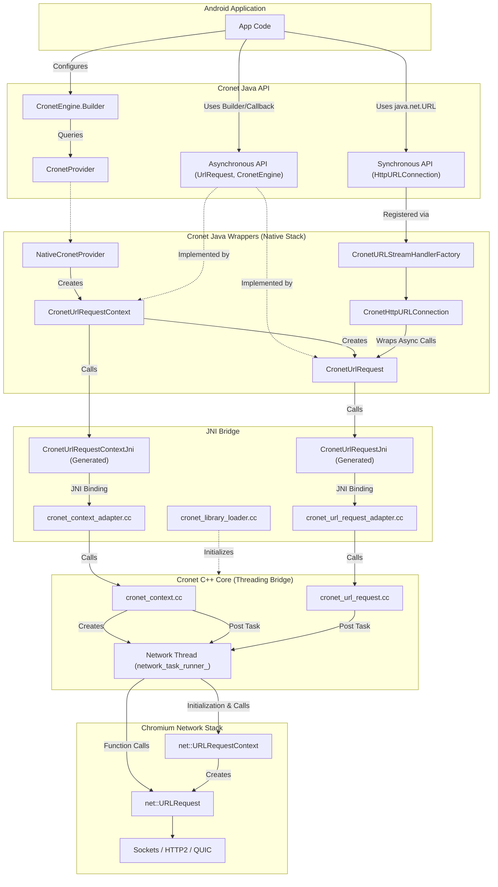
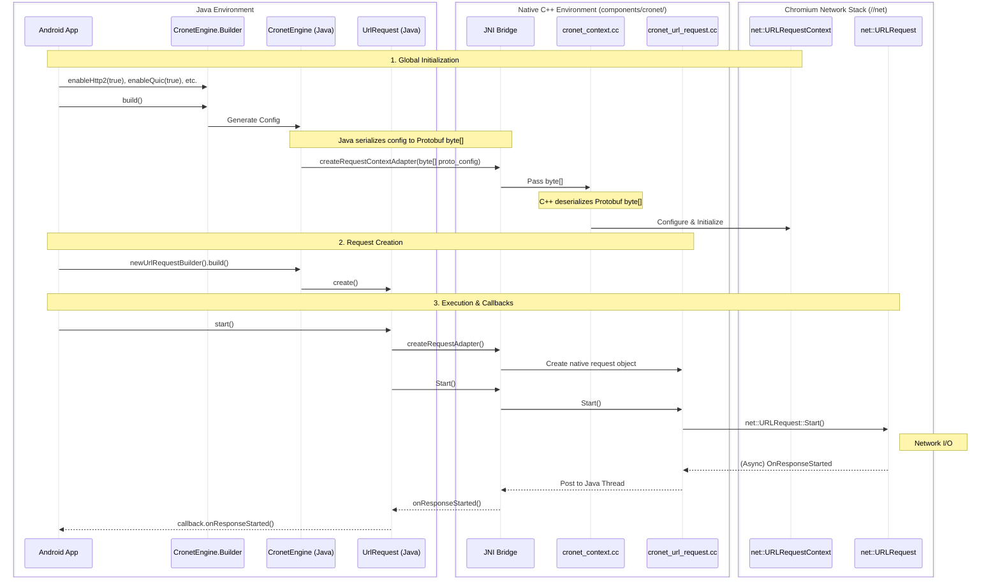

# Cronet Project Overview

**Cronet** is the networking stack of Chromium extracted into a library for use
on Android. It is the same networking stack used in the Chrome browser and
provides an easy-to-use, high-performance, standards-compliant, and secure way
to perform HTTP requests. The project utilizes a mix of C++ for the core
networking functionality and Java for Android integration and API exposure. It
also supports QUIC natively.

## Architecture

Cronet's architecture is a layered design that bridges Android's Java
environment with Chromium's high-performance native C++ network stack.

### Architecture Layers

1. **Android Application Layer**
   - The user's application code that integrates the Cronet library.

2. **Cronet Java API (`components/cronet/android/api/`)**
   - **Role:** Exposed interfaces for developers.
   - **`CronetProvider`:** A discovery class used by the `Builder` to find
     available implementations.
   - **Asynchronous API (`UrlRequest`, `CronetEngine`):** The primary,
     highly-performant API where requests are built and responses are handled
     asynchronously via `UrlRequest.Callback`.
   - **Synchronous/Standard API (`HttpURLConnection`):** Cronet provides an
     implementation of the standard `java.net.HttpURLConnection`. Developers can
     use it for individual connections via `engine.openConnection(url)` or
     globally by calling
     `URL.setURLStreamHandlerFactory(engine.createURLStreamHandlerFactory())`.
     This allows apps tightly coupled to the standard Java API to use Cronet
     with minimal code changes.

3. **Cronet Java Wrappers (Native Stack) (`components/cronet/android/java/`)**
   - **Role:** The internal Java wrappers and implementation selection logic.
   - **Engine Discovery & Selection:** Cronet uses a **Service Locator** pattern
     to discover available networking stacks. The `CronetEngine.Builder` queries
     `CronetProvider` (API layer), which uses **reflection** to find and
     instantiate implementation providers in the `org.chromium.net.impl`
     package.
   - **Implementation Selection:** It selects the best provider based on a score
     or version. The default providers are:
     1. **Custom Provider (Score 6):** An optional provider dynamically loaded
        only if the `CronetProviderClassName` string resource exists within the
        integrating app.
     2. **`NativeCronetProvider` (Score 5):** The high-performance Chromium
        network stack. Returns provider name `App-Packaged-Cronet-Provider`.
     3. **`HttpEngineNativeProvider` (Score 4/2):** A wrapper for the Android
        Platform's `android.net.http.HttpEngine`. Returns provider name
        `HttpEngine-Native-Provider`.
     4. **`PlayServicesCronetProvider` (Score 3):** Used when Cronet is provided
        by Google Play Services (loaded via reflection, not in Cronet tree).
     5. **`GmsCoreCronetProvider` (Score 3):** Deprecated provider for older
        versions of Google Play Services.
     6. **`JavaCronetProvider` (Score 1):** A pure Java fallback implementation
        using `java.net.HttpURLConnection`. Returns provider name
        `Fallback-Cronet-Provider`.
   - **Core Implementation Classes:**
     - **`CronetUrlRequestContext`:** The primary implementation that uses JNI
       to bridge to the C++ core.
     - **`CronetUrlRequest`:** The implementation of the asynchronous
       `UrlRequest` for the native stack.
     - **`CronetHttpURLConnection`:** Provides `java.net.HttpURLConnection`
       compatibility by wrapping asynchronous engines and blocking to simulate
       synchronous behavior.
     - **`CronetURLStreamHandlerFactory`:** Used to register Cronet as the
       handler for `java.net.URL` connections.

4. **JNI Bridge (`components/cronet/android/`)**
   - **Role:** Translates Java method calls into native C++ calls.
   - **Java Interfaces:** Core classes like `CronetUrlRequestContext` and
     `CronetUrlRequest` define an internal interface named `Natives` annotated
     with `@NativeMethods`. This interface declares the signatures of the native
     functions.
   - **Generated Java Stubs (`jni_zero`):** During compilation, helper classes
     are automatically generated that implement the `Natives` interface:
     `CronetUrlRequestContextJni` and `CronetUrlRequestJni`. The Java
     implementation routes calls through these classes (e.g.,
     `CronetUrlRequestContextJni.get().<method>`).
   - **C++ Adapters:** These generated JNI calls map directly to specific C++
     adapter files:
     - `CronetUrlRequestContextJni` maps to `cronet_context_adapter.cc`.
     - `CronetUrlRequestJni` maps to `cronet_url_request_adapter.cc`.
   - These C++ adapter files then translate the JNI types and call into the
     **Cronet C++ Core** classes.

5. **Cronet C++ Core (`components/cronet/`)**
   - **Role:** The C++ implementation that bridges the Java JNI layer to the
     Chromium `//net` stack. Its primary role is to **encapsulate Chromium's
     threading model**, ensuring that concurrent Java calls are safely
     serialized onto the native network thread.
   - **`cronet_context.cc` (`cronet::CronetContext`):**
     - **Context Management:** Manages a pool of `net::URLRequestContext`
       instances.
     - **Threading:** Spawns and manages the dedicated **Network Thread** (named
       `CronetNet`, an IO-type thread) and a **File Thread** (`CronetFile`). It
       exposes a `base::SingleThreadTaskRunner` (`network_task_runner_`) that
       acts as the entry point for all native tasks.
     - **`NetworkTasks` Pattern:** Uses a nested `NetworkTasks` class to execute
       all heavy `//net` operations (like context initialization and NQE
       management) safely on the Network Thread.
     - **Persistence:** Coordinates `CronetPrefsManager` and
       `HostCachePersistenceManager` to save/load networking state (cookies, NQE
       estimates, etc.) to disk.
   - **`cronet_url_request.cc` (`cronet::CronetURLRequest`):**
     - **Request Lifecycle:** Wraps the Chromium `net::URLRequest` and
       implements the state machine for individual HTTP requests.
     - **Thread Bridging:** Acts as a thread-safe proxy. It receives commands
       from Java (via JNI) on various threads and dispatches them to the Network
       Thread using the `CronetContext`'s task runner and its own `NetworkTasks`
       helper.
     - **Metrics Collection:** Captures detailed `net::LoadTimingInfo` and
       populates `net::NetErrorDetails` to be reported back to the Java layer.
   - **`url_request_context_config.cc`:** Responsible for parsing the complex
     Protobuf-based configuration and applying it to the
     `net::URLRequestContextBuilder`.

6. **Chromium Net Stack (`//net`)**
   - **Role:** The core networking engine of Chromium, performing the actual
     HTTP/2, QUIC, TCP, and UDP operations.

### Other Components

- **`components/cronet/tools/`** 
  Python scripts for building (`cr_cronet.py`), testing, and managing the
  project.

- **`components/cronet/testing/`** 
  Unit tests for the Python tools (NOT for the Cronet library itself).

- **`components/cronet/proto/`** 
  Protobuf structures used to serialize `CronetEngine` configurations in Java
  and safely pass them across the JNI boundary to the C++ core.

- **Sample App (`components/cronet/android/sample/`)** 
  A functional sample APK that demonstrates how to use Cronet Java API.

- **Tests (`components/cronet/android/test/`)** 
  Extensive test suites for Android. Includes Java API tests (`javatests`),
  benchmarks (`javaperftests`), smoketests, Java mocking/server utilities
  (`src/`), and C++ server utilities (`test_server/` and root `test/`).

### Typical Call Flow

This sequence diagram illustrates the core lifecycle of using the Cronet
asynchronous Java API, demonstrating where global configuration and request
execution occur.

## Building and Testing

Build and test instructions are maintained in dedicated documentation files.
Agents must use these as the primary source of truth while remaining aware of
the local execution environment.

- **Build Instructions:** See [build_instructions.md](build_instructions.md).
- **Test Instructions:** See [test_instructions.md](test_instructions.md).

### AI Guidelines for Building and Testing

1.  **Environment Awareness:** Before executing any shell commands, identify if
    you are in a managed environment (e.g., Cider-V). If so, **do not** run raw
    `autoninja` or `cr_cronet.py` commands; instead, use the environment's
    built-in build/test tools or APIs.
2.  **Output Directory (`<out_dir>`)**: Some documentation uses the `<out_dir>`
    placeholder. You should determine the correct directory by inspecting the
    `out/` directory (e.g., `out/Debug-arm64`).
3.  **Verification**: Always verify the build or test target existence within
    the `BUILD.gn` files before attempting to run it.

## Coding Style

As a component of the larger Chromium project, Cronet adheres strictly to
Chromium's established coding standards. Before submitting any code, ensure your
changes comply with the following guidelines:

- **C++**: Follows the [Google C++ Style
  Guide](https://google.github.io/styleguide/cppguide.html), with a few
  [Chromium-specific
  rules](https://chromium.googlesource.com/chromium/src/+/main/styleguide/c++/c++.md)
  (e.g., using `base::` utilities like `base::Bind` and `base::OnceCallback`
  instead of standard library equivalents where specified).
- **Java**: Follows the [Chromium Java Style
  Guide](https://chromium.googlesource.com/chromium/src/+/main/styleguide/java/java.md),
  which is heavily based on the Google Java Style Guide.
- **Python**: Used primarily for tooling (`components/cronet/tools/`). Follows
  [PEP 8](https://peps.python.org/pep-0008/) and the [Chromium Python Style
  Guide](https://chromium.googlesource.com/chromium/src/+/main/styleguide/python/python.md).
- **Build Files (GN)**: `BUILD.gn` and `.gni` files must be formatted using the
  built-in formatter. Run `gn format <filename>` to automatically format them.

**Pre-upload Checks:** Chromium uses `git cl` for code review. When you run `git
cl upload`, a series of presubmit scripts (configured in `PRESUBMIT.py`) will
automatically run linting and formatting checks (e.g., `clang-format` for
C++/Java, `yapf` for Python) to ensure your code matches these conventions. You
can manually format your code before uploading using `git cl format`.
