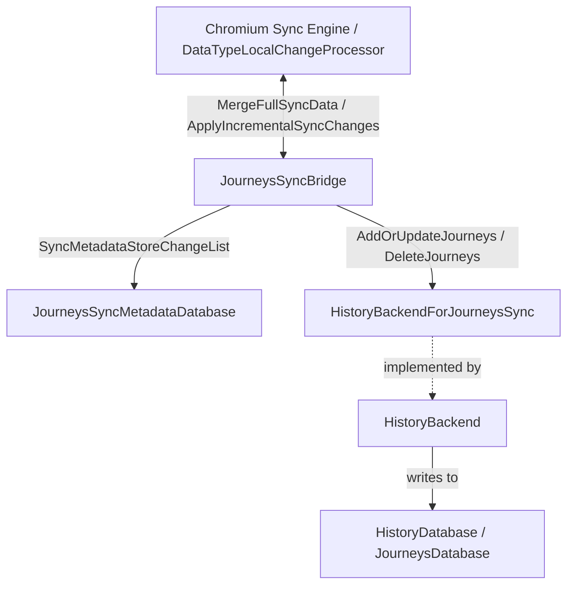
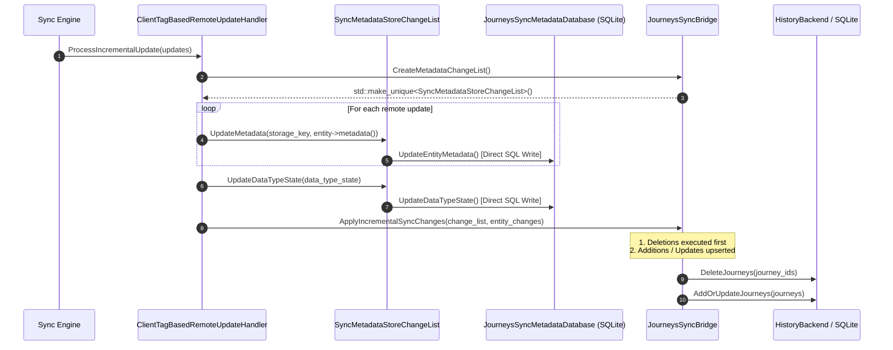

# History Journeys Component

The `journeys` directory manages client-side storage, synchronization, and query execution for Chrome Journeys (user history clusters) synchronized across devices via Chrome Sync using the `syncer::JOURNEY` data type.

## Architecture Overview

The Journeys subsystem consists of three major layers:
1. **Sync Bridge (`JourneysSyncBridge`)**: Subclasses `syncer::DataTypeSyncBridge` to interface with the Chrome Sync machinery. Operates as a **read-only / downstream** consumer (client commits back to sync are not currently supported).
2. **Metadata Store (`JourneysSyncMetadataDatabase`)**: Implements `syncer::SyncMetadataStore` to store sync progress markers (`DataTypeState`) and per-entity metadata (`EntityMetadata`) in SQLite.
3. **Storage & Backend (`JourneysDatabase` & `HistoryBackendForJourneysSync`)**: SQLite tables storing journey records, visit timestamps, and query suggestions. Decoupled from the sync bridge via the `HistoryBackendForJourneysSync` interface for modularity and unit testing.

### Threading Model
All classes in this directory (`JourneysSyncBridge`, `JourneysDatabase`, and `JourneysSyncMetadataDatabase`) run exclusively on the background history sequence (`base::SequencedTaskRunner`), guarded by `DCHECK_CALLED_ON_VALID_SEQUENCE`. Sync communication from the UI thread is mediated via a `ProxyDataTypeControllerDelegate`.

## SQLite Tables

| Table | Description |
|---|---|
| `journeys` | Core journey metadata (ID, title, timestamps, emoji, overview). |
| `journey_history_entries` | Clustered junction table (`WITHOUT ROWID`) linking visits to journeys. |
| `journey_continuation_queries` | Suggested search queries associated with a journey. |
| `journey_sync_metadata` | Syncer metadata store (`DataTypeState` and `EntityMetadata`). |

## Sync Remote Update Flow

When new or updated journeys arrive from the Sync server, mutations follow a two-tier execution pipeline:

### Key Lifecycle & Design Characteristics
- **Immediate Metadata Persistence**: Because `JourneysSyncBridge::CreateMetadataChangeList()` produces a `SyncMetadataStoreChangeList`, calls from the sync processor to `UpdateMetadata()` and `UpdateDataTypeState()` execute immediate SQL `INSERT OR REPLACE` operations directly into `JourneysSyncMetadataDatabase` while the processor processes incoming updates.
- **Entity Ingestion (`ApplyIncrementalSyncChanges`)**:
  - Protobuf `sync_pb::JourneySpecifics` payloads are converted into native `JourneyRow` structs via `JourneyRowFromSpecifics`.
  - The sync processor squashes per-entity changes, and updates/deletions are ingested against the backend.
  - Additions and updates are grouped into a single batch upsert passed to `backend_->AddOrUpdateJourneys()`.
- **Full Sync Merge (`MergeFullSyncData`)**: Directly applies initial sync records via `ApplyIncrementalSyncChanges()` since no data originates locally and there is nothing to merge.
- **Read-Only Operation**: `GetDataForCommit()` is `NOTREACHED()` because local mutations are not sent back to sync. `GetAllDataForDebugging()` is provided for diagnostic inspection in `chrome://sync-internals`.
- **Sync Teardown (`ApplyDisableSyncChanges`)**: Wipes persisted entity metadata, datatype state, and all local journey rows from the database when the user disables sync or signs out.
- **Error Recovery (`OnDatabaseError`)**: Resets internal database raw pointers and immediately notifies the sync processor with `ModelError` to avoid dangling references on SQLite corruption or I/O failure.
