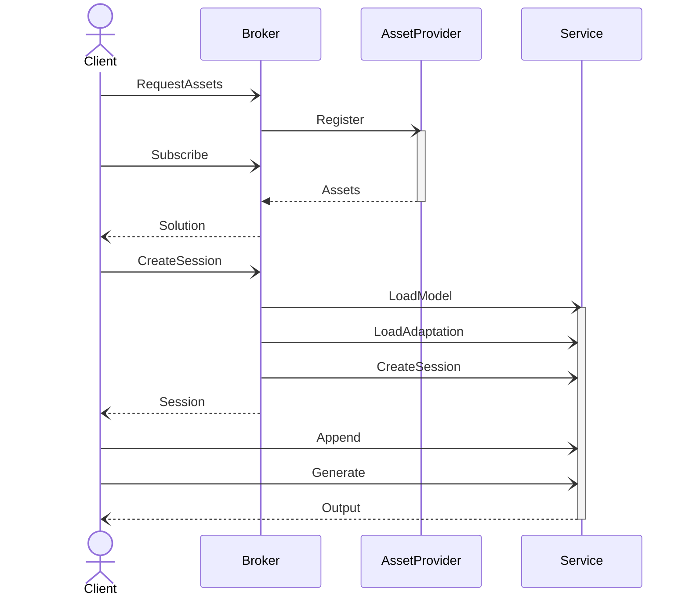
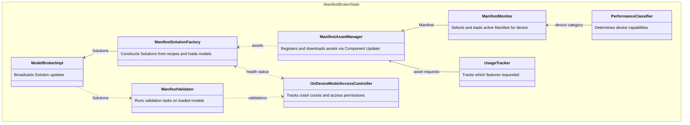
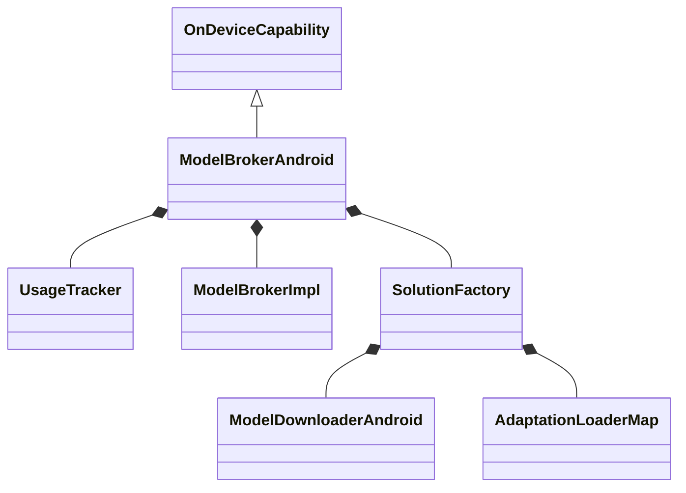
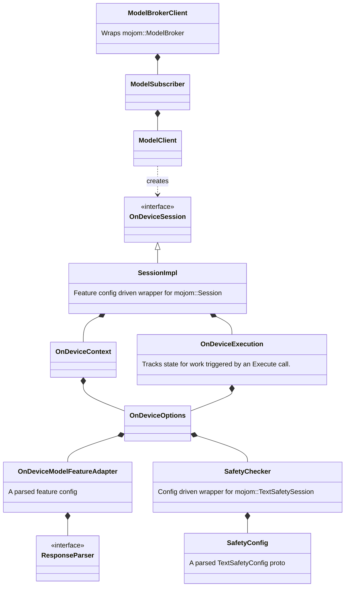

# On-Device Model Execution overview

This directory defines the OnDeviceCapability API, it's implementations, and
utility objects and methods for working with it. This API allows the use of
shared on-device models, and the code here manages download of assets and
instantiation of shared model resources.

There are 4 major participants in the logic here:

1.  The Client that wants to use the model. This directory also provides wrapper
    objects that act on behalf of the Client. This code may run in any process.

2.  The Broker, which the client initiates usage with. This code runs in the
    browser process, and there are different implementations on different
    platforms.

3.  The AssetProviders, which the broker uses to download models and configs.
    Different implementations use different providers.

4.  The Service, which the broker direct to load models into memory.

# Desktop Broker

The desktop implementation uses a manifest-based broker architecture
(`ManifestBroker`). It uses the `on_device_model` service utility process (see
`//services/on_device_model`) as its Service (via `ServiceClient`) and gets
Assets from the Chrome Component Updater via `ManifestAssetManager::Delegate`.

In this architecture, available models, adaptations, safety models, and solution
configurations are specified in a centralized Manifest proto
(`manifest.binarypb`), which is downloaded as a component (or can be overridden
for local development).

The main implementation class is `ManifestBrokerState`, which composes several
parts:

*   **`ManifestBrokerState`**: Implements `OnDeviceCapability` and
    `mojom::ModelBrokerDebug`, wiring together the manifest monitor, asset
    manager, solution factory, usage tracker, performance classifier, and broker
    implementation.
*   **`ManifestMonitor`**: Listens for manifest component updates, checks
    available disk space, and selects and loads the `Manifest` for the device's
    category.
*   **`PerformanceClassifier`**: Evaluates device performance and capabilities
    (e.g. GPU or CPU performance tiers) to inform the `ManifestMonitor` and
    verify feature eligibility.
*   **`UsageTracker`**: Tracks which features and use cases are requested by
    clients to trigger on-demand asset downloads.
*   **`OnDeviceModelAccessController`**: Tracks safety/performance/crash state
    and access permissions (e.g. GPU blocking or model crash limits).
*   **`ManifestAssetManager`**: Coordinates with the Component Updater via
    `ManifestAssetManager::Delegate` to register, download, update, and
    uninstall on-demand model and adaptation assets based on active use cases
    and disk space constraints. Also manages download progress.
*   **`ManifestSolutionFactory`**: Instantiated when a new manifest is loaded.
    Consumes asset state updates from `ManifestAssetManager`, evaluates recipes
    (base models, adaptations, safety models, solutions) for supported use
    cases, loads solution configs, and loads models into the `on_device_model`
    service. Emits `Solution` updates to `ModelBrokerImpl`.
*   **`ModelBrokerImpl`**: Manages solution providers, handles mojo bindings for
    `mojom::ModelBroker`, and broadcasts `Solution` updates to clients.
*   **`ManifestValidator`**: Executes validation tasks defined in the manifest
    on loaded models to verify on-device model execution.
*   **`ServiceClient`**: Manages the lifecycle of and IPC communication with the
    `on_device_model` service utility process.

# Android Broker

The android implementation uses AICore as the Service, and as the AssetProvider.
It downloads additional assets from optimization_guide::ModelProvider. The main
class is ModelBrokerAndroid, which is analogous to ManifestBrokerState. Chrome
will download and own feature configs that match the models found in AICore.

Android:

# Client

Several objects are provided for working with
optimization_guide::mojom::ModelBroker and on_device_model::mojom::Sessions mojo
objects. These objects act in the "Client" space and generally provide state
management and config-driven behaviors.

Client:

