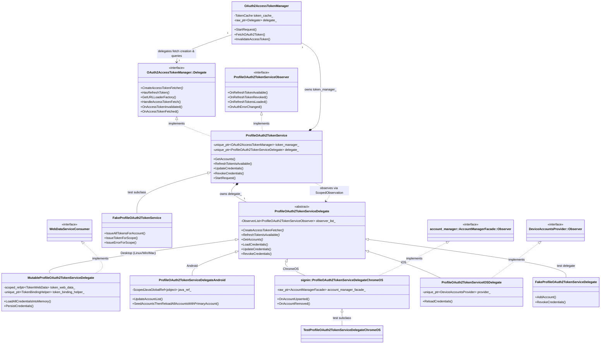

# ProfileOAuth2TokenService Architecture

Freshness: 2026-09-02

## Overview
[`ProfileOAuth2TokenService`](../profile_oauth2_token_service.h) is the central coordinator for OAuth2 token management in Chromium. It manages the lifecycle of long-lived OAuth2 refresh tokens and short-lived access tokens across all Google accounts in a Profile.

The service decouples token caching and network fetch scheduling ([`OAuth2AccessTokenManager`](../../../../../google_apis/gaia/oauth2_access_token_manager.h)) from platform-specific credential storage and synchronization backends ([`ProfileOAuth2TokenServiceDelegate`](../profile_oauth2_token_service_delegate.h)).

---

## Architectural Breakdown

### 1. Access Token Layer ([`OAuth2AccessTokenManager`](../../../../../google_apis/gaia/oauth2_access_token_manager.h))
- **Role**: Handles access token caching, request multiplexing, in-flight request batching, and exponential backoff retry logic.
- **Contract**: Relies on [`OAuth2AccessTokenManager::Delegate`](../../../../../google_apis/gaia/oauth2_access_token_manager.h) to:
  - Query refresh token availability (`HasRefreshToken`).
  - Create platform-appropriate access token fetchers ([`OAuth2AccessTokenFetcher`](../../../../../google_apis/gaia/oauth2_access_token_fetcher.h)).
  - Retrieve the appropriate `network::SharedURLLoaderFactory`.
  - Receive diagnostic notifications on token fetch successes, failures, and invalidations.

### 2. Service Coordination Layer ([`ProfileOAuth2TokenService`](../profile_oauth2_token_service.h))
- **Role**: Encapsulates token management for an individual browser profile.
- **Composition**:
  - Owns `token_manager_` ([`OAuth2AccessTokenManager`](../../../../../google_apis/gaia/oauth2_access_token_manager.h)) for access token orchestration.
  - Owns `delegate_` ([`ProfileOAuth2TokenServiceDelegate`](../profile_oauth2_token_service_delegate.h)) for refresh token persistence and platform integration.
- **Interface Implementations**:
  - Implements [`OAuth2AccessTokenManager::Delegate`](../../../../../google_apis/gaia/oauth2_access_token_manager.h) to forward access token creation and token queries to `delegate_`.
  - Implements [`ProfileOAuth2TokenServiceObserver`](../profile_oauth2_token_service_observer.h) to listen to refresh token events from `delegate_` and notify profile-level observers (including `IdentityManager`).

### 3. Platform Delegation Layer ([`ProfileOAuth2TokenServiceDelegate`](../profile_oauth2_token_service_delegate.h))
- **Role**: Abstract base class providing the interface for refresh token lifecycle operations (`LoadCredentials`, `UpdateCredentials`, `RevokeCredentials`, `GetAccounts`).
- **Observer Notification**: Maintains an internal `base::ObserverList<ProfileOAuth2TokenServiceObserver>` to broadcast token availability, revocation, and authentication error changes.
- **Concrete Subclasses**:
  - [`MutableProfileOAuth2TokenServiceDelegate`](../mutable_profile_oauth2_token_service_delegate.h) *(Desktop: Linux, Windows, macOS)*:
    - Persists encrypted refresh tokens to SQLite `TokenWebData` using `WebDataServiceConsumer`.
    - Coordinates with [`TokenBindingHelper`](../token_binding_helper.h) for device-bound sessions and hardware-backed keys.
    - Monitors network state transitions via `NetworkConnectionTracker::NetworkConnectionObserver`.
  - [`ProfileOAuth2TokenServiceDelegateAndroid`](../profile_oauth2_token_service_delegate_android.h) *(Android)*:
    - Interfaces directly with the Android OS AccountManager through JNI (`ScopedJavaGlobalRef<jobject>`).
    - Uses system-level accounts and token broker APIs.
  - [`signin::ProfileOAuth2TokenServiceDelegateChromeOS`](../profile_oauth2_token_service_delegate_chromeos.h) *(ChromeOS)*:
    - Synchronizes with ChromeOS system accounts via `account_manager::AccountManagerFacade::Observer`.
    - Handles account additions, removals, and persistent errors across ChromeOS user sessions.
  - [`ProfileOAuth2TokenServiceIOSDelegate`](../profile_oauth2_token_service_delegate_ios.h) *(iOS)*:
    - Bridges to iOS platform Single Sign-On (SSO) identities by observing `DeviceAccountsProvider`.

### 4. Observer Interface ([`ProfileOAuth2TokenServiceObserver`](../profile_oauth2_token_service_observer.h))
- **Role**: `base::CheckedObserver` interface allowing services (notably `ProfileOAuth2TokenService` and embedders) to monitor the availability, invalidation, and error states of refresh tokens across all accounts in a profile.
- **Key Events**:
  - `OnRefreshTokenAvailable(account_id)`: Dispatched when a login-scoped refresh token is loaded or updated for an account. Once available, callers may mint access tokens. Any pending access token fetch requests are canceled and must be retried.
  - `OnRefreshTokenRevoked(account_id)`: Dispatched when a refresh token is explicitly revoked or removed.
  - `OnRefreshTokensLoaded()`: Dispatched once during startup after initial credentials have been loaded from persistent storage or system brokers.
  - `OnEndBatchChanges()`: Guarantees batch grouping for multiple token updates (every `OnRefreshTokenAvailable` and `OnRefreshTokenRevoked` is guaranteed to be grouped within a batch).
  - `OnAuthErrorChanged(account_id, auth_error, source)`: Dispatched when an account encounters or clears a persistent authentication error (e.g. invalid grant or bad credentials), distinct from token revocation.
  - *iOS Platform Events*: `OnAccountsOnDeviceChanged()` and `OnAccountOnDeviceUpdated(account_info)` dispatch platform SSO device changes.

### 5. Testing Infrastructure
- [`FakeProfileOAuth2TokenService`](../fake_profile_oauth2_token_service.h): Subclass of `ProfileOAuth2TokenService` designed for unit tests. Allows tests to synchronously or asynchronously complete access token fetches, inspect pending requests, and inject mock credentials.
- [`FakeProfileOAuth2TokenServiceDelegate`](../fake_profile_oauth2_token_service_delegate.h): In-memory delegate fake allowing tests to simulate token additions, updates, revocations, and auth error states without disk I/O or platform dependencies.
- [`TestProfileOAuth2TokenServiceDelegateChromeOS`](../test_profile_oauth2_token_service_delegate_chromeos.h): Specialization of the ChromeOS delegate for browser tests and mock account environments.
