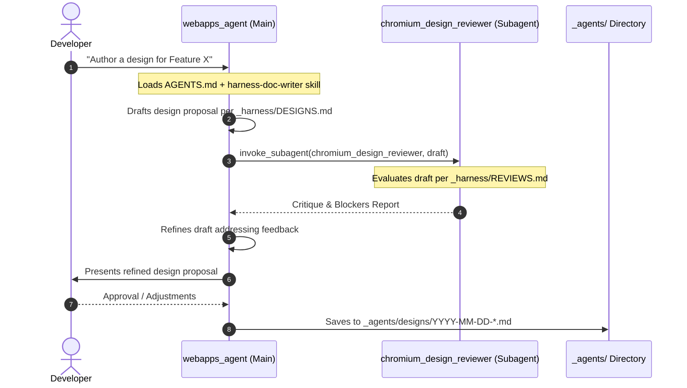

<!--
**Agent Preamble:**
> **CRITICAL:** Before reading this design or writing any code, you MUST read
> the project's AGENTS.md (if it exists).

**Execution Plans:**
*   [MVP Plan](../plans/2026-08-25-webapps-ai-harness-mvp-plan.md)
-->

# Design: WebApps AI Agent Harness MVP

## 1. Context and Goals

### Problem Formulation

Chromium developers lack a standardized, component-grounded AI Harness for
authoring technical designs, execution plans, adversarial design reviews, code
diff reviews, and enforcing component-specific architecture and style
boundaries.

Early prototype iterations demonstrated two key failure modes:

1. **Configuration Drift and Duplication:** Duplicating task personas (e.g.
   reviewers, planners) and rule checklists across individual component
   directories created massive maintenance overhead.
2. **Premature Repository-Wide Pollution:** Attempting to place universal
   harness infrastructure directly into the shared root `agents/` directory in a
   first patch risks conflicting with existing, established Chromium agent
   configurations and complicates iteration before the harness model is proven
   in production.

### Background

This design establishes a standardized, layered AI Agent Harness architecture
tailored to Chromium's open-source Git/Gerrit development workflow. It
establishes a pilot implementation for the Web Applications subsystem
(`components/webapps/` and its satellite spokes).

### Goals

1. **Self-Contained First CL:** Scope the entire initial change to
   `components/webapps/_agents/` and its parent `AGENTS.md`, leaving the
   repository's root `agents/` untouched (referencing pre-existing templates and
   prompts rather than modifying them).
2. **Quarantined Reusable Harness Layer:** Place all reusable, repo-agnostic
   harness machinery (templates, dispatcher rules, core personas, doc-writer and
   updater skills) in `components/webapps/_agents/_harness/`, ready for clean
   promotion to top-level `agents/` once vetted.
3. **Streamlined Personas (2 Personas):**
   - **`chromium_code_reviewer`**: Read-only Senior Software Engineer performing
     code diff reviews.
   - **`chromium_design_reviewer`**: Skeptical Architect performing adversarial
     reviews of proposed technical designs and execution plans, delegating its
     evaluation criteria strictly to `REVIEWS.md`.
4. **Streamlined Skills (2 Skills):**
   - **`harness-doc-writer`**: Orchestrates document drafting by the driving
     agent (e.g., `webapps_agent`), delegating adversarial critique to
     `chromium_design_reviewer` in a multi-round refinement loop.
   - **`harness-updater`**: Performs link integrity audits, rule freshness
     verification, and rule extraction from code review feedback.
5. **Canonical Documentation as Single Source of Truth:** Harness rules must act
   as thin, curated pointers to authoritative Chromium documentation
   (`docs/security/mojo.md`, `styleguide/c++/c++.md`,
   `docs/threading_and_tasks.md`, `base/containers/README.md`,
   `components/webapps/README.md`, `chrome/browser/web_applications/README.md`)
   rather than paraphrasing or duplicating codebase knowledge.
6. **End-to-End Testable Vertical Slices:** Structure execution planning
   (`PLANS.md`) around severable, demonstrable "steel threads" where each
   milestone corresponds to a single reviewable Gerrit CL with observable
   validation criteria.
7. **Zero-Config Context Grounding:** Support native directory walk-up discovery
   via `AGENTS.md` so that AI assistants editing webapps files immediately
   ingest domain context and architectural boundaries.

### Non-Goals

- **Modifying Global `agents/` in MVP:** Global promotion of universal skills or
  rules to root `agents/` is deferred to a subsequent milestone after the pilot
  is validated.
- **Component Bootstrapper Skill (`harness-bootstrap`) in MVP:** Automated
  scaffolding of new project hubs is deferred until a second component is
  onboarded.
- **Central Harness Catalog (`HARNESS_INDEX.md`) in MVP:** Directory catalogs
  are deferred until multiple component harnesses exist.
- **Separate Generator (`planner`) Persona:** The driving agent authors drafts
  directly; a separate generator subagent is not required.
- **Server-Side CI/Gerrit Integration:** Local developer workflow only;
  automated bot reviews on Gerrit are out of scope.

______________________________________________________________________

## 2. Proposed Architecture

### Directory Hierarchy & Layering

```
src/
└── components/webapps/
    ├── AGENTS.md                          # Front door entrypoint & rules
    ├── docs/                              # Canonical human documentation
    └── _agents/                           # Project Pilot Hub
        ├── CODE_STRUCTURE.md              # Spatial map (links docs/ & READMEs)
        ├── DEPENDENCIES.md                # Boundaries (links BUILD.gn & DEPS)
        ├── agents.json                   # Registers webapps + harness personas
        ├── skills.json                   # Registers webapps + harness skills
        ├── agents/                       # Custom personas (Markdown)
        │   └── webapps_agent.md          # Primary project assistant persona
        ├── skills/webapps-harness/       # Domain context loader skill
        │   └── SKILL.md
        ├── designs/                      # WebApps project design docs
        ├── plans/                        # WebApps project execution plans
        │
        └── _harness/                     # Reusable Harness Infrastructure
            ├── README.md                  # Overview & promotion roadmap
            ├── AGENTS.md                  # Universal guidelines (C++, Mojo)
            ├── DESIGNS.md                # Design doc template & requirements
            ├── PLANS.md                  # Exec plan template & requirements
            ├── REVIEWS.md                # Review spec & critique dimensions
            ├── agents.json               # Harness personas manifest
            ├── agents/                   # Reusable review personas
            │   ├── chromium_code_reviewer.md # Code reviewer persona
            │   └── chromium_design_reviewer.md # Skeptical architect persona
            ├── skills.json               # Manifest registering harness skills
            ├── skills/                   # Reusable harness skills
            │   ├── harness-doc-writer/   # Authoring & review workflow
            │   │   └── SKILL.md
            │   └── harness-updater/      # Link audit & rule freshness skill
            │       └── SKILL.md
            ├── designs/                  # Harness's own design documentation
            │   └── 2026-08-25-webapps-ai-harness-mvp-design.md
            └── plans/                    # Harness's own execution plans
                └── 2026-08-25-webapps-ai-harness-mvp-plan.md
```

### Platforms Affected

- **N/A:** This is developer tooling / AI harness markdown configuration with no
  runtime platform-specific behavior.

### Process & Thread Model

- **N/A:** Developer tooling and prompt configuration; introduces no C++ runtime
  processes, threads, or IPC endpoints.

### Personas & Subagent Interactions



1. **`webapps_agent`**: Primary interactive persona
   (`_agents/agents/webapps_agent.md`). Holds project directives, loads domain
   context via `webapps-harness`, and authors code, designs, and plans. When
   tasked with document authoring, it executes the `harness-doc-writer`
   workflow, formatting according to `_harness/DESIGNS.md` (or
   `_harness/PLANS.md`) and delegating critique to `chromium_design_reviewer`.
2. **`chromium_code_reviewer`**: Read-only subagent
   (`_harness/agents/chromium_code_reviewer.md`). Inspects workspace diffs and
   outputs structured code review reports.
3. **`chromium_design_reviewer`**: Read-only subagent
   (`_harness/agents/chromium_design_reviewer.md`). Performs rigorous design
   critiques across 6 dimensions defined in `_harness/REVIEWS.md`.

### Document & Plan Lifecycle

In standard Chromium engineering workflows:

1. **Design First:** A Technical Design Document (`DESIGNS.md`) is authored,
   adversarially critiqued by `chromium_design_reviewer`, and approved by the
   user/team *first* to establish architectural consensus before any
   implementation planning begins.
2. **Plan Second:** Once the technical architecture is finalized, an Execution
   Plan (`PLANS.md`) is drafted as a separate step to break the architecture
   down into severable, reviewable Gerrit CL milestones.
3. **Flexible Coupling:** While this decoupled, sequential lifecycle is the
   standard default, the harness remains flexible for smaller refactors or
   self-contained tasks where design and execution planning may iterate
   concurrently.

### Manifest and Skill Standards

- **Repository-Relative Paths:** All registry manifests (`agents.json` and
  `skills.json`) specify paths relative to the Chromium source root `src/`
  (e.g.,
  `"path": "components/webapps/_agents/_harness/skills/harness-doc-writer"`),
  ensuring consistent resolution across tooling.
- **Skill Metadata & Presubmits:** All `SKILL.md` definitions adhere to Chromium
  presubmit standards (`CheckSkillFiles`), requiring valid YAML frontmatter with
  `name` matching the containing folder name and a non-empty `description`.

______________________________________________________________________

## 3. Alternatives Considered

### Alternative 1: Global Layering in Root `agents/` (Prototype Approach)

- **Description:** Place universal rules, templates, and task skills in
  repo-root `agents/`, leaving only project-specific rules in
  `components/webapps/_agents/`.
- **Trade-offs:** While architecturally clean at steady-state, modifying the
  shared root `agents/` tree in the initial MVP commit introduces unnecessary
  review friction, potential merge conflicts with other agents, and premature
  coupling before the workflow is proven.
- **Decision:** Rejected for MVP. Quarantining reusable infrastructure under
  `components/webapps/_agents/_harness/` provides full modular isolation while
  maintaining an identical internal structure for future zero-cost promotion.

### Alternative 2: Separate Generator (`planner`) Persona

- **Description:** Maintain three distinct personas: a dedicated generator
  (`planner`), a dedicated evaluator (`chromium_design_reviewer`), and a code
  reviewer (`chromium_code_reviewer`), coordinated by a multi-agent GAN runner.
- **Trade-offs:** Adds unnecessary configuration overhead and extra turn
  latency. The primary project assistant (`webapps_agent`) already possesses
  full workspace context to draft technical proposals. The independence of the
  review is fully preserved by delegating critique to the read-only
  `chromium_design_reviewer` subagent.
- **Decision:** Rejected. Dropped `planner` in favor of a 2-persona
  architecture.

### Alternative 3: Comprehensive Inline Rule Duplication

- **Description:** Re-write detailed C++, threading, and Mojo rules directly
  into the harness markdown files.
- **Trade-offs:** High maintenance burden, rapid rule obsolescence, and context
  window bloat. Chromium maintains extensive, authoritative documentation under
  `docs/` and `styleguide/`.
- **Decision:** Rejected. Rules are consolidated directly into `AGENTS.md` files
  (per `agent-rules.md`), acting as thin index pointers to canonical docs with
  minimal AI-specific guardrails.

______________________________________________________________________

## 4. Core Principle Considerations

- **Speed & Efficiency:** N/A (Developer documentation and prompt templates; no
  impact on browser startup, main thread performance, or binary size).
- **Security:** N/A (No C++ code or runtime attack surface introduced. Personas
  that review code/designs are strictly read-only and prohibited from file
  mutations).
- **Stability & Simplicity:** N/A (No runtime stability impact. Clean directory
  separation keeps maintenance simple).

### Documentation & Link Conventions

Following Chromium markdown and Gitiles practices:

- **Markdown Link Resolution:**
  - Use standard relative links (`./file.md`, `../sibling.md`) only for local,
    shallow navigation within 1–2 directory levels.
  - Use repository-root-relative links (e.g.
    `[Central Hub](/components/webapps/AGENTS.md)`) when linking across distant
    directories or subsystems. Deep `../../../../..` path traversals are
    explicitly prohibited for readability.
  - Linkify descriptive document/entity names directly instead of duplicating
    raw path text.
- **No `@` in Markdown Files:** Markdown files must never use `@` path notation
  or raw `@/path` syntax (wrap illustrative examples in backticks).
- **Markdown Custom Agent Format:** Personas are authored in preferred Markdown
  format (`.md`) with YAML frontmatter, eliminating legacy `agent.json` and
  `config.yaml` manifests.

______________________________________________________________________

## 5. Privacy, Enterprise & A11y

- **Privacy:** N/A (Internal engineering process and AI harness configuration;
  no end-user data collection).
- **Enterprise:** N/A (Developer tooling; no enterprise policy impact).
- **Accessibility (A11y):** N/A (No UI components introduced).

______________________________________________________________________

## 6. Metrics & Rollout Plan

### Rollout Stages

1. **Stage 1 (This MVP):** Deploy self-contained harness in
   `components/webapps/_agents/` with quarantined `_harness/`. Validate with
   WebApps team developers.
2. **Stage 2 (Dogfooding & Refinement):** Author new WebApps feature designs and
   execution plans using `harness-doc-writer` and `chromium_design_reviewer`.
3. **Stage 3 (Promotion & Bootstrap):** Move `_agents/_harness/` to
   repository-root `_agents/` (promoting `_harness/AGENTS.md` to root
   `_agents/AGENTS.md`), publish `harness-bootstrap` skill, and index active
   harnesses in `HARNESS_INDEX.md`.

______________________________________________________________________

## 7. Testing & Verification Plan

Because this change introduces markdown templates, agent configurations, and
skills rather than compiled C++ targets, verification consists of:

1. **Link Integrity Audit:** Run automated audit ensuring every relative link in
   markdown and every path in configuration manifests resolves to an existing
   file on disk with zero broken references.
2. **JSON Schema Validation:** Validate all `agents.json` and `skills.json`
   manifests for syntactical correctness and path resolution.
3. **Presubmit Verification:** Run `git cl format` and
   `git cl presubmit -u --force` to ensure markdown formatting and repository
   checks pass.
4. **Architectural Alignment:** Ensure checked-in design
   (`2026-08-25-webapps-ai-harness-mvp-design.md`) and execution plan
   (`2026-08-25-webapps-ai-harness-mvp-plan.md`) strictly conform to
   `_harness/DESIGNS.md` and `_harness/PLANS.md` schemas.

______________________________________________________________________

## 8. Detailed Implementation Breakdown

| Component         | Path                                       | Action              |
| :---------------- | :----------------------------------------- | :------------------ |
| **Front Door**    | `components/webapps/AGENTS.md`             | Link to `_agents/`  |
| **Spatial Maps**  | `_agents/{CODE_STRUCTURE,DEPENDENCIES}.md` | Update maps         |
| **Registries**    | `_agents/{agents,skills}.json`             | Register entities   |
| **Project Agent** | `_agents/agents/webapps_agent.md`          | Author assistant    |
| **Project Skill** | `_agents/skills/webapps-harness/`          | Context loading     |
| **Harness Infra** | `_agents/_harness/README.md`               | Overview & roadmap  |
| **Guidelines**    | `_agents/_harness/AGENTS.md`               | Universal standards |
| **Templates**     | `_harness/{DESIGNS,PLANS}.md`              | Standard templates  |
| **Personas**      | `_agents/_harness/agents/*.md`             | Reviewer personas   |
| **Skills**        | `_agents/_harness/skills/*/`               | Skill workflows     |
| **Harness Docs**  | `_agents/_harness/{designs,plans}/`        | MVP design & plan   |
| **Spokes**        | Satellite `AGENTS.md` files                | Central Hub routing |
| **Root Clean-up** | `agents/**`                                | Pristine upstream   |

______________________________________________________________________

## 9. Future Work & Technical Debt

- **Bootstrap Scaffolder:** Build `harness-bootstrap` once the WebApps harness
  proves successful, allowing other Chromium components (e.g.
  `components/autofill/`, `components/omnibox/`) to bootstrap with a single
  command.
- **Top-Level Promotion:** Move `components/webapps/_agents/_harness/` to
  `agents/` once multiple teams adopt the framework.
- **Promptfoo Evaluations:** Add regression evaluation datasets for skill
  workflows.
