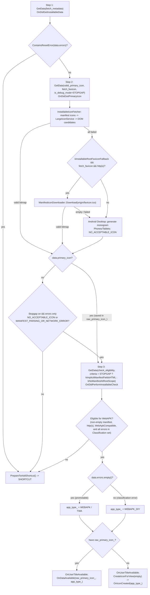

<!--
**Agent Preamble:**
> **CRITICAL:** Before reading this design or writing any code, you MUST read
> the project's AGENTS.md (if it exists).

**Execution Plans:**
*   N/A (implemented directly on branch)
-->

## 1. Context and Goals

**Problem formulation:** On Desktop, "Install page" installs *any* secure page
as a DIY app. On Android (phones, tablets, and Android Desktop), the Universal
Install bottom sheet and the Add-to-Homescreen (A2HS) dialog still downgrade
most pages that lack a promotable manifest to a plain `SHORTCUT` (which opens in
a browser tab rather than a standalone app window).

### How `AddToHomescreenDataFetcher` works today

When the user opens the install sheet or A2HS dialog,
`AddToHomescreenDataFetcher` (`components/webapps/browser/android/`) queries
`InstallableManager::GetData()` in **three sequential steps**.
`InstallableManager` caches fetched artifacts per `WebContents` in
`InstallablePageData`, and each `GetData()` call advances an `InstallableTask`
through the requested stages (`CheckEligibility` -> `FetchWebPageMetadata` ->
`FetchManifest` -> `CheckInstallability` -> `FetchPrimaryIcon`), **stopping
early at the first stage that records an error** unless `params.is_debug_mode`
is set:

1. **Step 1 — Metadata & Manifest (`FetchInstallableData` ->
   `OnDidGetInstallableData`):** Calls `GetData(fetch_metadata=true)`.
   `InstallableTask` fetches `WebPageMetadata` from the renderer and downloads
   the `<link rel="manifest">` (when no link is present, it synthesizes a
   default manifest with an empty `manifest_url` and
   `NO_ERROR_DETECTED`—`NO_MANIFEST` is only emitted by `CheckInstallability` in
   Step 3; when the manifest 404s or fails to parse, it caches
   `MANIFEST_PARSING_OR_NETWORK_ERROR`). The fetcher populates `ShortcutInfo`
   with the page/manifest titles, URLs, and splash icon URL.
2. **Step 2 — Primary Icon (`OnDidGetInstallableData` ->
   `OnDidGetPrimaryIcon`):** Calls
   `GetData(valid_primary_icon=true, prefer_maskable_icon=true, fetch_favicon=true)`.
   `InstallableIconFetcher` tries manifest icons first, then queries
   `LargeIconService` (the favicon DB), and finally downloads
   `<link rel="icon">` candidates from the DOM. On Android Desktop only,
   `InstallableIconFetcher::MaybeEndWithError()` generates a monogram icon if
   all candidates fail; on phones and tablets it finishes with
   `NO_ACCEPTABLE_ICON` and `primary_icon = nullptr`.
3. **Step 3 — Installability Check (`OnDidGetPrimaryIcon` ->
   `OnDidPerformInstallableCheck`):** Calls
   `GetData(check_eligibility=true, installable_criteria=kNoManifestAtRootScope)`.
   `InstallableTask` checks origin eligibility (`IN_INCOGNITO`,
   `NOT_FROM_SECURE_ORIGIN`) and evaluates the manifest against
   `kNoManifestAtRootScope`.

Because of how Steps 2 and 3 gate progression, five common page classes
downgrade to `SHORTCUT` via `PrepareToAddShortcut()` today:

| Failure Case                                      | Example                                                                                  | Why it downgrades to `SHORTCUT` today                                                                                                                                                                                                                                     |
| :------------------------------------------------ | :--------------------------------------------------------------------------------------- | :------------------------------------------------------------------------------------------------------------------------------------------------------------------------------------------------------------------------------------------------------------------------ |
| **No manifest, sub-path URL**                     | `nike.com/us/en/`                                                                        | **Step 3:** `kNoManifestAtRootScope` rejects non-root paths (`NO_MANIFEST`) -> `PrepareToAddShortcut()`.                                                                                                                                                                  |
| **No manifest, uncached implicit `/favicon.ico`** | `walmart.com` (no `<link rel="icon">`)                                                   | **Step 2 or 3:** Fails in Step 2 if `/favicon.ico` is not yet in `LargeIconService` at >= 48px, or in Step 3 if on a sub-path.                                                                                                                                            |
| **Tiny linked icon or no icon at all**            | `slack.com` (links 35x34 PNG, serves unlinked 256x256 `/favicon.ico`) or text-only pages | **Step 2:** Blink only reports a default `/favicon.ico` candidate when a page has *zero* `<link rel="icon">` tags, and `InstallableIconFetcher` skips `is_default_icon` anyway. Step 2 finishes with `!data.primary_icon` -> `PrepareToAddShortcut()` before Step 3 runs. |
| **Manifest present, not promotable**              | `display: browser`, missing name, or missing >= 144px icon                               | **Step 3:** `installable_check_passed == false` -> `PrepareToAddShortcut()`.                                                                                                                                                                                              |
| **Manifest 404 or unparsable**                    | Broken `<link rel="manifest">`                                                           | **Step 2:** `InstallableTask` re-emits the cached `MANIFEST_PARSING_OR_NETWORK_ERROR` from Step 1 and aborts *before* reaching `FetchPrimaryIcon`, returning `!data.primary_icon` -> `PrepareToAddShortcut()`.                                                            |

**Background:** Closing this parity gap is a P0 (`crbug.com/570202962`,
`b/555795180`) targeted for cherry-pick to **M155 (Stable)** and **M156
(Beta)**. PRD:
[Installing Any Page as a DIY App on Android & Android Desktop](https://docs.google.com/document/d/1TiKQD8o46zxXSI4WSXG3RRI8tJCEMcP4BMor87BKe7A).

Two related efforts exist:

- **v1 (`android-install-any-page-impl`):** Collapses the three `GetData()`
  calls into a single accumulating call and adds `CHECK`s and reset reordering
  to `InstallableManager`. At ~400 LOC across 15 files (including code shared
  with Desktop and DevTools), and having surfaced a synchronous-completion
  constructor crash during testing, it carries too much risk for a Stable
  cherry-pick.
- **v2 (`android-install-any-page-design-v2`):** The long-term trunk
  architecture, not intended for branch backport.

**Goals:**

- **Product parity:** With the feature flag enabled, any eligible `https` page
  installs as `WEBAPK_DIY` (or `WEBAPK`/`TWA` when the manifest is promotable)
  across all five failure cases above.
- **Merge safety:** Flag-off behavior is unchanged except for two
  flag-independent crash guards on teardown/reset paths (§4) and two diagnostic
  histograms (§6). No new `CHECK`s in shared `InstallableManager` code, and no
  change to the 3-step `GetData()` sequencing.
- **Minimal, clean cherry-pick:** Touch only `components/webapps/` (and
  `WebappsFeatureMap.java` for test flag registration) in files unchanged since
  the M155/M156 branch points.
- **Finch kill switches:** Separate feature flags for the A2HS decision changes
  and the root `/favicon.ico` fallback.

**Non-Goals:**

- Replacing the 3-step `GetData()` pipeline with a single call (deferred to v2).
- Fixing pre-existing abort/teardown leaks in `AddToHomescreenCoordinator` or
  `InstallableManager` beyond ensuring this change does not worsen them.
- Changing Android Desktop's monogram fallback in `InstallableIconFetcher` (it
  remains in place, running *after* the new `/favicon.ico` fallback).
- Modifying TWA auto-minting (`kAndroidAutoMintedTWA` is `DISABLED_BY_DEFAULT`)
  or SPA title / `manifest_id` fallback rules.

## 2. Proposed Architecture

The stopgap preserves `AddToHomescreenDataFetcher`'s 3-step `GetData()` state
machine and modifies only the parameters and branching decisions at each step,
gated behind `webapps::features::kAndroidInstallAnyPageAsDiyAppStopgap`
(`ENABLED_BY_DEFAULT` on `IS_DESKTOP_ANDROID`, `DISABLED_BY_DEFAULT` elsewhere),
plus a root `/favicon.ico` fallback in `InstallableIconFetcher` gated behind
`webapps::features::kInstallableRootFaviconFallback` (`ENABLED_BY_DEFAULT` kill
switch).

### Architectural Changes Across the Fetch Pipeline

1. **Step 1 — Metadata & Manifest (`OnDidGetInstallableData`):**
   - **Omit broken manifest URLs:** When `data.errors` contains
     `MANIFEST_PARSING_OR_NETWORK_ERROR`, leave `shortcut_info_.manifest_url`
     empty so the WebAPK update pipeline never attempts to fetch a broken
     manifest URL.
2. **Step 2 — Primary Icon (`ParamsToFetchPrimaryIcon` &
   `OnDidGetPrimaryIcon`):**
   - **Run past cached manifest errors (`params.is_debug_mode = true`):**
     Because `InstallableDataFetcher::FetchManifest` re-emits a cached manifest
     error on every subsequent `GetData()` call, Step 2 sets
     `params.is_debug_mode = true` when the stopgap flag is enabled. This
     instructs `InstallableTask` not to abort after the manifest stage so
     broken-manifest pages still reach `InstallableIconFetcher` and fetch a
     favicon.
   - **Root `/favicon.ico` fallback
     (`InstallableIconFetcher::MaybeEndWithError`):** Before
     `InstallableIconFetcher` gives up (or generates a monogram on Android
     Desktop), if `fetch_favicon_` is true, `kInstallableRootFaviconFallback` is
     enabled, and the page URL scheme is `http` or `https`, it probes
     `<origin>/favicon.ico` once via `content::ManifestIconDownloader::Download`
     (`square_only = true`, minimum 48px on Android). Placing this in
     `InstallableIconFetcher` rather than `AddToHomescreenDataFetcher` ensures
     it runs *before* Android Desktop's monogram generator and benefits phones,
     tablets, Android Desktop, the install sheet pre-fetch, and banners alike.
   - **Proceed to Step 3 when no icon is available:** If `data.primary_icon` is
     null and `data.errors` contains only
     `{NO_ACCEPTABLE_ICON, MANIFEST_PARSING_OR_NETWORK_ERROR}`,
     `OnDidGetPrimaryIcon` no longer calls `PrepareToAddShortcut()`. Instead, it
     proceeds to Step 3 with an empty `raw_primary_icon_` and generates a
     monogram icon afterwards. Any reset or unexpected error still falls back to
     `PrepareToAddShortcut()`.
3. **Step 3 — Installability Check (`ParamsToPerformInstallableCheck` &
   `OnDidPerformInstallableCheck`):**
   - **Evaluate with `kImplicitManifestFieldsHTML`:** Replaces
     `kNoManifestAtRootScope` (which had no other callers) so that
     `data.errors.empty()` means "the page has a promotable manifest", matching
     `AppBannerManagerAndroid`.
   - **Eligibility & error classification:** `InstallableTask` always runs
     `CheckEligibility` as its first state, so `IN_INCOGNITO` and
     `NOT_FROM_SECURE_ORIGIN` are always populated in `data.errors` even if a
     cached manifest error stops the task before `CheckInstallability`. The page
     is eligible for WebAPK installation if:
     - `!blink::IsEmptyManifest(*data.manifest)` (rejects opaque origins,
       sandboxed frames, and error pages),
     - `shortcut_info_.url.SchemeIsHTTPOrHTTPS()`,
     - `WebappsUtils::AreWebManifestUrlsWebApkCompatible(*data.manifest)`
       (rejects URLs with embedded credentials), and
     - Every code in `data.errors` belongs to the **Classification** bucket
       below.
   - **Crafted vs. DIY assignment (`crafted = data.errors.empty()`):**
     - If `data.errors.empty()`, the manifest is promotable: `app_type_` is set
       to `WEBAPK` (or `TWA` if auto-minting is enabled), and the observer
       receives `shortcut_info_.name`. This intentionally does not depend on
       whether Step 2 downloaded an icon: a promotable manifest whose icon
       download failed becomes `WEBAPK` with a generated monogram on all form
       factors (matching Android Desktop today and keeping `manifest_url` update
       behavior consistent).
     - If `data.errors` is non-empty (all in the Classification bucket),
       `app_type_` is set to `WEBAPK_DIY`, and the observer receives
       `shortcut_info_.user_title`.
   - **Display mode (`ShortcutInfo::UpdateDisplayMode(AppType)`):** For
     `WEBAPK_DIY`, preserves `standalone`, `fullscreen`, or `minimal-ui` if
     specified by the manifest; otherwise defaults to `standalone` on
     phones/tablets and `minimal-ui` on Android Desktop
     (`base::android::device_info::is_desktop()`). `WEBAPK`/`TWA` and `SHORTCUT`
     keep their existing `UpdateDisplayMode(bool)` behavior.
4. **Icon Finalization (`OnIconCreated`):**
   - If Step 2 produced `raw_primary_icon_`, Step 3 notifies
     `observer_->OnDataAvailable` directly.
   - Otherwise, Step 3 calls `CreateIconForView(SkBitmap())` to generate a
     monogram on `base::ThreadPool`. In `OnIconCreated`, when
     `is_icon_generated` is true and `app_type_ != SHORTCUT`,
     `shortcut_info_.best_primary_icon_url` is set to `shortcut_info_.url`
     (mirroring Android Desktop's existing convention so `WebApkIconsHasher`
     falls back to hashing the generated PNG bytes and `webapk_proto_builder`
     includes the icon in the mint request) and `observer_->OnDataAvailable` is
     invoked with `app_type_`.

### Error Classification in Step 3 (Stopgap Enabled)

| Bucket                                                                       | `InstallableStatusCode` values                                                                                                                                                                                                  | Result                                |
| :--------------------------------------------------------------------------- | :------------------------------------------------------------------------------------------------------------------------------------------------------------------------------------------------------------------------------ | :------------------------------------ |
| **Classification** (page is eligible, manifest is missing or non-promotable) | `NO_MANIFEST`, `MANIFEST_PARSING_OR_NETWORK_ERROR`, `START_URL_NOT_VALID`, `MANIFEST_MISSING_NAME_OR_SHORT_NAME`, `MANIFEST_DISPLAY_NOT_SUPPORTED`, `MANIFEST_DISPLAY_OVERRIDE_NOT_SUPPORTED`, `MANIFEST_MISSING_SUITABLE_ICON` | `WEBAPK_DIY`                          |
| **Eligibility**                                                              | `IN_INCOGNITO`, `NOT_FROM_SECURE_ORIGIN`                                                                                                                                                                                        | `SHORTCUT`                            |
| **Reset / Lifecycle**                                                        | `USER_NAVIGATED`, `MANIFEST_URL_CHANGED`, `RENDERER_EXITING`, `RENDERER_CANCELLED`, `DATA_TIMED_OUT`                                                                                                                            | `SHORTCUT`                            |
| **Anything else / unknown**                                                  | Any other current or future status code                                                                                                                                                                                         | `SHORTCUT` (conservative; no `CHECK`) |

### Behavior Matrix (Stopgap Enabled)

| Page Scenario                                                         | Today                                                                  | With Stopgap + Root Favicon Fallback                                                       |
| :-------------------------------------------------------------------- | :--------------------------------------------------------------------- | :----------------------------------------------------------------------------------------- |
| No manifest, root scope, cached favicon                               | `WEBAPK_DIY`                                                           | `WEBAPK_DIY` (unchanged)                                                                   |
| No manifest, sub-path (`nike.com/us/en/`)                             | `SHORTCUT`                                                             | `WEBAPK_DIY`, scope `/us/en/`, downloaded icon                                             |
| No manifest, implicit `/favicon.ico` (`walmart.com`)                  | `SHORTCUT`                                                             | `WEBAPK_DIY`; `LargeIconService` icon if >= 48px, else `/favicon.ico` probe, else monogram |
| Tiny `<link rel="icon">`, large unlinked `/favicon.ico` (`slack.com`) | `SHORTCUT` (phones/tablets); `WEBAPK_DIY` + monogram (Android Desktop) | `WEBAPK_DIY` with the 256px `/favicon.ico` frame on **all** form factors                   |
| No downloadable icon anywhere                                         | `SHORTCUT`                                                             | `WEBAPK_DIY` + generated monogram                                                          |
| Non-promotable manifest (`display: browser`, no name, no icon)        | `SHORTCUT`                                                             | `WEBAPK_DIY`, manifest fields preserved                                                    |
| Manifest 404 or unparsable                                            | `SHORTCUT`                                                             | `WEBAPK_DIY`, `manifest_url` cleared                                                       |
| Promotable PWA                                                        | `WEBAPK` (`TWA` if auto-mint)                                          | `WEBAPK` / `TWA` (unchanged)                                                               |
| Promotable manifest, icon download fails                              | `SHORTCUT` (phones/tablets); `WEBAPK` + monogram (Android Desktop)     | `WEBAPK` + monogram on all form factors                                                    |
| `http:`, Incognito, credentials in URL, empty manifest                | `SHORTCUT`                                                             | `SHORTCUT`                                                                                 |
| Timeout, navigation, manifest URL change, dead renderer               | `SHORTCUT`                                                             | `SHORTCUT`                                                                                 |

### Platforms Affected

- [ ] Windows, Mac, Linux, ChromeOS, iOS (unaffected: `InstallableIconFetcher`
  gates the `/favicon.ico` fallback on `fetch_favicon_`, which only Android
  sets)
- *Android Form Factors:*
  - [x] Android (Smartphones/Tablets)
  - [x] Android Desktop
  - [ ] Chrome Custom Tabs (CCT) / Android WebView (unaffected)

### Process & Thread Model

- Runs on the Browser UI thread, with existing background hops to
  `base::ThreadPool` for `ProcessFaviconInBackground` and
  `FinalizeLauncherIconInBackground`.
- No new Mojo interfaces or IPCs.
- **Synchronous Step 1 completion:** `InstallableManager::GetData()` starts a
  task inline when the queue is idle, and `InstallableTask` invokes its callback
  synchronously if all requested stages are already cached (e.g., pre-populated
  by `AppBannerManagerAndroid`) or if the first uncached stage fails
  synchronously (`RENDERER_EXITING`). Thus `OnDidGetInstallableData` (Step 1)
  can execute **inside the `AddToHomescreenDataFetcher` constructor**, before
  the caller assigns its `data_fetcher_` pointer. Step 1 must therefore never
  invoke `observer_->OnUserTitleAvailable` synchronously (see §4). Steps 2 and 3
  always run after at least one task hop because
  `InstallableManager::OnTaskFinished()` posts `FinishAndStartNextTask`.

### Data Models & Schemas

- `AddToHomescreenDataFetcher` adds one member:
  `AddToHomescreenParams::AppType app_type_ = AppType::SHORTCUT;`.
- `InstallableIconFetcher` adds one re-entrancy guard:
  `bool probed_root_favicon_ = false;`.
- `ShortcutInfo` adds `UpdateDisplayMode(AddToHomescreenParams::AppType)`.
- No database, pref, or protobuf schema changes.

### API Surface & Mojo Interfaces

- `webapps::features::kAndroidInstallAnyPageAsDiyAppStopgap`
  (`ENABLED_BY_DEFAULT` on `IS_DESKTOP_ANDROID`, `DISABLED_BY_DEFAULT`
  elsewhere, exposed to `WebappsFeatureMap.java` for test annotations) and
  `webapps::features::kInstallableRootFaviconFallback` (`ENABLED_BY_DEFAULT`,
  platform-neutral kill switch).
- `AddToHomescreenParams::GetWebAppInstallType(bool crafted)` (parameter renamed
  from `has_manifest` to reflect "manifest is promotable").
- `AddToHomescreenDataFetcher::AnyPageDecision` and `AnyPagePrimaryIconSource`
  enums for UMA logging.

## 3. Alternatives Considered

| Alternative                                                                                       | Trade-offs                                                                                                                                                                                                                 | Verdict                                                                                                                       |
| :------------------------------------------------------------------------------------------------ | :------------------------------------------------------------------------------------------------------------------------------------------------------------------------------------------------------------------------- | :---------------------------------------------------------------------------------------------------------------------------- |
| **v1 single-`GetData()` refactor** (`android-install-any-page-impl`)                              | Consolidates the 3 steps and reorders `InstallableManager` resets, but spans ~400 LOC across 15 files, adds `CHECK`s in code shared with Desktop/DevTools, and surfaced a synchronous-completion crash in the constructor. | Too risky for M155/M156 backport; land individual pieces on trunk.                                                            |
| **v2 trunk redesign** (`android-install-any-page-design-v2`)                                      | Clean long-term architecture, but too large to cherry-pick to Stable/Beta branches.                                                                                                                                        | Target M157+; replaces the stopgap once complete.                                                                             |
| **Only switch `kNoManifestAtRootScope` -> `kImplicitManifestFieldsHTML`**                         | 1-line change, but pages without icons or with broken manifests still downgrade to `SHORTCUT` in Step 2.                                                                                                                   | Insufficient.                                                                                                                 |
| **Java-side override in sheet/dialog**                                                            | Native code owns `ShortcutInfo`, icon bitmaps, and `WebApkInstaller` inputs; Java cannot synthesize scope or icon bytes, and two separate UI surfaces would need patching.                                                 | Rejected.                                                                                                                     |
| **Generated icon transport via empty `src` in `webapk_proto_builder.cc`** (`crrev.com/c/8524699`) | Drops the `best_primary_icon_url.is_valid()` guard so generated icons have an empty `src` in the mint proto. Unverified with the production WebAPK minting server.                                                         | Deferred to trunk; for branches we substitute `best_primary_icon_url = shortcut_info_.url` (proven on Android Desktop today). |

## 4. Core Principle Considerations

### Speed & Efficiency

- **Main Thread / Startup / Memory / Binary Size:** Negligible impact (one enum
  member, one bool member, O(errors) classification, only active when the
  install pipeline runs).
- **Network Resources:**
  - Broken-manifest pages now run the existing favicon stage in Step 2 instead
    of aborting early.
  - Pages where all manifest/DB/DOM icon candidates fail issue one same-origin
    `<origin>/favicon.ico` GET per page load via `ManifestIconDownloader`
    (served from the HTTP cache if Blink already fetched it, and cached in
    `InstallablePageData` across `AppBannerManagerAndroid` and
    `AddToHomescreenDataFetcher`).
  - Substituting `best_primary_icon_url = shortcut_info_.url` for generated
    monogram icons causes `WebApkSingleIconHasher` to attempt downloading the
    page URL before falling back to hashing the generated PNG (already the case
    on Android Desktop today).

### Security

- **Threat Model & Eligibility:** Unchanged. `IN_INCOGNITO` and
  `NOT_FROM_SECURE_ORIGIN` are evaluated first in Step 3 and always produce
  `SHORTCUT`. `SchemeIsHTTPOrHTTPS()`, `!blink::IsEmptyManifest()`, and
  `AreWebManifestUrlsWebApkCompatible()` (rejecting embedded URL credentials)
  remain enforced.
- **Rule of Two & Attack Surface:** No new untrusted parsing in the browser
  process. The `/favicon.ico` fallback uses `content::ManifestIconDownloader` ->
  `WebContents::DownloadImage`, which decodes images in the sandboxed renderer
  process on a same-origin `http(s)` URL.

### Stability & Simplicity

- **Conservative error handling (no new `CHECK`s):** Any unrecognized
  `InstallableStatusCode` falls back to `SHORTCUT`.
- **Observer synchronous-deletion safety:**
  `PwaUniversalInstallBottomSheetCoordinator`'s
  `AppDataFetcher::OnDataAvailable` executes `delete this` synchronously,
  destroying `AddToHomescreenDataFetcher`. Every member access and UMA histogram
  call (`RecordPrimaryIconSource`) is placed strictly *before*
  `observer_->OnDataAvailable(...)`, which is the final statement on every path.
- **Two flag-independent hardening guards in `AddToHomescreenDataFetcher`:**
  1. **Dying `WebContents` guard (Steps 1 & 2):** `OnDidGetInstallableData` and
     `OnDidGetPrimaryIcon` return early if
     `!web_contents_ || web_contents_->IsBeingDestroyed()`. `~WebContentsImpl`
     notifies `WebContentsDestroyed` mid-destructor while `WeakPtr<WebContents>`
     is still valid; without this check,
     `InstallableManager::Reset(RENDERER_EXITING)` firing Step 1's callback
     during destruction would call `GetData()` for Step 2 with a dying
     `WebContents`.
  2. **Step 1 reset & crashed-frame guard (`OnDidGetInstallableData`):** If
     `data.errors` contains a reset code (`USER_NAVIGATED`,
     `MANIFEST_URL_CHANGED`, `RENDERER_EXITING`) or if the primary main frame
     has crashed/exited
     (`web_contents_->IsCrashed() || !web_contents_->GetPrimaryMainFrame()->IsRenderFrameLive()`,
     which covers crashes after `AppBannerManagerAndroid` already cached
     `InstallablePageData`), Step 1 does not issue Step 2 (issuing `GetData()`
     from inside `ResetWithError` runs before `page_data_->Reset()`, leaving
     dangling manifest references). Instead, it calls `StopTimer()`, sets
     `installable_status_code_` (to `data.GetFirstError()` or
     `RENDERER_EXITING`), and posts
     `PrepareToAddShortcut(AnyPageDecision::kShortcutReset)` via
     `SequencedTaskRunner::GetCurrentDefault()->PostTask` (and
     `PrepareToAddShortcut()` checks `if (!web_contents_) return;`). Posting is
     required because Step 1 can run synchronously inside the
     `AddToHomescreenDataFetcher` constructor before the owning coordinator has
     assigned its `data_fetcher_` member.
- **Fallback timeout and lifetime:** The `/favicon.ico` download is bounded by
  `AddToHomescreenDataFetcher`'s existing 8s/12s `data_timeout_timer_`, and
  `probed_root_favicon_` (also set when a linked DOM candidate is itself
  `<origin>/favicon.ico`) prevents probing `/favicon.ico` twice.
- **Coordinator `SHORTCUT` override, downstream `installable_status`, & dead
  restore observer:** `AddToHomescreenCoordinator` can override `app_type_` to
  `SHORTCUT` when the user chooses "Add shortcut" on the universal install
  sheet.
  - Setting `best_primary_icon_url = shortcut_info_.url` in `OnIconCreated`
    remains safe because `AddToHomescreenMediator` forces `display = kBrowser`
    for shortcuts, which makes `ShortcutHelper.addShortcut` ignore `iconUrl`.
  - Passing `data.GetFirstError()` (e.g. `NO_MANIFEST`,
    `MANIFEST_DISPLAY_NOT_SUPPORTED`) as `installable_status` to
    `OnDataAvailable` for `WEBAPK_DIY` results is safe: `InstallWebApk` ignores
    `params.installable_status`, and its only reader (`ShortcutHelper` ->
    `RecordAddToHomeScreenUKM`) uses it to populate `ShortcutReason` in the
    `Webapp.AddToHomeScreen` UKM when a user explicitly chooses "Add shortcut".
  - `WebApkRestoreTask` (`chrome/browser/android/webapk/webapk_restore_task.cc`)
    also implements `AddToHomescreenDataFetcher::Observer`, but it is
    unreachable dead code in production: `kWebApkBackupAndRestoreBackend`,
    `WebApkSyncService` (the only class that instantiated
    `WebApkRestoreManager`), and the PWA Restore UI were deleted under
    crbug.com/400662034 (`crrev.com/c/8323847`, `crrev.com/c/8377882`,
    `crrev.com/c/8411291`, `crrev.com/c/8426612`).
- **WebAPK update behavior & generated icon hashing for DIY apps:**
  - **No-manifest and 404/unparsable-manifest DIY apps (`manifest_url` is
    empty):** `WebApkUpdateDataFetcher.start()` returns `false` immediately when
    `oldInfo.manifestUrl()` is empty, so navigating within the installed DIY app
    never attaches a `TabObserver` or fetches page metadata/favicons. Only
    WebAPK shell-version updates (throttled to once per 24 hours by
    `WebappDataStorage.shouldCheckForUpdate()`) can run, using `mInfo` with
    `isManifestStale = true`.
  - **Partial-manifest DIY apps (`manifest_url` is non-empty, e.g.
    `display: browser`, missing name, or missing icons):** Update checks are
    throttled to once per 24 hours and `WebApkUpdateDataFetcher` runs
    `InstallableManager::GetData()` with
    `installable_criteria = kValidManifestWithIcons` and
    `fetch_favicon = false`, aborting if `!data.errors.empty()`. Thus,
    navigating across pages with different titles or favicons never synthesizes
    DIY state or triggers spurious updates; an update only occurs if the site
    later serves a fully valid, promotable manifest with a matching
    `manifest_id` (`web_manifest_id_ == data.manifest->id`).
  - **Generated monogram icon hashes:** At install time, when
    `best_primary_icon_url` is set to `shortcut_info_.url`, `WebApkIconsHasher`
    falls back to `WebApkSingleIconHasher::SetIconDataAndHashFromSkBitmap`,
    which PNG-encodes the generated monogram `SkBitmap` and computes the Murmur2
    hash of those PNG bytes for the mint request and installed
    `AndroidManifest.xml` (`iconUrlToMurmur2HashMap`). Subsequent stale-manifest
    shell updates retain the installed icon and hash unchanged, while upgrading
    to a valid manifest with a real icon URL produces a new hash and triggers a
    normal icon update.

## 5. Privacy, Enterprise & A11y

### Privacy

- For `WEBAPK_DIY` installs without a manifest, URL fields come from
  `ManifestManager::DefaultManifest()` (matching Desktop DIY and existing
  root-scope Android DIY):
  - `start_url` and `shortcut_info_.url`: the page's last-committed URL (query
    preserved, fragment stripped for `manifest_id`).
  - `scope`: `start_url.GetWithoutFilename()` (directory path; filename, query,
    and fragment removed).
- Incognito pages fail `IN_INCOGNITO` in Step 3 and remain local `SHORTCUT`s
  (never sent to the WebAPK server).

### Enterprise & Accessibility (A11y)

- **N/A:** User-initiated install flow only; no new enterprise policies and no
  UI or accessibility string changes (`WEBAPK_DIY` UI is already shipped).

## 6. Metrics & Rollout Plan

### Success & Regression Metrics

- **Existing histograms:** `WebApk.UniversalInstall.DialogShownForAppType`
  (primary share of `WEBAPK_DIY` vs `SHORTCUT`), `WebApk.Install.InstallResult`,
  `WebApk.Install.PathToInstall`, and `Webapp.AddToHomescreenDialog.Timeout`.
  - *Note on histogram expiry:* Because `generate_expired_histograms_array.py`
    drops expired histograms on-device at build time, `crrev.com/c/8527736`
    (un-expiring `InstallResult` and `DialogShownForAppType`) must be merged to
    M155 and M156 alongside this change.
- **New diagnostic histograms** (recorded in both flag-off and flag-on arms so
  Finch control and enabled groups are directly comparable):
  - `Webapp.AddToHomescreen.AnyPage.Decision` (`AnyPageDecision` enum):
    `kCrafted`, `kDiyNoManifest`, `kDiyManifestError`, `kDiyNotPromotable`,
    `kShortcutIneligible` (incognito, insecure origin, empty manifest,
    non-`http(s)`, or incompatible manifest URLs), `kShortcutReset`,
    `kShortcutTimeout`, `kShortcutNoIcon` (flag-off Step 2),
    `kShortcutNotRootScope` (flag-off Step 3), and `kShortcutUnknownError`
    (flag-on remainder).
  - `Webapp.AddToHomescreen.AnyPage.PrimaryIconSource`
    (`AnyPagePrimaryIconSource` enum, recorded for non-`SHORTCUT` results):
    `kDownloaded` vs. `kGenerated` (monogram generated by the A2HS fetcher or by
    `InstallableIconFetcher` on Android Desktop where
    `best_primary_icon_url == url`).

### Rollout, Finch & Branch Backport

- **Flags:**
  - `kAndroidInstallAnyPageAsDiyAppStopgap` (`ENABLED_BY_DEFAULT` on
    `IS_DESKTOP_ANDROID` with Finch kill-switch capability;
    `DISABLED_BY_DEFAULT` on phones/tablets, added to
    `fieldtrial_testing_config.json` on trunk and rolled out via Finch).
  - `kInstallableRootFaviconFallback` (`ENABLED_BY_DEFAULT`, acts as a Finch
    kill switch across branches).
- **Hand-off to v2 on trunk:** The stopgap uses a distinct flag name from v2
  (`kAndroidInstallAnyPageAsDiyApp`) so a Stable kill switch never toggles
  in-progress v2 code on Canary/Dev and UMA comparisons stay clean. When the v2
  CL that replaces `AddToHomescreenDataFetcher`'s decision logic lands on trunk,
  it will delete `kAndroidInstallAnyPageAsDiyAppStopgap` and its flag-on branch
  in the same commit.
- **M155 / M156 cherry-pick readiness:** None of the touched
  `add_to_homescreen_*` or `shortcut_info.*` files have changed since the M155
  (`8059`) or M156 (`8078`) branch points. For M155, cherry-picking
  `67a6a4b58bb23` (DOM-favicon candidate fallback +
  `installable_icon_fetcher_unittest.cc`) first is recommended so the
  `InstallableIconFetcher` changes and unit tests apply cleanly across all three
  branches.

## 7. Testing Plan

- **`add_to_homescreen_data_fetcher_unittest.cc` (`components_unittests`):**
  - Verifies all five previously-downgraded page classes (`NoManifestSubPath`,
    `NoIcon_GeneratedMonogram`, `ManifestDisplayBrowser`, `Manifest404`, and
    `PromotableIconDownloadFails`) produce `WEBAPK_DIY` or `WEBAPK` when the
    stopgap flag is enabled, and `SHORTCUT` when disabled.
  - Verifies eligibility rejections (`Incognito`, `InsecureOrigin`,
    `EmptyManifest`, non-`http(s)`, credentials in URL), mid-fetch resets
    (`USER_NAVIGATED`, `MANIFEST_URL_CHANGED`, `RENDERER_EXITING`, `WebContents`
    destruction in Step 1 and Step 2), timeouts, synchronous observer deletion
    (`ObserverDeletesFetcher_{FlagOff,FlagOn}`), and `Decision` /
    `PrimaryIconSource` histogram buckets.
- **`shortcut_info_unittest.cc` (`components_unittests`):**
  - Verifies `ShortcutInfo::UpdateDisplayMode(AppType)` defaults `WEBAPK_DIY` to
    `standalone` on phones/tablets and `minimal-ui` on Android Desktop while
    preserving explicit WebAPK display modes (`standalone`, `fullscreen`,
    `minimal-ui`).
- **`installable_icon_fetcher_unittest.cc` (`components_unittests`):**
  - Verifies `kInstallableRootFaviconFallback` downloads `<origin>/favicon.ico`
    on `http` and `https` pages after manifest/DB/DOM candidates fail, rejects
    undersized (`< 48px`) or 404 responses without re-probing, skips non-HTTP(S)
    pages or `fetch_favicon=false`, and runs before Android Desktop's monogram
    generator.
- **Instrumentation tests (`chrome_public_test_apk`):**
  - `AddToHomescreenInstallTest#testInstallDiyWebApk` and
    `PwaUniversalInstallBottomSheetIntegrationTest#testNoManifestLeafPageShowsInstallableDiyDialog_flagEnabled`
    verify end-to-end DIY WebAPK classification and installation on a sub-path
    page without a manifest or icon.
- **Verification command:**
  `tools/autotest.py -C out/Android components/webapps/browser/android/add_to_homescreen_data_fetcher_unittest.cc components/webapps/browser/android/shortcut_info_unittest.cc components/webapps/browser/installable/installable_icon_fetcher_unittest.cc`

## 8. Detailed Implementation Breakdown

| Component / File                                                                                 | Summary of Changes                                                                                                                                                                                                                                                                                                                                                                                  |
| :----------------------------------------------------------------------------------------------- | :-------------------------------------------------------------------------------------------------------------------------------------------------------------------------------------------------------------------------------------------------------------------------------------------------------------------------------------------------------------------------------------------------- |
| `components/webapps/browser/features.{h,cc}`, `webapps_feature_map.cc`, `WebappsFeatureMap.java` | Declare `kAndroidInstallAnyPageAsDiyAppStopgap` (`ENABLED_BY_DEFAULT` on `IS_DESKTOP_ANDROID`, `DISABLED_BY_DEFAULT` elsewhere, exposed to Java) and `kInstallableRootFaviconFallback` (`ENABLED_BY_DEFAULT`).                                                                                                                                                                                      |
| `components/webapps/browser/android/add_to_homescreen_data_fetcher.{h,cc}`                       | Set `is_debug_mode = true` in Step 2; proceed to Step 3 when Step 2 has no icon; evaluate `kImplicitManifestFieldsHTML` and classify errors in Step 3; store `app_type_` and set `best_primary_icon_url = shortcut_info_.url` for generated WebAPK icons in `OnIconCreated`; add dying-`WebContents` and Step 1 reset guards; record `AnyPage.Decision` and `AnyPage.PrimaryIconSource` histograms. |
| `components/webapps/browser/android/shortcut_info.{h,cc}`                                        | Add `ShortcutInfo::UpdateDisplayMode(AddToHomescreenParams::AppType)` (`standalone` on phones/tablets, `minimal-ui` on Android Desktop for `WEBAPK_DIY`).                                                                                                                                                                                                                                           |
| `components/webapps/browser/android/add_to_homescreen_params.{h,cc}`                             | Rename `GetWebAppInstallType` parameter from `has_manifest` to `crafted`.                                                                                                                                                                                                                                                                                                                           |
| `components/webapps/browser/installable/installable_icon_fetcher.{h,cc}`                         | Probe `<origin>/favicon.ico` once in `MaybeEndWithError()` via `ManifestIconDownloader::Download` when `fetch_favicon_` and `kInstallableRootFaviconFallback` are enabled.                                                                                                                                                                                                                          |
| `tools/metrics/histograms/metadata/webapps/{histograms,enums}.xml`                               | Define `Webapp.AddToHomescreen.AnyPage.Decision` and `Webapp.AddToHomescreen.AnyPage.PrimaryIconSource`.                                                                                                                                                                                                                                                                                            |
| `testing/variations/fieldtrial_testing_config.json`                                              | Enable `AndroidInstallAnyPageAsDiyAppStopgap` on Android test bots.                                                                                                                                                                                                                                                                                                                                 |

## 9. Future Work & Technical Debt

- **Replaced by v2 on trunk:** Once the v2 single-`GetData()` fetcher lands on
  trunk, delete `kAndroidInstallAnyPageAsDiyAppStopgap`, its flag-off branch,
  the `is_debug_mode` workaround in Step 2, and
  `InstallableCriteria::kNoManifestAtRootScope`.
- **Root `/favicon.ico` follow-ups in v2:** Fold the `/favicon.ico` fallback
  into `InstallableIconFetcher::FetchFaviconFromCandidates` (revisiting the
  `is_default_icon` exclusion in `IsCandidateBigEnough`), remove the
  `kInstallableRootFaviconFallback` kill-switch flag once baked, and update
  `WebApkSingleIconHasher` to select multi-frame `.ico` bitmaps by target size
  rather than `bitmaps[0]`.
