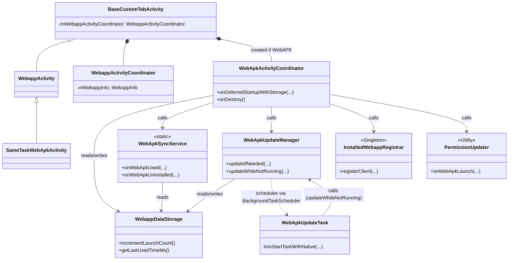
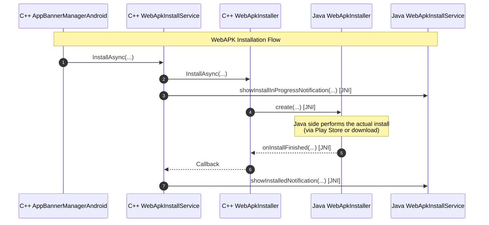
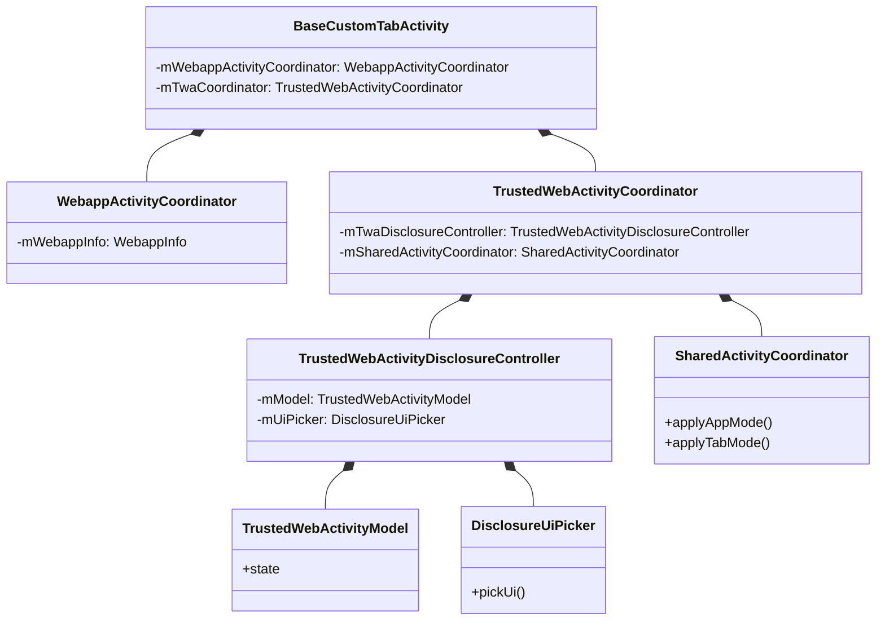
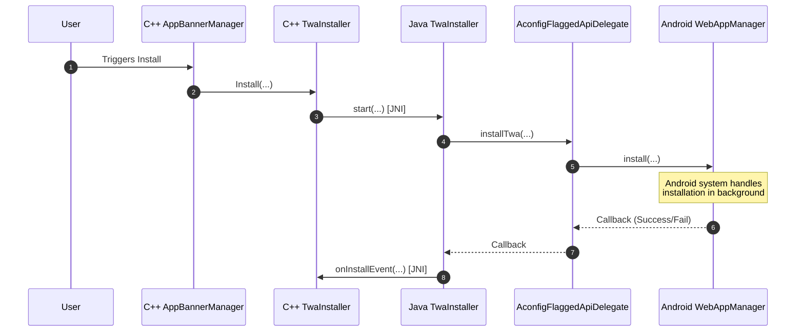
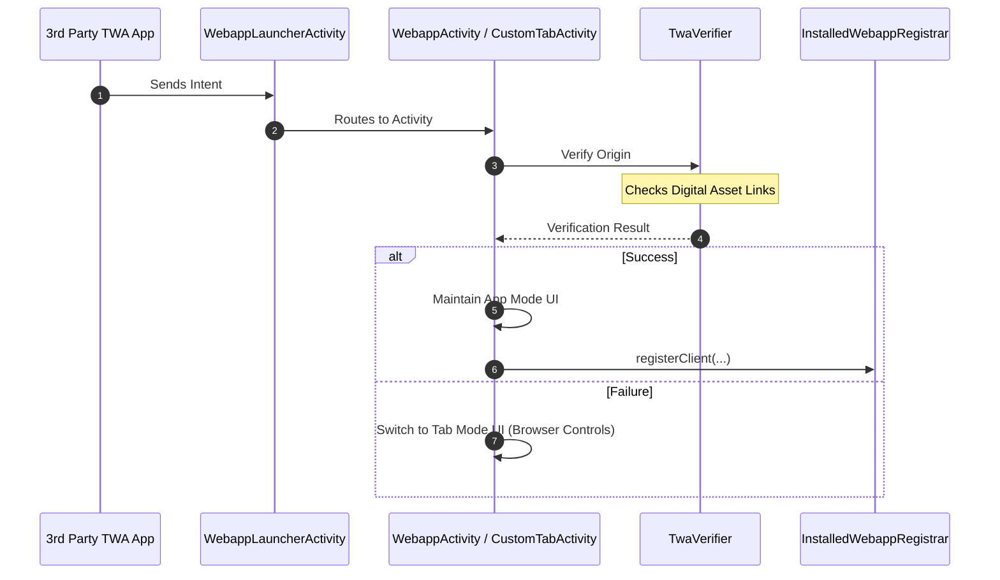

# Android Web App Architectures (WebAPK and TWA)

This document describes the architecture of Webapp, WebAPK, and Trusted Web
Activity (TWA) related classes, focusing on their interactions and call
patterns.

## Code Locations

The code is distributed across several key directories:

- [`chrome/android/java/src/org/chromium/chrome/browser/webapps/`](../../../chrome/android/java/src/org/chromium/chrome/browser/webapps/):
  Core Java logic for Webapps and WebAPKs in Chrome.
- [`chrome/android/java/src/org/chromium/chrome/browser/browserservices/`](../../../chrome/android/java/src/org/chromium/chrome/browser/browserservices/):
  Java logic for Custom Tabs and Trusted Web Activities (TWA).
- [`chrome/android/webapk/`](../../../chrome/android/webapk/): Code for the
  WebAPK shell (the installed APK wrapper) and client libraries.
- [`components/webapps/browser/android/`](../browser/android/): C++ shared
  component code specific to Android.
- [`components/webapps/browser/`](../browser/): Cross-platform C++ shared
  component code (installability, banners).

## Installation Systems

Chromium on Android supports three distinct systems for "installing" web
applications, each with different characteristics and use cases.

### 1. WebAPK

WebAPK is the standard and most integrated way to install Progressive Web Apps
(PWAs) on Android.

- **Mechanism**: Chrome requests a specialized server (WebAPK minting server) to
  generate a real Android APK for the web app. This APK is then installed on the
  device.
- **Integration**: WebAPKs appear in the Android app drawer, settings, and can
  handle intents for their registered scope.
- **Runtime**: They are thin shells that load Chrome to render the content. They
  share logic with Chrome via a runtime library extracted from Chrome.
- **Updates**: Handled by `WebApkUpdateManager` and `WebApkUpdateTask`.

### 2. Standard Trusted Web Activity (TWA)

Standard TWAs are used by 3rd party Android apps to display web content in a
customized Custom Tab without browser UI.

- **Mechanism**: A 3rd party app launches an intent to Chrome specifying a URL
  and a session.
- **Verification**: Chrome verifies that the app is authorized to open the URL
  in TWA mode (via Digital Asset Links).
- **Characteristics**: Shares cookies and storage with the user's main Chrome
  profile. It does not create a new APK; it uses the existing Custom Tabs
  infrastructure.
- **Updates**: The Android app shell must be updated externally by the developer
  via the app store. The web content updates automatically like a normal
  website.

### 3. Auto-minted TWA (TWA Installer)

This system allows Chrome to install a TWA-like experience directly, used in
specific projects like Desktop Android.

- **Mechanism**: Uses `TwaInstaller` in components/webapps, which calls
  `WebAppManager` via `AconfigFlaggedApiDelegate`.
- **API**: Relies on Android's `WebAppManager` / `IWebAppService` (Mainline
  module) for the actual installation on the OS side.
- **Runtime**: Once running in Chrome, it follows the same path as a standard
  TWA, calling `InstalledWebappRegistrar.registerClient` to establish the link.
- **Updates**: Handled by the Android system's `WebAppManager` or follows the
  TWA model.

## General Webapp Architecture

`WebappActivity` is the base class for displaying a web app in a nearly UI-less
Chrome. It extends `BaseCustomTabActivity`, leveraging the Custom Tabs
infrastructure but hiding most of the browser UI.

- **`WebappActivity`**: Thin shell that overrides some methods to customize
  behavior (e.g., disabling bookmarking, handling "open in browser"). It
  determines whether to use a standard Webapp or WebAPK intent data provider.
- **`WebappActivityCoordinator`**: Handles lifecycle events and storage updates.
  It uses `WebappDeferredStartupWithStorageHandler` to manage tasks that need
  storage access. It also warms up shared preferences for the web app.

## Differences from Normal Browser Usage

Installed web apps (WebAPKs and TWAs) differ from normal browser usage in
several key ways to provide an app-like experience:

- **UI**: They run in a nearly UI-less mode (`WebappActivity`), hiding the URL
  bar, tab switcher, and other browser controls.
- **Task Management**: WebAPKs and TWAs can run in their own Android tasks,
  separate from the main Chrome task, making them appear as separate apps in the
  Android recents screen.
- **Storage and Cookies**: Standard TWAs share cookies and storage with the
  user's main Chrome profile, ensuring a seamless transition from the browser.
- **Permission Delegation**: Permissions granted to the Android app shell (e.g.,
  notification permission) can be delegated to the web origin inside Chrome, so
  the user doesn't have to grant permissions twice.
- **Lifespan**: Webapps can have specific lifecycles managed by
  `WebappActivityCoordinator` and deferred startup tasks.

______________________________________________________________________

## WebAPK Architecture

This section covers details specific to WebAPKs.

### Component Overview (WebAPK)

- **`WebApkActivityCoordinator`**: Orchestrates the startup and deferred startup
  tasks for a WebAPK activity. It triggers sync, update checks, and permission
  registration.
- **`WebApkUpdateManager`**: Manages checking for updates to the Web Manifest
  and scheduling background update tasks.
- **`WebApkUpdateTask`**: A background task executed by the
  `BackgroundTaskScheduler` to perform updates when the WebAPK is not running.
- **`WebApkSyncService`**: A utility class that communicates with native code
  via JNI to sync WebAPK data (like usage and uninstallation) with the user's
  account.
- **`WebApkUninstallTracker`**: Tracks uninstalls of WebAPKs and defers
  reporting metrics until native is loaded.

### Interactions Graph

This graph illustrates the interactions between the core Webapp and WebAPK
components, showing how they fit into the Custom Tabs base class.

### Call Flows

#### 1. Launch Flow (Deferred Startup)

When a WebAPK is launched, `WebApkActivityCoordinator` executes the following
steps during deferred startup:

1. **Update Usage in Storage**: Increments launch count in `WebappDataStorage`.
2. **Sync Usage**: Calls `WebApkSyncService.onWebApkUsed` to notify sync that
   the app was used.
3. **Check for Updates**: Calls `WebApkUpdateManager.updateIfNeeded` to check if
   the manifest has changed.
4. **Register Permissions (Android T+)**: Calls
   `InstalledWebappRegistrar.registerClient` and
   `PermissionUpdater.onWebApkLaunch` to ensure permissions are delegated
   correctly.

#### 2. Update Flow

1. **Check for Updates**: `WebApkUpdateManager` fetches the current Web Manifest
   and compares it with the data stored in `WebappInfo` (extracted from the
   installed WebAPK's Android Manifest).
2. **Generate Update Reasons**: It compares fields like name, short name, icons,
   colors, orientation, display mode, share target, and shortcuts.
3. **Persist Request via JNI**: If an update is needed, it encodes icons in the
   background and calls native code via JNI
   (`WebApkUpdateManagerJni.get().storeWebApkUpdateRequestToFile`) to serialize
   the update request data to a file.
4. **Schedule Background Task**: After the file is successfully saved, it
   schedules a `WebApkUpdateTask` via `BackgroundTaskScheduler`.
5. **Perform Update**: When the task triggers (typically when the app is closed
   and on an unmetered network), `WebApkUpdateTask` calls
   `WebApkUpdateManager.updateWhileNotRunning`.
6. **Request New APK**: `WebApkUpdateManager` calls native code
   (`WebApkUpdateManagerJni.get().updateWebApkFromFile`) which reads the file
   and sends the update request to the WebAPK server.

#### 3. Installation Flow (C++ to Java)

This sequence diagram shows the flow when a WebAPK installation is triggered,
crossing the JNI boundary between C++ and Java.

#### 4. Uninstall Flow

1. **Detection**: A broadcast receiver detects that a WebAPK has been
   uninstalled.
2. **Deferral**: `WebApkUninstallTracker.deferRecordWebApkUninstalled` is called
   to save the package name and timestamp in `SharedPreferences`, avoiding
   loading native libraries.
3. **Processing**: When Chrome is next launched and native libraries are loaded,
   `WebApkUninstallTracker.runDeferredTasks` is called.
4. **Metrics and Sync**: It records histograms and UKM metrics, and calls
   `WebApkSyncService.onWebApkUninstalled` to notify sync.

### Interface Points between WebAPK and Clank

WebAPKs are thin shells that rely heavily on Chrome (Clank) for their logic and
rendering. They interface with Clank in several key ways:

#### 1. Launch Intent

When a user launches a WebAPK, it sends an intent to Chrome to start the web
application.

- **Action**: If the WebAPK is bound to Chrome, it uses
  `com.google.android.apps.chrome.webapps.WebappManager.ACTION_START_WEBAPP`. If
  unbound, it uses `android.intent.action.VIEW`.
- **Routing**: Chrome's `WebappLauncherActivity` receives this intent and routes
  it to `SameTaskWebApkActivity` or `WebappActivity`.

#### 2. Runtime Library Extraction

To keep the WebAPK small and up-to-date, it does not contain most of the web app
logic. Instead:

- The WebAPK extracts a runtime library from Chrome's assets at runtime.
- This allows the WebAPK to share logic with Chrome and be updated whenever
  Chrome updates, without reinstalling the WebAPK.

#### 3. AIDL Bound Service (`IWebApkApi`)

Chrome communicates with the WebAPK via a bound service using the `IWebApkApi`
AIDL interface.

- **Class**: `WebApkServiceClient` in Chrome manages this connection.
- **Uses**:
  - **Notifications**: Chrome hands over notifications to the WebAPK to display,
    so they look like they come from the WebAPK.
  - **Permissions**: Chrome can query and request notification permissions from
    the WebAPK (especially on Android T+).

#### 4. JNI Bridges (Java \<-> C++)

WebAPK features in Java often rely on C++ components via JNI:

- **Sync**: `WebApkSyncService` calls native code to sync usage and
  uninstallation.
- **Update**: `WebApkUpdateManager` calls native code to serialize update
  requests to a file, and to perform the update from that file.
- **Permissions**: `InstalledWebappBridge` facilitates permission decisions
  between C++ permission system and Java updaters.

______________________________________________________________________

## Trusted Web Activity (TWA) Architecture

This section covers details specific to TWAs.

### Component Overview (TWA)

- **`TrustedWebActivityCoordinator`**: The main entry point for TWA-specific
  logic in a Custom Tab activity. It handles splash screens and registers the
  client with `InstalledWebappRegistrar` upon successful verification.
- **`SharedActivityCoordinator`**: Manages UI state (immersive mode, theme
  color, status bar color) that is shared between TWAs and general Webapps. It
  switches between "app mode" and "tab mode" based on site verification results.
- **`TrustedWebActivityDisclosureController`**: Controls when to show the
  "Running in Chrome" disclosure to the user.
- **`TrustedWebActivityModel`**: Holds the state for the TWA, particularly
  regarding the disclosure UI.
- **`DisclosureUiPicker`**: Chooses the appropriate disclosure UI (Notification,
  Snackbar, or Infobar) based on user settings and intent parameters.

### Interactions Graph

This graph illustrates the ownership and management structure of the key
components in the TWA area.

### Call Flows

#### 1. Auto-minted TWA Installation Flow

This sequence diagram shows the flow when an Auto-minted TWA installation is
triggered on platforms like Desktop Android.

#### 2. Standard TWA Launch and Verification Flow

This sequence diagram shows the flow when a standard TWA is launched by a 3rd
party app.

### TWA Disclosure (Running in Chrome)

To ensure users know their data is shared with Chrome, a disclosure is shown
when a TWA is launched.

1. **Logic**: `TrustedWebActivityDisclosureController` checks
   `BrowserServicesStore` to see if the user has already accepted or seen the
   disclosure.
2. **UI Selection**: `DisclosureUiPicker` decides which UI to show:
   - **Notification**: High or low priority silent notification, used if
     notifications are enabled.
   - **Snackbar**: Auto-dismissing snackbar, used if notifications are disabled.
   - **Infobar**: The old persistent infobar, used as a fallback or if
     explicitly requested by intent.
3. **State**: The choice and state are maintained in `TrustedWebActivityModel`.

### UI Mode Switching

`SharedActivityCoordinator` optimistically applies "app mode" UI (no browser
controls, Twa theme colors) before layout inflation.

- If site verification **succeeds**, it maintains app mode.
- If site verification **fails**, it switches to "tab mode" UI, showing browser
  controls and standard Chrome theming to indicate the site is not trusted by
  the TWA app.
- **`WebAppHeaderLayoutCoordinator`**: This class is responsible for drawing the
  web app header UI (e.g., custom action bar, window-controls-overlay,
  minimal-ui) depending on the display mode requested by the PWA manifest and
  browser settings.

### Display Modes and Immersive Mode

`SharedActivityCoordinator` also manages how the app draws relative to system
bars (status bar and navigation bar) and display cutouts.

Currently, the main path to enable drawing into the cutout area is:

- **`TrustedWebActivityDisplayMode.ImmersiveMode`**:
  - Used when a TWA explicitly requests immersive mode via intent, or
    synthesized for installed webapps/WebAPKs when the manifest declares
    `display: fullscreen`.
  - This triggers full immersive mode, honoring client-supplied cutout mode and
    sticky flags. It hides system bars.

______________________________________________________________________

## Common Systems

### Site Settings and Permission Delegation

A key difference between webapps and normal browser usage is how site settings
and permissions are managed.

- **`InstalledWebappRegistrar`**: A singleton that handles registration requests
  when a TWA/WebAPK is verified or navigated.
- **`InstalledWebappDataRegister`**: Manages the storage of registered web apps
  in `SharedPreferences`.
- **`PermissionUpdater`**: Coordinates updating permissions (notifications,
  location) in Chrome when apps are verified or uninstalled.

For more details on Registration and Permission Delegation, see
[Registration and Permission Delegation](android_registration_and_permissions.md).

## Testing

For details on how to test Web Apps on Android, including manual testing
instructions and a list of automated test suites, see the
[Android Testing Guide](android_testing_guide.md).

## TODO / Next Steps

- [ ] Add more details on TWA installer and interaction with Play Store.
- [ ] Document the interaction with Android's `WebAppManager` in more detail.
- [ ] Research WebAPK update server communication details.

## Resources

- go/webapps-android-docs
