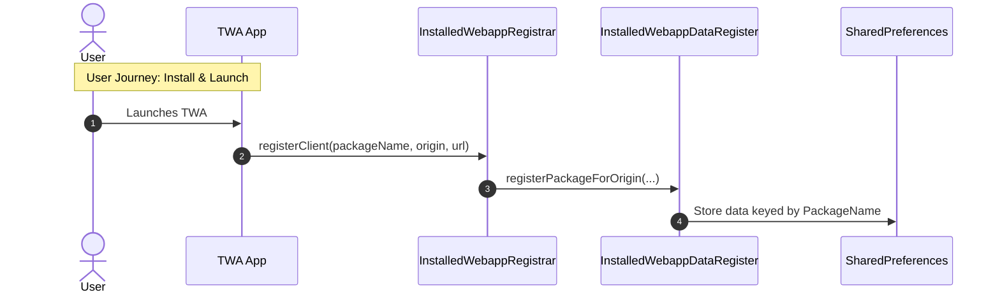
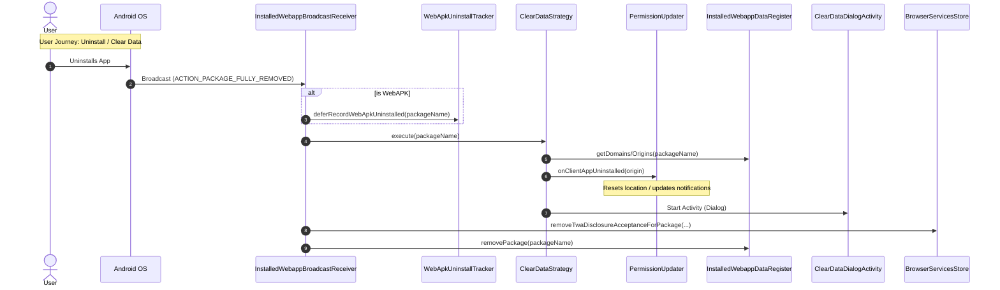
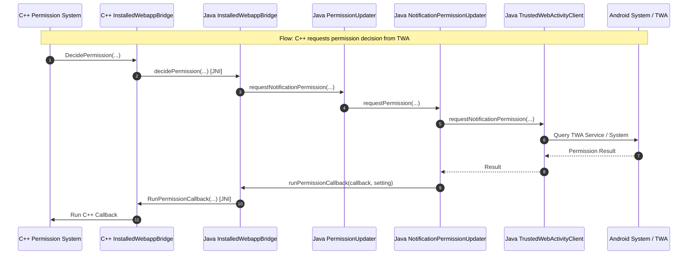

# [WebApps on Android](android_architecture.md) - Registration and Permission Delegation

This document describes how Chromium on Android registers installed web
applications (TWAs and WebAPKs) and manages permission delegation between the
Android OS and the browser.

## Overview

To provide a seamless app-like experience, Chrome needs to know which web
origins are associated with which installed Android packages. This allows for
features like:

- Delegating notification permissions from the Android app to the web origin.
- Clearing browsing data when the app is uninstalled.
- Showing "Managed by [App Name]" in site settings.

## Core Components

- **`InstalledWebappRegistrar`**: A singleton that handles registration requests
  when a TWA is verified or navigated. It deduplicates requests and calls
  `InstalledWebappDataRegister` and `PermissionUpdater`.
- **`InstalledWebappDataRegister`**: A utility class that manages the storage of
  registered web apps in `SharedPreferences`. It handles the mapping between
  Android identifiers and web origins/domains.
- **`InstalledWebappBroadcastReceiver`**: An Android `BroadcastReceiver` that
  listens for package uninstallation or data clearing events and triggers
  cleanup in Chrome.
- **`PermissionUpdater`**: A utility class that coordinates updating permissions
  (notifications, location) in Chrome when apps are verified or uninstalled.
- **`InstalledWebappBridge`**: The JNI bridge between C++ and Java for
  permission decisions.

## Registration Flow

This sequence diagram shows the flow when a user launches or installs a
TWA/WebAPK.

## Uninstallation and Data Clear Flow

This sequence diagram shows the flow when an app is uninstalled or its data is
cleared.

## Permission Decision Flow (C++ to Java)

This diagram shows how permission requests flow from C++ to Java and back via
JNI.

## Critical User Journey (CUJ) Entry Points

### 1. Installation and Registration

- **WebAPKs**:
  - **Entry Point**:
    `org.chromium.chrome.browser.webapps.WebApkActivityCoordinator`
  - **Action**: Calls
    `InstalledWebappRegistrar.getInstance().registerClient(packageName, origin, storage.getUrl())`
    during activity setup.
- **Standard TWAs**:
  - **Entry Point**:
    `org.chromium.chrome.browser.browserservices.ui.trustedwebactivity.TrustedWebActivityCoordinator`
  - **Action**: Calls
    `InstalledWebappRegistrar.getInstance().registerClient(...)` during setup.
- **Auto-Minted TWAs**:
  - Shares the `TrustedWebActivityCoordinator` flow on the Chrome side, but
    relies on Android's `IWebAppService` (Mainline module) for the actual
    installation on the OS side.

### 2. Launch

- **WebAPKs**:
  - **Entry Point**:
    `org.chromium.chrome.browser.webapps.WebApkActivityCoordinator`
  - **Action**: Specifically calls
    `PermissionUpdater.onWebApkLaunch(origin, packageName)` to check and update
    notification permissions on launch (especially for Android T+).
- **Standard TWAs & Auto-Minted TWAs**:
  - Rely on `InstalledWebappRegistrar.registerClient` being called on navigation
    to ensure permissions are up to date.

## Design of the Fix: UID to Package Name Migration

For a detailed design of the fix for shared UID and origin deduplication issues,
including the migration plan, see
[design.md](projects/al-site-settings/design.md).

## Uninstallation and Data Clearing Details

### Permission Revocation on Uninstall

When a client app is uninstalled, `PermissionUpdater.onClientAppUninstalled` is
called. It performs the following:

- **Notifications**: It checks if there is *any other* installed TWA/WebAPK that
  can handle notifications for the origin. If found, it updates the permission
  to match that app. If no other app is found, it unregisters the origin and
  removes delegated permissions.
- **Location**: It resets the stored permission for the origin, reverting it to
  the state before the app was installed.

### Deferred Uninstall Tracking

WebAPK uninstalls are often detected by a broadcast receiver when Chrome is not
running. To avoid loading native libraries immediately just to record metrics,
`WebApkUninstallTracker` defers this work. It stores the uninstalled package
names in `SharedPreferences` and processes them (recording histograms and UKM)
the next time Chrome is launched and native is loaded.

### Data Clearing Dialog

`ClearDataDialogActivity` is triggered when an app is uninstalled or its data is
cleared. It doesn't clear data directly but prompts the user and navigates them
to Chrome's Site Settings:

- If the app has only one associated origin, it opens `SingleWebsiteSettings`
  for that origin.
- If the app has multiple origins, it opens `AllSiteSettings` filtered by the
  domains (eTLD+1) associated with the app, allowing the user to clear data for
  the relevant scope.
