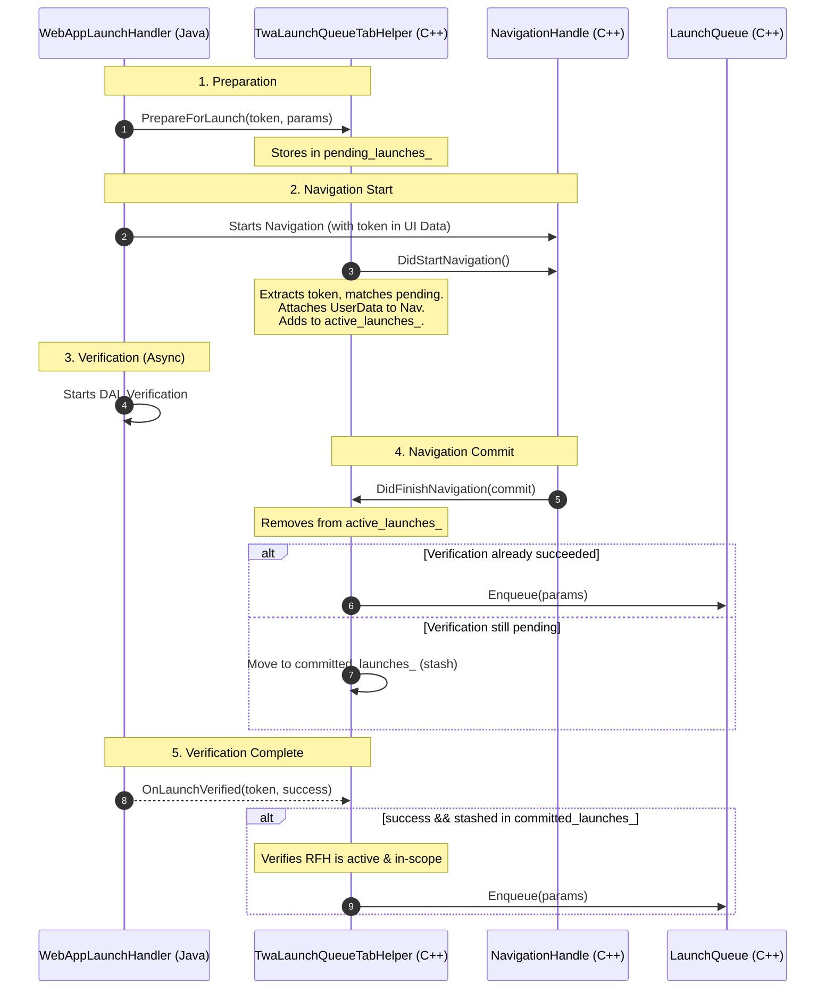

# Deep Dive: TWA Launch Parameters Handling

This document provides a technical deep dive into how Trusted Web Activity (TWA)
launch parameters (e.g. file handles passed via Android intents) are securely
routed and delivered to the web application's launch queue in Chromium.

For the design history and rationale, see the
[Design Doc](projects/twa-launch-params/design.md).

## Architecture Overview

TWA launch parameters handling spans across the JNI boundary:

- **Java (`WebAppLaunchHandler`)**: Manages the Android intent lifecycle,
  initiates Digital Asset Links (DAL) verification, and triggers C++ actions.
- **C++ (`TwaLaunchQueueTabHelper`)**: Manages the state of active launches,
  matches them to C++ navigations, and enqueues parameters to the cross-platform
  `LaunchQueue`.

To prevent security vulnerabilities (specifically, delivering file handles to
malicious origins via redirects), the system correlates launch intents with C++
navigations using a unique **launch token** and performs strict scope checks
upon navigation commit.

## Life of a TWA Launch (Sequence Diagram)

The following diagram illustrates the typical flow of a TWA launch where the
navigation commits before DAL verification completes (the most common race
condition scenario):

## Java-side Routing & Client Modes

When a TWA launch intent is received, Java's `WebAppLaunchHandler` determines
how to route the launch parameters based on the requested
`LaunchHandlerClientMode` and whether the current page in the tab is in scope:

- **`NAVIGATE_NEW`**: Java launches a new Android Activity (which creates a new
  task).
- **`NAVIGATE_EXISTING`**: Java reuses the existing tab and triggers a C++
  navigation with a token (calls `PrepareForLaunch`).
- **`FOCUS_EXISTING`**:
  - **In-Scope**: If the current page is already within the TWA's scope, Java
    delivers the parameters immediately without navigating (calls
    `EnqueueNonNavigating`).
  - **Out-of-Scope Fallback**: If the current page is out of scope (e.g. the
    user navigated away to an external site), Java falls back to navigating the
    existing tab to the target URL (calls `PrepareForLaunch`).
    - *Note*: This fallback models the default Android behavior of reusing and
      navigating the existing tab when launching an app with a URL (behaving
      like `navigate-existing`), rather than opening a new activity.

If the client mode is not specified or set to `AUTO`, Android defaults to
`NAVIGATE_EXISTING` (unlike Desktop which may default to `NAVIGATE_NEW`).

## State Machine

`TwaLaunchQueueTabHelper` tracks launches in three maps:

1. `pending_launches_` (`token -> PendingLaunch`): Holds launches prepared by
   Java that have not yet started navigating.
2. `active_launches_` (`token -> NavigationHandle*`): Holds active navigations.
   The launch parameters are stored in `TwaLaunchNavigationHandleUserData`
   attached to the `NavigationHandle`.
3. `committed_launches_` (`token -> CommittedLaunch`): Holds launches that
   committed but are waiting for DAL verification. Stores the parameters and the
   target `RenderFrameHost` ID.

## Scope Protections & Edge Cases

The centralized C++ state machine protects against several critical scope and
stability edge cases:

### 1. Cross-Origin Redirects (Race Mitigation)

If a TWA launch starts a navigation to a verified URL, but that page immediately
redirects to a different origin:

- In `DidFinishNavigation`, we check `TwaLaunchQueueDelegate::IsInScope` against
  the final committed URL.
- Since the redirected URL is cross-origin/out-of-scope, the check fails.
- The parameters are discarded and NOT enqueued, preventing the redirect target
  from accessing the file handles.

### 2. Speculative Loads (Fallback Matching)

If a tab was pre-warmed (e.g. via `CustomTabsSession::mayLaunchUrl`), the
navigation might have started before Java received the launch intent and
prepared the C++ helper. In this case, the navigation will not have a token in
`ChromeNavigationUIData`.

- Java passes `has_speculative_navigation = true` in `PrepareForLaunch`.
  - For **initial intents** (cold start), this is true if the tab was created
    hidden and the speculated URL matches the target URL.
  - For **new intents** (warm start), this is true if a speculative navigation
    was started in the existing tab and the speculated URL matches the target
    URL.
- In `DidFinishNavigation`, if `user_data` is missing, we perform a fallback
  match by comparing the committed URL against `pending_launches_` that are
  marked speculative.
- Fallback matching is strictly restricted to speculative launches to prevent
  normal/manual navigations from accidentally adopting stale pending launches.

### 3. Aborted Navigations

If a launch navigation is started but then aborted (e.g. replaced by a new user
navigation before commit):

- `DidFinishNavigation` is called with `committed = false`.
- We clean up the `active_launches_` entry to avoid dangling pointers.
- The launch parameters are discarded as the navigation failed. We do not
  deliver parameters to a document that did not result from the launch
  navigation.

### 4. Stale Launch Cleanup

If a launch commits and is stashed in `committed_launches_` (waiting
verification), but the verification hangs or takes too long, and the user
navigates away:

- When any new primary main-frame navigation commits to a new document, we call
  `committed_launches_.clear()`.
- This prevents stale parameters from accumulating in memory and potentially
  being delivered if verification completes much later.

### 5. Pre-existing Navigation Commit Race

If a new launch intent arrives while a pre-existing navigation is already in
progress in the tab:

- `PrepareForLaunch` stashes the new parameters in `pending_launches_`.
- If the pre-existing navigation commits before the new launch navigation
  starts, we must NOT clear `pending_launches_`.
- To avoid this race, `pending_launches_` is only cleaned up (clearing all
  entries, including speculative ones) when a *new* launch is prepared, rather
  than on navigation commits.
