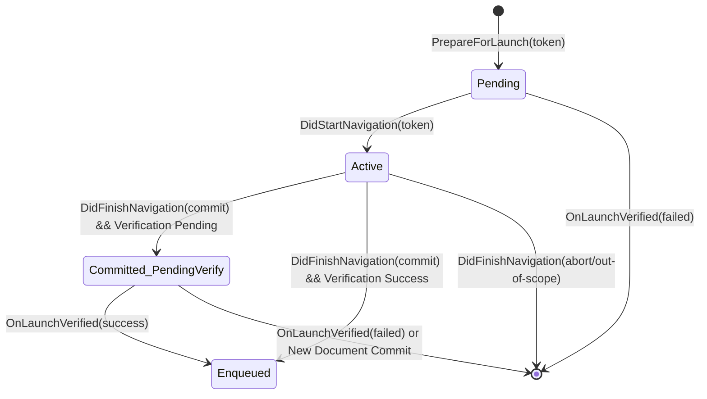

# Design: Centralized TWA Launch Parameters Matching in C++

- **Last Modified**: 2026-07-14
- **Status**: Implemented

## Background & Concepts

Trusted Web Activities (TWAs) allow Android applications to display verified web
content in a customized Custom Tab. TWAs support
[Web App Launch Handler API](https://w3c.github.io/web-app-launch/), allowing
them to receive launch parameters (including file handles) from the OS (via
share/file intents) and access them via `window.launchQueue.setConsumer`.

Previously, the launch parameters were stashed in C++ `TwaLaunchQueueTabHelper`
as a single `pending_launch_params_` field. C++ would then attach these
parameters to the next primary main-frame navigation that it observed in
`DidStartNavigation`.

## Problem Statement

The previous implementation suffered from a timing race and lack of scope
enforcement, leading to a potential race condition (b/523738212):

1. **Timing Race**: The JNI notification from Java containing the launch
   parameters is asynchronous (delayed by Digital Asset Links verification). If
   the navigation started by the TWA launch triggers `DidStartNavigation`
   *before* the JNI notification arrives, the parameters are left pending. They
   would then be blindly attached to the *next* navigation, which could be an
   untrusted page if the TWA immediately redirected.
2. **No Scope Enforcement**: C++ did not verify if the navigation destination
   was actually in-scope of the TWA before delivering the parameters.
   `TwaLaunchQueueDelegate::IsInScope` was a stub returning `true`.
3. **Complex State**: Attempting to manage this state and handle edge cases
   (like navigation cancellations, pre-warming, etc.) across the JNI boundary
   with split logic in Java and C++ was highly complex and prone to errors.

## Goals & Requirements

- **Security**: Prevent cross-origin file handle leaks. Launch parameters must
  only be delivered to the specific document/navigation that was triggered by
  the TWA launch.
- **Robustness**: Support speculative loads (pre-warmed tabs) and handle aborted
  navigations gracefully without losing parameters.
- **Simplification**: Centralize the launch lifecycle state machine in C++ to
  allow reliable observation of C++ navigation events (starts, commits,
  redirects) and avoid complex JNI synchronization.

## Design Proposal

We centralize the launch state machine in C++ `TwaLaunchQueueTabHelper` and use
a unique `launch_token` to correlate Java launch intents with C++ navigations.

### 1. Launch Correlation via Tokens

- Java generates a unique `int64_t launch_token` for each TWA launch.
- Java passes this token to C++ navigation initiation using
  `ChromeNavigationUIData::set_twa_launch_token()`.
- Java also notifies C++ of the launch parameters via JNI
  `PrepareForLaunch(token, params, ...)`.

### 2. C++ State Machine (`TwaLaunchQueueTabHelper`)

We track launches in three states:

- **Pending**: Launch prepared but navigation not started. Stored in
  `pending_launches_` map.
- **Active**: Navigation in progress. C++ `DidStartNavigation` extracts the
  token from `ChromeNavigationUIData`, finds it in `pending_launches_`, and
  associates the `NavigationHandle` with the token in `active_launches_`.
  `TwaLaunchNavigationHandleUserData` is attached to the handle.
- **Committed (Waiting Verification)**: Navigation committed but DAL
  verification is still pending. Stored in `committed_launches_` along with the
  `GlobalRenderFrameHostId`.
- **Enqueued**: Parameters delivered to the document's `LaunchQueue`.

### 3. JNI Interface

- `PrepareForLaunch(webContents, token, startUrl, packageName, fileUris, scopeUrl, hasSpeculativeNavigation)`:
  Prepares the C++ helper for a launch.
- `OnLaunchVerified(webContents, token, success)`: Called when Java DAL
  verification completes. Updates the state:
  - If **Active**: Updates status in `TwaLaunchNavigationHandleUserData`.
  - If **Committed**: Enqueues the parameters if success and RFH is still
    active/in-scope.
- `EnqueueNonNavigating(...)`: Handles "focus-existing" launches where no
  navigation is triggered.

### 4. Edge Cases

- **Speculative Launches**: If a navigation was started before the launch token
  was available (e.g. via `mayLaunchUrl`), C++ will not find a token in
  `ChromeNavigationUIData`. In `DidFinishNavigation`, if the navigation
  committed and has no `TwaLaunchNavigationHandleUserData`, C++ falls back to
  matching by URL against `pending_launches_` that have
  `has_speculative_navigation` set to true.
  - **Cold Start**: Java detects this if the CCT is created in
    `TabCreationMode.HIDDEN` and the target URL matches the speculated URL.
  - **Warm Start (New Intent)**: Java detects this if a speculative navigation
    was pre-warmed in the existing tab (e.g., via a subsequent `mayLaunchUrl`
    call) by checking if `CustomTabActivityTabProvider::getSpeculatedUrl()`
    matches the target URL.
- **Aborted Navigations**: If an active launch navigation is aborted, we remove
  it from `active_launches_` but do *not* discard the parameters immediately,
  allowing them to potentially match a subsequent navigation if it was a
  temporary redirect or retry (though normally we expect a new launch intent to
  generate a new token).
- **Stale Cleanup**: To prevent memory accumulation, `committed_launches_` is
  cleared whenever *any* new primary main frame navigation commits to a
  different document.
- **Pre-existing Navigation Commit Race**: If a TWA receives a new launch intent
  while an unrelated navigation is already in progress, `PrepareForLaunch` will
  stash the new parameters. If the pre-existing navigation commits *after*
  `PrepareForLaunch` but *before* the new launch navigation actually starts, we
  must ensure we do not discard the newly pending parameters. For this reason,
  we do not clear `pending_launches_` on arbitrary navigation commits. Instead,
  stale entries in `pending_launches_` (both speculative and non-speculative)
  are cleared when a new launch is prepared.

### 5. Scope Verification

`TwaLaunchQueueDelegate::IsInScope` is implemented to check if the committed URL
is within the TWA scope passed from Java. This check is performed:

1. On navigation commit in `DidFinishNavigation` before enqueuing or stashing.
2. On verification completion in `OnLaunchVerified` before enqueuing.
3. In `EnqueueNonNavigating` before enqueuing.

## Alternatives Considered

### Maintaining WebContentsObservers in both Java and C++

- **Cons**: Resulted in too many edge cases due to the decoupling of the Java
  lifecycle and C++ navigation events (which can be aborted, redirected, etc.
  independently). Centralizing the state machine in C++ simplifies this.

### Relying purely on URL matching

- **Pros**: Simple JNI interface (no tokens).
- **Cons**: Vulnerable to race conditions and redirects. If a page immediately
  redirects to a different origin, the new page's navigation might match the URL
  of the initial launch if we only checked the start URL. Using tokens ensures
  we only target the navigation initiated by the launch.

### Discarding parameters immediately on any new navigation start

- **Pros**: Aggressive cleanup.
- **Cons**: If a background navigation (e.g., speculative prefetch or subframe)
  starts, it could destroy the pending launch params for the main frame
  navigation we care about. We only clear stashed committed launches when a new
  primary main frame navigation *commits* to a different document, which is a
  safer signal that the user has navigated away.

## Other Considerations

- **Security**: The design ensures that file handles are only delivered if the
  final committed document is same-origin and in-scope of the verified TWA.
- **Memory Safety**: `TwaLaunchQueueTabHelper` observes navigation destruction
  and cleans up its maps to avoid dangling `NavigationHandle` or
  `RenderFrameHost` pointers.

## References

- **Bug**: b:523738212
- **CL**:
  [8048065](https://chromium-review.googlesource.com/c/chromium/src/+/8048065)
