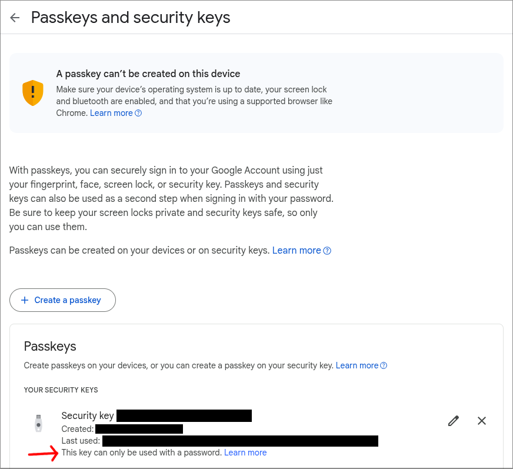
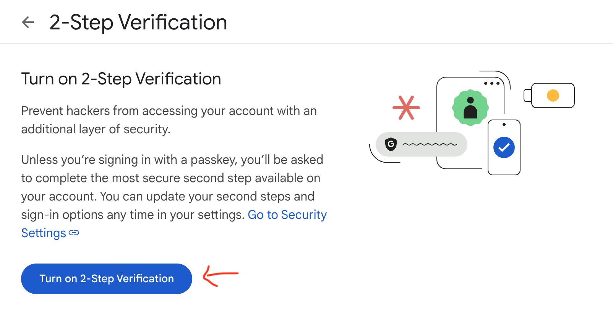
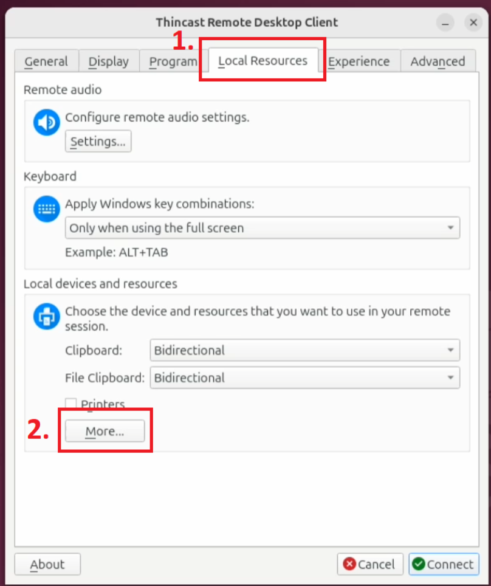
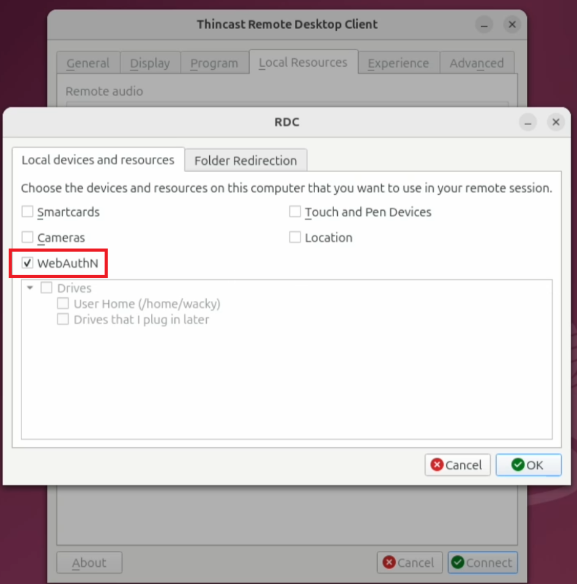
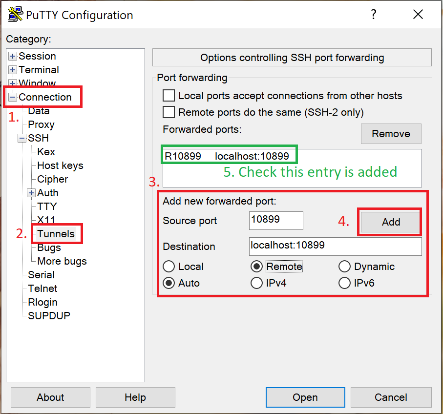
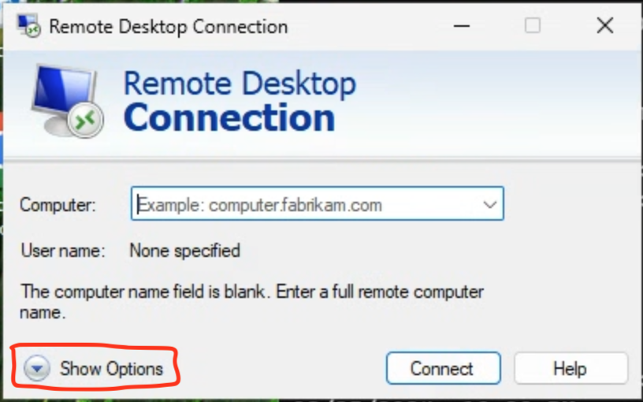
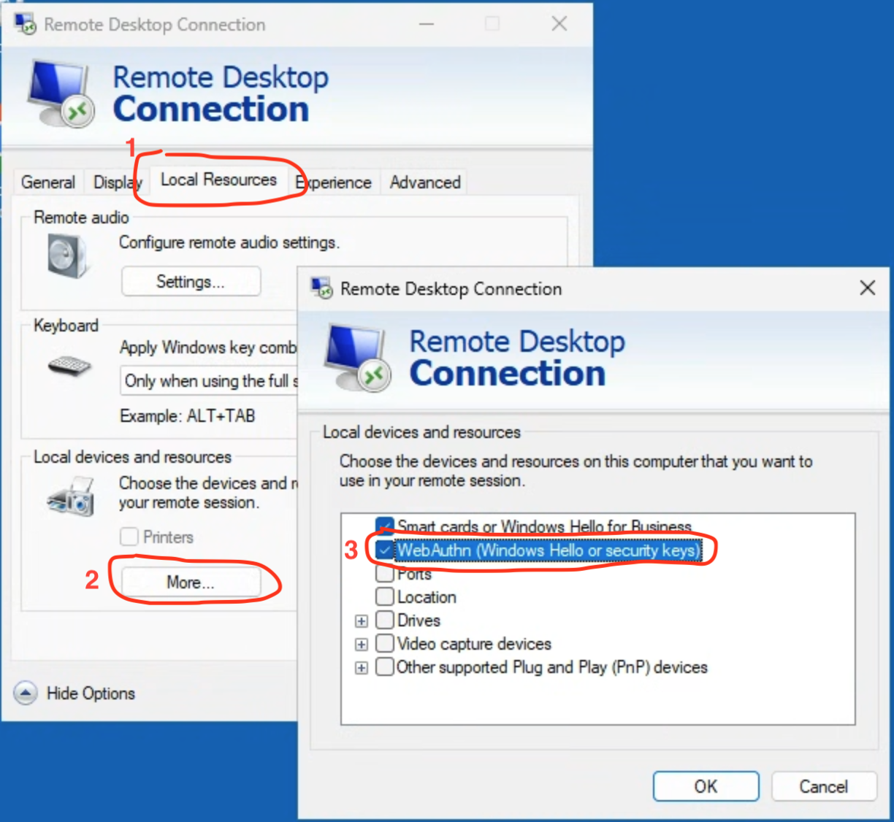

# Gerrit ReAuth

*** promo
Googlers: See [go/gerrit-reauth](http://go/gerrit-reauth) for more information.
***

[TOC]

## Background

To further protect the integrity of Chromium’s codebase and other related
projects, including Git repositories, a significant security enhancement is
being implemented. This enhancement requires all **committers** who write or
review code to utilize a security key for two-factor authentication on their
associated Google account.

This new approach, referred to as ReAuth, mandates a security key tap once every
20 hours to obtain a fresh set of credentials for interactions with Git and
Gerrit. Specifically, actions requiring committer powers, such as reviewing
Change Lists (CLs) for submission and uploading CLs (which counts as the
uploader self-reviewing the CL), will necessitate ReAuth.

The primary goal of this policy is to establish a robust layer of protection
against unauthorized access, significantly diminishing the risk of compromised
accounts, supply chain attacks, and malicious activities stemming from stolen
committer credentials.

Please follow this guide to setup your machine, and to complete ReAuth.

## Prerequisites

### Physical Security Key

You must have a physical
[FIDO security key](https://www.google.com/search?q=FIDO+security+key)
registered with your Google account.

To register a key or check your existing keys, go to
[https://myaccount.google.com/signinoptions/passkeys](https://myaccount.google.com/signinoptions/passkeys)



The line "This key can only be used with a password" indicates a **U2F**
security key. If the line is missing, the key is a **FIDO2** security key.
Please include this info when reporting issues.

**Important Note**: Passkeys won't be supported by ReAuth. A physical security
key is required.

If you’re using a Google Workspace account, make sure
"[2-Step Verification](https://myaccount.google.com/signinoptions/twosv)" is
turned on.



### Accurate Timezone / Time

Make sure your device's timezone and time are set correctly.

If you’re behind a corporate network or network proxy, your system’s auto
configured timezone might be incorrect. If this is the case, go to your system’s
settings and set timezone and/or time manually.

### Latest Git

Ensure you have the latest version of Git (or at least later than 2.46.0). Use
the package manager for your system or download from the [Git
website](https://git-scm.com/downloads). (Note: if you are on Ubuntu LTS you may
need to follow the instructions on the Git website to install from PPA)

### Latest depot_tools

Ensure you
[have depot_tools](https://commondatastorage.googleapis.com/chrome-infra-docs/flat/depot_tools/docs/html/depot_tools_tutorial.html#_setting_up)
installed and configured on PATH.

Then run:

```
update_depot_tools
```

### Git config for Gerrit

Make sure your Git is configured for Gerrit. You only need to do this once.

```
git cl creds-check --global
```

Please follow the prompts from the tool and resolve any issues.

## Performing ReAuth

You can ReAuth with a locally attached security key, or over an SSH or remote
desktop session.

You will be required to ReAuth every 20 hours or so, we recommend you ReAuth
when you start your day.

### Local ReAuth

This is for completing ReAuth when you're using a machine with a locally
attached security key.

First, make sure you have the [latest depot_tools](#latest-depot_tools) and
have [set up Git to access Gerrit](#git-config-for-gerrit).

Then, check if you're already logged in (this is likely if you have already
logged in with depot_tools):

```
git credential-luci info
```

This should print a line containing `email=<your email>`. If not, you'll need to
login first:

Inside your terminal, run:

```
git credential-luci login
```

To perform ReAuth, run the following command inside your terminal:

```
git credential-luci reauth
```

You will be prompted to touch your security key. If you see “ReAuth succeed.”,
then it works\!

If it doesn't work, please refer to [Troubleshooting](#troubleshooting) to turn
on debug logs, then retry the command.

### Remote ReAuth

This is for completing ReAuth when:

- You plug-in a security key to a local client machine machine
- You SSH or remote desktop into a remote development machine (where the
  chromium/src checkout lives)

First, make sure you have the [latest depot_tools](#latest-depot_tools)
installed on **both local and remote** machines.

Then, make sure you have
[set up Git to access](#git-config-for-gerrit).

Then, ensure you're logged into Gerrit on the **remote machine**. You can check
this by running:

```
git credential-luci info
```

The above command should print your email. If not, run the following command to
login:

```
git credential-luci login
```

Then, refer to the instructions for your SSH / remote desktop workflow below.

#### Linux Client Prerequisites {#linux-client-prerequisites}

You need to do some manual configuration to make your security keys available
to depot_tools (or the remote desktop application of your choice).

On most distributions, you need to set up udev rules and/or install some
dependencies.

- The exact instructions depend on your Linux distribution.
- You can follow
  [Yubico’s guide](https://support.yubico.com/hc/en-us/articles/360013708900-Troubleshooting-using-your-YubiKey-with-Linux)
  here, which we confirmed to be working on Ubuntu 24 Desktop.

After you finished the setup, you can check depot_tools can access your security
keys by running:

```
luci-auth-fido2-plugin --list-devices
```

If the above command lists your security keys, you’re good to go.

#### I’m using a Linux / Mac client, I want to SSH into Linux

If you’re using a Linux client, ensure you’ve completed
["Linux Client Prerequisites"](#linux-client-prerequisites) and made your
security keys available to applications.

Then, on the local machine, set the security key plugin with
\`GOOGLE_AUTHN_WEBAUTHN_PLUGIN\` environment variable, then use
\`luci-auth-ssh-helper\` to SSH into the remote machine.

You can specify SSH options (such as port forwarding) after a double dash.

```
luci-auth-ssh-helper [-- ssh_options...] [user@]host
```

In this SSH session, run the following command to ReAuth:

```
git credential-luci reauth
```

You should be prompted to touch your security key. If you see "ReAuth succeed",
then it works\!

For the first security key touch, there might be a delay before your security
key starts blinking. This is caused by `luci-auth-fido2-plugin` bootstrapping.

#### I’m using a Linux / Mac client, I want to remote desktop into Windows

If you’re using a Linux client, ensure you’ve completed
["Linux Client Prerequisites"](#linux-client-prerequisites) and made your
security keys available to applications.

You need a remote desktop client that supports WebAuthn forwarding.

For example,
[Thincast Remote Desktop Client](https://thincast.com/en/products/client)
(available free of charge for non-commercial use):

- On Linux, install the **flatpak version**
  ([instructions](https://thincast.com/en/documentation/tcc/latest/index#install-linux)).
  Snapcraft version doesn’t work with security keys (as of 2025 August)
- On MacOS, download and install the universal dmg package
  ([instructions](https://thincast.com/en/documentation/tcc/latest/index#install-linux))

Then, launch the Thincast remote desktop client, enable the "WebAuthn" option in
"Local Resource \> Local devices and resource \> More…" (refer to screenshots
below).

Click "OK" to save your settings, then go back to the "General" tab, input the
remote desktop server with your development machine’s hostname (or IP address)
and user name, then click "Connect".





In the remote desktop session, open a command prompt (CMD), then run the
following command to ReAuth:

```
git credential-luci reauth
```

Wait for your security key to blink, then touch it to complete ReAuth. You
should see "ReAuth succeed" in the command prompt.

For the first security key touch, there might be a delay before your security
key starts blinking. This is caused by `luci-auth-fido2-plugin` bootstrapping.

#### I’m using a Windows client, I want to SSH into Linux

First, start `luci-auth-ssh-helper` in daemon mode on a TCP port (we use 10899
in the example). The helper will listen for incoming ReAuth challenges.

```
set GOOGLE_AUTH_WEBAUTHN_PLUGIN=luci-auth-fido2-plugin
luci-auth-ssh-helper -mode=daemon -port=10899
```

Then, use your SSH client and port-forward a port (here we use the same port
number for convenience) on your remote Linux machine to the helper’s port on the
local machine.

Note, you might need to update your SSH server config to allow port-forwarding
(if not enabled by default).

If you’re using the an OpenSSH client (e.g. built-in to Windows, or included in
Git-on-Windows):

```
ssh -R 10899:localhost:10899 [user@]remote_host
```

If you’re using PuTTY, set up port-forwarding on the "Connection \> SSH \>
Tunnels" page in the connection dialog (see screenshot). Remember to "Save" your
configuration in the "Session" page if you want to persist the configuration.



Inside your SSH session, set `SSH_AUTH_SOCK` to the forwarding port, then run
the ReAuth command.

```
export SSH_AUTH_SOCK=localhost:10899
git credential-luci reauth
```

Windows will prompt you to touch the security key. Touch the security to
complete ReAuth. If you see "ReAuth succeed", then it works.

For the first security key touch, there might be a delay before your security
key starts blinking. This is caused by `luci-auth-ssh-plugin` and
`luci-auth-fido2-plugin` bootstrapping.

You need to make sure `luci-auth-ssh-helper` is running on your local machine
when you want to perform ReAuth challenges over a SSH session. For convenience,
you can register it to start as a service on login.

#### I’m using a Windows client, I want to remote desktop into Windows

Use the built-in Windows Remote Desktop Connection application (also known as
`mstsc`), make sure "WebAuthn (Windows Hello or security keys)" is enabled in
"Show Options \> Local Resources \> More…" (refer to screenshots below). Then
connect to the remote Windows machine as usual.





Then, in the remote desktop session, run the following command in command prompt
(CMD):

```shell
git credential-luci reauth
```

Windows will prompt you to touch the security key. Touch it to complete ReAuth.

If you see "ReAuth succeed", then it works\!

#### None of the above

SSH / remote desktop workflows not listed above aren’t tested. We’re working on
adding instructions for more workflows.

If you have suggestions or feedback, please report to:
[https://issues.chromium.org/issues/new?component=1456702&template=2176581](https://issues.chromium.org/issues/new?component=1456702&template=2176581).

## Troubleshooting

Please set `LUCI_AUTH_DEBUG` environment variable to enable debug logs.

In Linux / Mac, run:

```
export LUCI_AUTH_DEBUG=1
```

In Windows (CMD), run:

```
set LUCI_AUTH_DEBUG=1
```

Then, retry the failed command (e.g. `git credential-luci reauth`).

If you run into issues, please report to
[https://issues.chromium.org/issues/new?component=1456702&template=2176581](https://issues.chromium.org/issues/new?component=1456702&template=2176581)

**Please be sure to include**:

- The debug logs produced by setting `LUCI_AUTH_DEBUG`
- The security key you're using (e.g. manufacturer, model, etc.)
- Whether the security key is registered as a FIDO2 or U2F key (see
  [Prerequisites](#prerequisites))

Note, when sharing debug logs, please edit out the value after `Signature:`
field (if it's present) and any other values if you wish.

## FAQs

**I accidentally shared the `Signature:` in the debug logs\!**

Do not worry too much if you share this. This can be used in a very small time
frame to exchange for a token that only lasts for 20 hours, and both the
exchange and any subsequent use of the token also requires your actual/regular
credentials in addition to the token. Furthermore, as of this writing, no
actions can be authorized with this token yet.

Of course, we do recommend avoiding sharing this as a general safety precaution.

**Can I use other forms of 2-Step Verification (2SV)?**

For ReAuth: No. You must use a physical security key. SMS, authenticator app,
passkeys won't satisfy ReAuth requirement (e.g. when uploading code, doing code
reviews).

You can still add and use other 2SV methods to sign into your Google account.

**What should I expect to see when ReAuth is required?**

ReAuth is required every 20 hours. When ReAuth is required you will see the
following error when performing Gerrit remote operations like uploading CLs:

```
ReAuth is required

If you are running this in a development environment, you can fix this by running:

git credential-luci reauth
```

You will need to run `git credential-luci reauth` every 20 hours to avoid or
resolve this issue. We recommend you ReAuth when you start your day.
