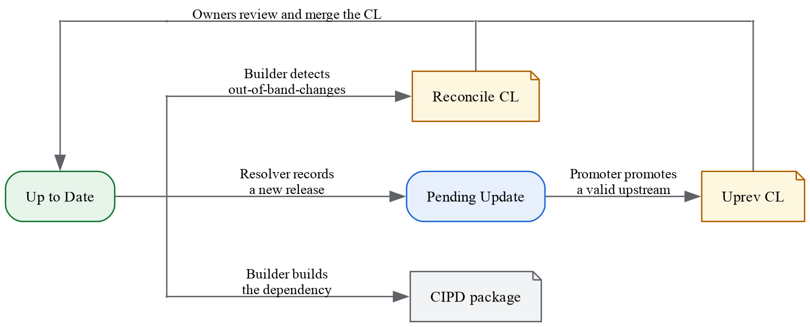

# Using Crowbar Workflow to manage third-party dependencies

[TOC]

A Crowbar workflow is useful when you need to:

*   Apply patches, or string replacements.
*   Take a subset of files from the upstream.
*   Generate code from upstream source code, such as config headers.

## Why Crowbar?

Historically, dependencies that can't be imported as a
["pristine" git submodule](https://chromium.googlesource.com/chromium/src/+/main/docs/managing-third-party/skia-autoroller.md)
were either checked in directly into the Chromium repository, or built as a
[3pp package](https://chromium.googlesource.com/chromium/src/+/main/docs/cipd_and_3pp.md)
and pulled in via DEPS.

With the introduction of the
["keeping the dependency fresh"](https://chromium.googlesource.com/chromium/src/+/main/docs/adding_to_third_party.md#fresh-deps)
requirement, both practices showed clear drawbacks.

### Checked-in Dependency

**No automation was available:** Owners have to be made aware of upstream
releases somehow (e.g. reading a newsletter) and perform an update manually on
their workstation.

Some owners wrote bespoke `update.sh` scripts to clone the repository (maybe
HEAD, or a hardcoded commit), apply patches, and run code generation commands on
their workstation. However, such scripts rely on the author's host machine
toolchain, and aren't always reproducible on Chromium CI builders.

There's no standard way to apply a bake-in delay or minimum release age. Owners
have to manually inspect upstream commit history and pick a commit that "looks
right".

**Patch maintenance was difficult:** Patches may become out-of-date because we
lacked automation to verify that patches and checked-in code are consistent.
This blurs the boundary between third-party authored code and Chromium-specific
modifications.

Owners may also choose not to maintain patches. This risks overwriting or
silently dropping Chromium patches when cherry-picking upstream changes. The
lack of patch files also caused Chromium's patched copy to diverge further over
time, making future merges harder.

### 3pp and CIPD

The [3pp-CIPD](https://chromium.googlesource.com/chromium/src/+/main/docs/cipd_and_3pp.md)
system was designed before the requirement to keep dependencies fresh, and
primarily focused on Chromium Infrastructure needs (e.g. multi OS-Arch support,
cross-compilation, long-term artifact storage and distribution).

**The 3pp schema's versioning primitives are limited.** Non-Git upstreams
require manually changing URL and version strings in the 3pp spec, or writing a
custom Python `fetch.py` script to always fetch the latest artifacts.

Similar to updating checked-in dependencies, the manual update work requires
engineers to be made aware of new releases somehow.

The `fetch.py` approach isn't ideal because the Python script may contain side
effects, and can't be cached by our CI builders. So the 3pp CI builders have to
download the complete upstream artifact every time they run (e.g. every 4
hours). This generates unnecessary traffic to upstream servers.

**3pp CIPD package updates involve multiple steps and have high latency.**
An engineer needs to first update and land the 3pp spec change. Then, they wait
for 3pp CI builders to build the package (which may take up to 4 hours before a
new build is triggered). Finally, they obtain the new CIPD package instance
identifier and update the DEPS file.


## Concepts

A Crowbar workflow is defined by a `crowbar.txtpb` file in a dependency's
directory. The workflow consists of
[three parts](https://source.chromium.org/chromium/infra/infra_superproject/+/main:infra/go/src/infra/tools/crowbar/pkg/proto/crowbar.proto):

*   **Upstream** specifies the third-party software artifacts to bring into
    Chromium, typically a git commit or an archive file.
*   **Latest** defines instructions for our services to detect newer releases
    from the upstream.
*   **Stages** defines steps to transform upstream artifacts for Chromium use.
    Transformation can include string replacement, patching, and code
    generation. The transformation result can either be checked into the
    Chromium git repo, or published as CIPD packages.

When a Crowbar workflow runs, the Crowbar tooling performs the following steps
in an isolated environment (to limit dependency on the host machine
environment):

1.  Fetch upstream artifacts based on the first `Upstream`.
2.  Unpack artifacts into a temporary directory.
3.  Run Copybara based on `copy.bara.sky`, typically to rename and patch files.
4.  Execute commands in `Stages.Output.Build` (if defined), typically to
    generate code.
5.  Collect the result into a Git commit, or package it into a CIPD package.

To achieve automated dependency updates, Chromium CI runs Crowbar builders
divided into three roles:

**Builder:** The builder builds and uploads CIPD packages after their Crowbar
workflow specification (`crowbar.txtpb`) is added or modified. The builder also
verifies that the checked-in code matches its workflow. If they don't match, the
builder generates a reconcile CL to overwrite out-of-band changes.

**Resolver:** The resolver runs periodically to query the upstream about the
latest releases. The resolver then records the latest one in `crowbar.txtpb`
with a `not_valid_until` timestamp in the future (aka "pending update"). This
acts as the "bake-in delay" mechanism.

**Promoter:** The promoter runs periodically to promote upstreams that are past
their `not_valid_until` time, triggering the workflow's build steps to "upgrade"
the dependency. The promoter sends a CL to the dependency owner to review, or to
intervene if the upgrade fails.

We aim to run the builder continuously to promptly pick up new dependencies. We
aim to run the resolver and the promoter at least once a day.

The following diagram shows the state transitions of automatic updates:



## Prerequisites

### Directory Structure

Crowbar dependencies follow the
[standard directory structure](https://chromium.googlesource.com/chromium/src/+/main/docs/adding_to_third_party.md#standard-dep-structure).

Put Crowbar workflow files (marked with `(*)`) into the dependency's top-level
directory:

```
third_party/
  foo/
    README.chromium
    crowbar.txtpb     <-- (*) Required, Crowbar workflow
    copy.bara.sky     <-- (*) Required, transformation steps
    patches/          <-- Optional, patch files
      abc.patch
    src/              <-- Generated by the workflow
      LICENSE             <-- Preserve the upstream LICENSE file
      ...                 <-- Post-transformation code
```

You MUST clearly separate "glue code" and "third-party code" (unmodified or
patched). Code that originates from the upstream MUST reside in the `src/`
directory. Crowbar tooling enforces this and will overwrite out-of-band
changes.

You CAN add glue code in the dependency's directory, as long as it isn't in the
`src/` folder. Glue code includes, but isn't limited to: integration tests,
build rules, and build config headers.

### No Code Reformatting

You MUST NOT reformat upstream code. We have disabled Chromium's formatter
in the `third_party/` directory, except for Python and Java files.

You SHOULD re-enable Chromium's formatter for glue code, such as integration
tests and fuzzers. You can do so by adding a
[`.clang-format-ignore`](https://source.chromium.org/chromium/chromium/src/+/main:third_party/ipcz/.clang-format-ignore;drc=c822490a82cdb6ad479159683a92858f7c6f0a58)
file in the glue code directory. If `.clang-format-ignore` is placed in the
dependency's root directory (alongside `src/`), include `src/**` in it so
upstream code remains unformatted.

If your dependency is Python source code, please add the dependency's `src/`
path to
[.yapfignore](https://source.chromium.org/chromium/chromium/src/+/main:.yapfignore;l=15;drc=6f023d4b49e6c6de014298fe784c7e5c622c704f).

If your dependency is Java source code, please consult us. It's a known issue
that Chromium's Java formatter isn't configurable and always formats code based
on the Google Java style guide.

## Set up a basic Crowbar Workflow

The following steps assume:

* `depot_tools` is [installed and on $PATH](https://commondatastorage.googleapis.com/chrome-infra-docs/flat/depot_tools/docs/html/depot_tools_tutorial.html#_setting_up).
* The dependency's folder is `third_party/foo` in `chromium/src`.
* The working directory of shell commands is the `chromium/src` folder.
* Shell command lines given in this section are for a Linux shell. Adjust path
  separators if you're on Windows.

Crowbar runs on Linux, macOS, and Windows. The CLI entrypoint is the `crowbar`
executable in `depot_tools`.

In Crowbar command line arguments, please use the correct path separator (`/`
on Unix-like systems, `\` on Windows).

In command line arguments, relative paths MUST start with a `./` or `.\` prefix.
If the dot-slash prefix is missing, Crowbar resolves the path relative to the
Git repository root.

In the Crowbar workflow specification (`crowbar.txtpb`) and Copybara config file
(`copy.bara.sky`), use the UNIX path separator (`/`) in paths.

To set up a Crowbar workflow, create the dependency folder following
[Directory Structure](#directory-structure).

At a bare minimum, you need three files:

```
third_party/
  foo/
    README.chromium    <-- The required metadata file
    crowbar.txtpb      <-- Crowbar workflow specification
    copy.bara.sky      <-- Copybara config
```

### 1. Write the README.chromium file
This is the required metadata file for all third-party dependencies.
See [README.chromium](https://chromium.googlesource.com/chromium/src/+/main/docs/adding_to_third_party.md#README_chromium).


### 2. Write crowbar.txtpb

`crowbar.txtpb` is a text format protocol buffer. Use the following
scaffolding content based on your use case, replacing placeholders (e.g. `<URL>`)
with suitable values.

#### Git Upstream
```
upstream {
  artifacts {
    git {
      repository: "<URL>"
      commit: "<COMMIT>"
    }
  }
}
stages {
  input {
    patch { copybara: {} }
  }
  output {
    update { git {} }
  }
}
```

#### Archive File
```
upstream {
  artifacts {
    # Required for HTTP artifacts: file name to use for archive extraction.
    name: "foo.zip"

    http {
      url: "<URL>"

      # Example: sha256:0123456...
      digest: "<ALGO>:<HASH>"
    }
  }
}
stages {
  input {
    unpack { default { strip_components: 1 } }
    patch { copybara: {} }
  }
  output {
    update { git {} }
  }
}
```

The `name` field is **REQUIRED** for HTTP artifacts and specifies the file name
for the downloaded URL file.

Crowbar's built-in unpacker (`unpack { default {} }`) automatically extracts
files based on the extension name. Common archive formats are supported: `.zip`,
`.jar`, `.tar.gz`, `.tar.xz`, and `.tar.bz2`.

The `digest` field is **REQUIRED**. "sha256" is the preferred hashing algorithm.
Crowbar verifies the downloaded file against this digest value, and will reject
it in case of a hash mismatch.

### 3. Write copy.bara.sky

`copy.bara.sky` is a [Copybara](https://github.com/google/copybara) config file.
The file uses [Starlark syntax](https://starlark-lang.org/) (similar to Python).

```python
load("//crowbar", "crowbar_workflow")

crowbar_workflow(
   origin_files = glob([
      "**",
   ])
)
```

*** note
Crowbar uses Copybara as a cross-platform source code transformation tool, and
doesn't use Copybara's origin and destination API. Don't bypass the provided
`crowbar_workflow` entrypoint.
***

The above Copybara config file will import everything in the upstream. If you
only need a subset of files, adjust the expression in `glob()`. The glob paths
are relative to the unpacked upstream (e.g. root of the git repo, or extracted
archive files).

The `glob` function supports `**` and `*` wildcards and can exclude paths. See
[Copybara Glob documentation](https://github.com/google/copybara/blob/master/docs/reference.md#glob-1)
for more details.

### 4. Trigger the workflow to import upstream code

Now you have a bare minimum workflow. Verify Crowbar can fetch the upstream
code.

You can trigger the workflow by running the Crowbar CLI in the `chromium/src`
folder:

```shell
crowbar build ./third_party/foo
```

The first run will take a few minutes as Crowbar first downloads its own
dependencies. Subsequent runs should be faster as Crowbar caches intermediate
steps.

If everything works, you should see the following in the output:

```
Package third_party/foo needs update, new git tree: <abcdef>
```

Then, you can inspect the workflow result by diffing this git tree against the
git repo with `git diff HEAD <tree>`, or set the Crowbar `--no-dry-run` option
to write the result into your Git worktree.


## Define Auto-Update Behavior

To instruct Crowbar services to automatically update the dependency, you need
to add a `latest` section in `crowbar.txtpb`. Conventionally, we put the
`latest` message after the `stages` message.

The `latest` message supports multiple upstream types and version selection
policies. For the full syntax, please refer to [crowbar.proto](https://source.chromium.org/chromium/infra/infra_superproject/+/main:infra/go/src/infra/tools/crowbar/pkg/proto/crowbar.proto?q=%22message%20Latest%22%20f:crowbar.proto&ss=chromium).

If you aren't sure about the upstream type, or the version selection policy to
use, please file a consultation request in
["Third-Party > Freshness"](https://issues.chromium.org/issues/new?component=1900398&template=2268619).

If Crowbar doesn't support your upstream, please file a feature request in
["Third-Party > Freshness"](https://issues.chromium.org/issues/new?component=1900398&template=2408111).

Here we use a Git repository that publishes semantic version tags as an example.
Add the following `latest` message to `crowbar.txtpb`:

```
upstream { ... }
stages { ... }

# --- Add the following ---
latest {
  semver {}
  git {
    repository: "<URL>"
    tags {}
  }
}
```

Then you can verify the resolution result with:

```
crowbar resolve ./third_party/foo
```

The command should print:

```
third_party/foo: resolved to a new upstream: v1.2.3
```

After the `latest` message is committed and landed in the `chromium/src` repo,
Crowbar services will start monitoring upstream releases, and send you CLs when
an update is performed.

By default, the Crowbar service applies a 14-day bake-in delay, and waits for 14
days before promoting a newly detected upstream version. Expect to receive 2 CLs
per month if the upstream makes daily releases.

Crowbar services automatically record new upstreams in `crowbar.txtpb` by
appending `Upstream` messages with a future `not_valid_until` timestamp.

When an upstream is promoted, Crowbar automatically sets the `Revision` and
`Version` fields in `README.chromium` files based on the resolved
[Upstream Identifier](https://source.chromium.org/chromium/infra/infra_superproject/+/main:infra/go/src/infra/tools/crowbar/pkg/proto/crowbar.proto?q=Identifier%20f:crowbar.proto&ss=chromium).


## When you receive a Crowbar CL

When the Crowbar service promotes a new upstream, it generates a CL for you to
review. Please review the CL (LGTM+1) and submit the CL.

To make changes to the CL, you can take over the CL by uploading a new patchset.
Please preserve the `Change-Id` field in the CL description. Crowbar relies on
`Change-Id` to track dependency updates and to avoid creating duplicates.


## Workflow Scenarios

Below we give example workflow snippets for common scenarios. You can combine
and adapt them on top of the workflow files added during
[Set up a basic Crowbar Workflow](#set-up-a-basic-crowbar-workflow).

To verify your edit, run `crowbar build ./third_party/foo`. See
[Set up a basic Crowbar Workflow](#set-up-a-basic-crowbar-workflow) for more
CLI usage.

### Take a subset of upstream files

Useful when you only need a subset of files from the upstream (e.g. to reduce
checkout size). This is accomplished with `origin_files` in `copy.bara.sky`.

```python
# In copy.bara.sky

crowbar_workflow(
  origin_files = glob([
      "LICENSE",
      "foo.h",
  ])
)
```

### Copybara transformations
Copybara transformations are performed in an isolated directory. This directory
contains a single `src` folder that contains the unpacked upstream artifacts.

You can use most Copybara transformations
[(full reference)](https://github.com/google/copybara/blob/master/docs/reference.md).

Common ones are:

* String replacements: `core.replace`, `core.replace_mapper`
* File move and rename: `core.move`, `core.rename`, `core.copy`
* Patch application: [`patch.apply`](#apply-and-maintain-patches) (we don't support `patch.quilt_apply`)

*** note
Dynamic transformations (whose documentation says "used by libraries
developers") MAY ONLY be used after consulting `chrome-ssci-team@google.com`.
You can file a consultation ticket in
["Third-Party > Freshness"](https://issues.chromium.org/issues/new?component=1900398&template=2268619).

Crowbar requires the transformation to be reproducible to trigger workflows and
cache results on the CI builders. Non-deterministic transformations invalidate
the cache's assumptions and will fail to trigger in subsequent builds.
***

We curated some utilities in
[`crowbar.bara.sky`](https://chromium.googlesource.com/infra/infra/+/main/go/src/infra/tools/crowbar/internal/utilities/crowbar/assets/copybara/crowbar.bara.sky). You can use them by first loading them into the
main `copy.bara.sky` file.

```python
# In copy.bara.sky

# Add the symbol name in load()       ↓
load("//crowbar", "crowbar_workflow", "replace_crlf")

# Use the utility functions in the transformations list
transformations = [ replace_crlf(paths = glob(["**.c", "**.h"])) ]
```

Feel free to suggest new utilities by creating CLs for the
[`crowbar.bara.sky`](https://chromium.googlesource.com/infra/infra/+/main/go/src/infra/tools/crowbar/internal/utilities/crowbar/assets/copybara/crowbar.bara.sky) file.


### Apply and maintain patches

We require you to put patch files in a `patches/` directory alongside
`crowbar.txtpb`. See [Directory Structure](#directory-structure).

You can then use Copybara's patch transformation in `copy.bara.sky` to apply
patches.

```python
# In copy.bara.sky

crowbar_workflow(
  transformations = [
    patch.apply(
      patches = ["patches/01-goal.patch"],
    ),
  ],
)
```

Patches are applied relative to the dependency's folder (e.g. `third_party/foo`).
In other words, patch headers should be `a/src/`.

We recommend writing small and meaningful patches. Don't squash everything into
a single patch file. Upstreaming patches is encouraged, but not required.

In the future, we may introduce auto-fix capabilities to Crowbar services to
automatically resolve merge conflicts. You are encouraged to document the intent
in the patch files themselves or include comments on the `patches` argument.

### Windows-related

If your dependency primarily targets Windows, or if you use Windows as a
development machine, you may run into the following issues.

We provide utility transformations in Crowbar to fix common issues. You can load
the utilities and use them in `copy.bara.sky`.

```python
# In copy.bara.sky

load("//crowbar", "crowbar_workflow", "UTILITY_NAME")

crowbar_workflow(
  transformations = [
    UTILITY_NAME( options... )
  ],
)
```

#### Line endings

Chromium uses UNIX line endings. If your dependency uses CRLF, specify
[replace_crlf](https://source.chromium.org/chromium/infra/infra_superproject/+/main:infra/go/src/infra/tools/crowbar/internal/utilities/crowbar/assets/copybara/crowbar.bara.sky;l=7-9;drc=4951a039d661acda9b25f3af2ba0a329f66457d7) in Copybara
transformations.

#### Executable bit

Certain archive files don't store or store incorrect executable permissions
(e.g. an archive packed on Windows).

By convention, the executable bit should only be set on files that are intended
to be run, such as scripts authored by Chromium contributors.

You can specify [`strip_executable_permission(glob(["**"]))`](https://source.chromium.org/chromium/infra/infra_superproject/+/main:infra/go/src/infra/tools/crowbar/internal/utilities/crowbar/assets/copybara/crowbar.bara.sky;l=11-20;drc=4951a039d661acda9b25f3af2ba0a329f66457d7)
in Copybara transformations to unset the executable bit on matching files in
upstream artifacts.
