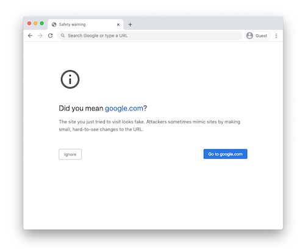
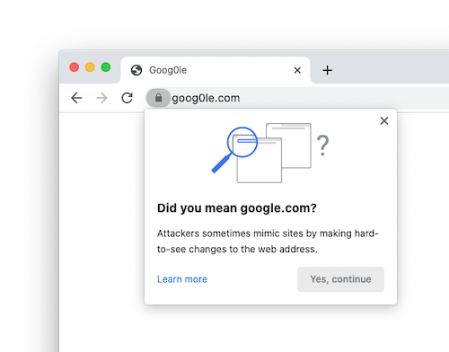

# "Lookalike" Warnings in Google Chrome

[TOC]

## What are lookalike warnings?

"Lookalike" domains are domains that are crafted to impersonate the URLs of
other sites in order to trick users into believing they're on a different site.
These domains are used in social engineering attacks, from phishing to retail
fraud.

In addition to [Google Safe Browsing](https://safebrowsing.google.com/)
protections, Chrome attempts to detect these lookalike domains by comparing the
URL you visited with other URLs that are either very popular, or that you have
visited previously. These checks all happen within Chrome -- Chrome does not
communicate with Google to perform these checks.

When Chrome detects a potential lookalike domain, it may block the page and show
a full-page warning, or it may show a pop-up warning, depending on how certain
Chrome is that the site is a spoof. These warnings typically have a "Did you
mean ...?" message.

| High-confidence warnings               | Low-confidence warning        |
|:--------------------------------------:|:-----------------------------:|
|  |  |

These warnings do not indicate that the site the user has visited is malicious.
The warnings indicate that the site looks like another site, and that the user
should make sure that they are visiting the site that they expected.

## Examples of lookalike domains

Chrome's checks are designed to detect spoofing techniques in the wild. Some
example "lookalike" patterns that trigger warnings include:

 * Domains that are a small edit-distance away from other domains, such as
   `goog0le.com`.
 * Domains that embed other domain names within their own hostname, such as
   `google.com.example.com`.
 * Domains that use IDN
   [homographs](https://chromium.googlesource.com/chromium/src/+/main/docs/idn.md),
   such as `goögle.com`.

This list is not exhaustive, and developers are encouraged to avoid using
domains that users without technical backgrounds may confuse for another site.

## Lookalike checks are imperfect

Chrome's lookalike checks are not always right. Chrome can not detect all
lookalike domains, and often lookalike domains are not malicious. Our
intent with Chrome's lookalike warnings is not to make spoofing impossible,
but to force attackers to use less convincing lookalikes, allowing users to
notice spoofs more easily.

While Chrome's checks sometimes label some benign pages as lookalikes, we use
several approaches to minimize mistakes:

 * Checks are tuned to minimize warnings on legitimate pages.
 * Users are never prohibited from visiting the site requested, and the warnings
   shown are designed to be helpful and informative, rather than scary.
 * Following the introduction of new lookalike checks, we proactively monitor
   what sites trigger the most warnings, and disable those that we identify as
   mistakes.
 * For domains used in company environments, we provide an [Enterprise
   Policy](https://cloud.google.com/docs/chrome-enterprise/policies/?policy=LookalikeWarningAllowlistDomains)
   allowing businesses to selectively disable warnings as needed for their
   users.
 * For several months following the roll-out of new lookalike checks, we accept
   review requests from site operators whose sites have been flagged.
 * New lookalike checks trigger a console message informing site owners of the
   issue for at least one release prior to triggering user-visible warnings.

## Not all users see all warnings

Chrome shows warnings in part based on a users' browsing history. This allows
Chrome to be both more helpful (by providing better recommendations) and make
fewer mistakes (by not flagging lookalikes for irrelevant sites).

Chrome only shows warnings on sites that the user has not used frequently.
Further, Chrome will only recommend sites that are either well-known (i.e. top)
sites, or the user has an established relationship.

Sites that show a warning to you may not show for another user, unless that user
has visited the same sites that you have.

