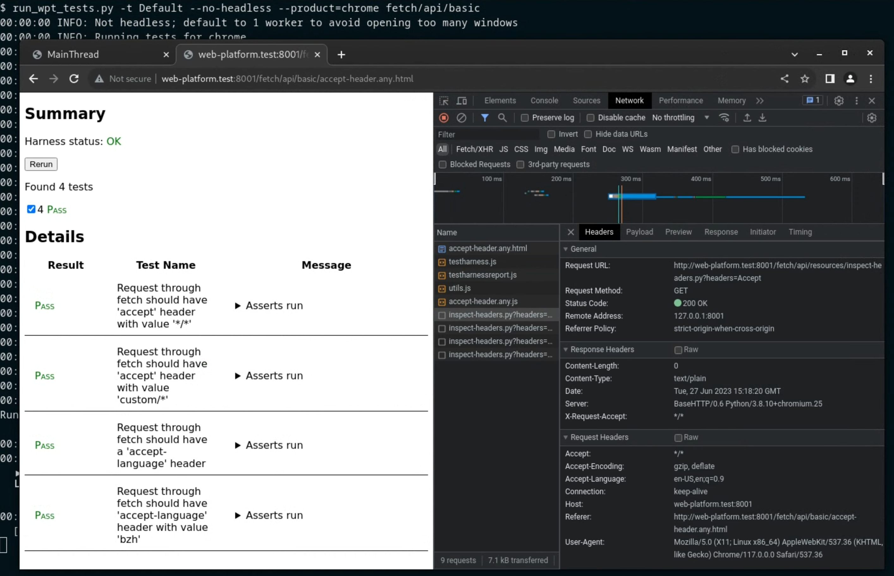

# Using wptrunner in Chromium (experimental)

[`wptrunner`](https://github.com/web-platform-tests/wpt/tree/master/tools/wptrunner)
is the harness shipped with the WPT project for running the test suite. This
user guide documents *experimental* support in Chromium for `wptrunner`, which
will replace [`run_web_tests.py`](web_platform_tests.md#Running-tests) for
running WPTs in CQ/CI.

For general information on web platform tests, see
[web-platform-tests.org](https://web-platform-tests.org/test-suite-design.html).

For technical details on the migration to `wptrunner` in Chromium, see the
[project plan](https://docs.google.com/document/d/1VMt0CB8LO_oXHh7OIKsG-61j4nusxPnTuw1v6JqsixY/edit?usp=sharing&resourcekey=0-XbRB7-vjKAg5-s2hWhOPkA).

*** note
**Warning**: The project is under active development, so expect some rough
edges. This document may be stale.
***

[TOC]

## Differences from `run_web_tests.py`

The main differences between `run_web_tests.py` and `wptrunner` are that:

1. `wptrunner` can run both the full `chrome` binary and the stripped-down
   `content_shell`. `run_web_tests.py` can only run `content_shell`.
1. `wptrunner` can communicate with the binary via WebDriver (`chromedriver`),
   instead of talking directly to the browser binary.

These differences mean that any feature that works on upstream WPT today (e.g.
print-reftests) should work in `wptrunner`, but conversely, features available to
`run_web_tests.py` (e.g. the `internals` API) are not yet available to
`wptrunner`.

## Running tests locally

The `wptrunner` wrapper script is
[`//third_party/blink/tools/run_wpt_tests.py`](https://source.chromium.org/chromium/chromium/src/+/main:third_party/blink/tools/run_wpt_tests.py).
First, build the [ninja target][1] for the product you wish to test:

``` sh
autoninja -C out/Release chrome_wpt
autoninja -C out/Release content_shell_wpt
autoninja -C out/Release system_webview_wpt   # `android_webview`
autoninja -C out/Release chrome_public_wpt    # `chrome_android`
```

To run the script, run the command below from `//third_party/blink/tools`:

``` sh
./run_wpt_tests.py [test list]
```

Test paths should be given relative to `blink/web_tests/` (*e.g.*,
[`wpt_internal/badging/badge-success.https.html`](https://source.chromium.org/chromium/chromium/src/+/main:third_party/blink/web_tests/wpt_internal/badging/badge-success.https.html)).
For convenience, the `external/wpt/` prefix can be omitted for the [external test
suite](https://source.chromium.org/chromium/chromium/src/+/main:third_party/blink/web_tests/external/wpt/)
(*e.g.*,
[`webauthn/createcredential-timeout.https.html`](https://source.chromium.org/chromium/chromium/src/+/main:third_party/blink/web_tests/external/wpt/webauthn/createcredential-excludecredentials.https.html)).

`run_wpt_tests.py` also accepts directories, which will run all tests under
those directories.
Omitting the test list will run all WPT tests (both internal and external).
Results from the run are placed under `//out/<target>/layout-test-results/`.

Useful flags:

* `-t/--target`: Select which `//out/` subdirectory to use, e.g. `-t Debug`.
  Defaults to `Release`.
* `-p/--product`: Select which browser (or browser component) to test. Defaults
  to `content_shell`, but choices also include [`chrome`, `chrome_android`, and
  `android_webview`](https://source.chromium.org/search?q=run_wpt_tests.py%20lang:gn).
* `-v`: Increase verbosity (may provide multiple times).
* `--help`: Show the help text.

## Experimental Builders

As of Q4 2022, `wptrunner` runs on a handful of experimental FYI CI builders
(mostly Linux):

* [`linux-wpt-content-shell-fyi-rel`](https://ci.chromium.org/p/chromium/builders/ci/linux-wpt-content-shell-fyi-rel),
  which runs content shell against `external/wpt/` and `wpt_internal/`
* [`win10-wpt-content-shell-fyi-rel`](https://ci.chromium.org/p/chromium/builders/ci/win10-wpt-content-shell-fyi-rel),
  which runs content shell against `external/wpt/` and `wpt_internal/`
* [`win11-wpt-content-shell-fyi-rel`](https://ci.chromium.org/p/chromium/builders/ci/win11-wpt-content-shell-fyi-rel),
  which runs content shell against `external/wpt/` and `wpt_internal/`
* [`linux-wpt-fyi-rel`](https://ci.chromium.org/p/chromium/builders/ci/linux-wpt-fyi-rel),
  which runs Chrome against `external/wpt/`
* [`linux-wpt-identity-fyi-rel`](https://ci.chromium.org/p/chromium/builders/ci/linux-wpt-identity-fyi-rel),
  which runs tests under `external/wpt/webauthn/`
* [`linux-wpt-input-fyi-rel`](https://ci.chromium.org/p/chromium/builders/ci/linux-wpt-input-fyi-rel),
  which runs tests under `external/wpt/{input-events,pointerevents,uievents}/`,
  as well as `external/wpt/infrastructure/testdriver/actions/`
* Various
  [Android](https://ci.chromium.org/p/chromium/g/chromium.android.fyi/console)
  builders

Each of these builders has an opt-in trybot mirror with the same name.
To run one of these builders against a CL, click "Choose Tryjobs" in Gerrit,
then search for the builder name.
A [`Cq-Include-Trybots:`](https://chromium.googlesource.com/chromium/src/+/main/docs/contributing.md#cl-footer-reference)
footer in the CL description can add a `wptrunner` builder to the default CQ
builder set.
Results for the bots use the existing layout test
[results viewer](https://test-results.appspot.com/data/layout_results/linux-wpt-identity-fyi-rel/201/wpt_tests_suite/layout-test-results/results.html).

## Expectations

`wptrunner` uses [WPT metadata files] to specify which tests should run and what
results to expect.
Each metadata file is checked in with an `.ini` extension appended to its
corresponding test file's path:

```
external/wpt/folder/my-test.html
external/wpt/folder/my-test-expected.txt  <-- run_web_tests.py baseline
external/wpt/folder/my-test.html.ini      <-- wptrunner metadata
```

A metadata file is roughly equivalent to a [`run_web_tests.py`
baseline](writing_web_tests.md#Text-Test-Baselines) and the
test's lines in [web test expectation files].
As the extension implies, metadata follow an INI-like structured text format:

[WPT metadata files]: https://web-platform-tests.org/tools/wptrunner/docs/expectation.html
[web test expectation files]: web_test_expectations.md#Kinds-of-expectations-files

|||---|||
###### `TestExpectations`

```
# Flakily slow
crbug.com/3 external/wpt/a/reftest.html [ Pass Timeout ]
```

(This `TestExpectations` line is equivalent to the metadata file on the right.)

###### `external/wpt/a/reftest.html.ini`

```
[reftest.html]
  bug: crbug.com/3
  # Flakily slow
  expected: [PASS, TIMEOUT]
```
|||---|||

* The brackets `[...]` start a (sub)test section whose contents follow in an
  indented block.
* The section heading should contain either the subtest name or the test URL
  without the dirname (i.e., should contain basename and query parameters, if
  any).
* A section may contain `<key>: <value>` pairs. Important keys that `wptrunner`
  understands:
    * `expected`: A
      [status](https://firefox-source-docs.mozilla.org/mozbase/mozlog.html#data-format)
      (or list of possible statuses) to expect.
        * Common test statuses include `TIMEOUT`, `CRASH`, and either `OK/ERROR`
          for testharness tests to represent the overall harness status, or
          `PASS/FAIL` for non-testharness tests that only have a single result
          (e.g., reftests).
        * Common subtest statuses include `PASS`, `FAIL`, `TIMEOUT`, or
          `NOTRUN`.
        * For convenience, `wptrunner` expects `OK` or `PASS` when `expected` is
          omitted.
          Deleting the entire metadata file implies an all-`PASS` test.
      * `disabled`: Any nonempty value will skip the test or ignore the subtest
        result. By convention, `disabled` should contain the reason the (sub)test
        is disabled, with the literal `neverfix` for [`NeverFixTests`][13].
* `#` starts a comment that extends to the end of the line.

*** note
**Note**: For testharness tests, the harness statuses `OK/ERROR` are orthogonal
to `PASS/FAIL` and have different semantics:

* `OK` only means all subtests ran to completion normally; it does *not* imply
  that every subtest `PASS`ed. A test may `FAIL` subtests while still reporting
  the harness is `OK`.
* `ERROR` indicates some problem with the harness, such as a WebDriver remote
  end disconnection.
* `PASS/FAIL` represent passing or failing assertions against the browser under
  test.
***

`testharness.js` subtest expectations are represented by a section nested under
the relevant test:

|||---|||
###### `external/wpt/test-expected.txt`

```
This is a testharness.js-based test.
PASS passing subtest
FAIL failing subtest whose name needs an escape []
Harness: the test ran to completion.
```

###### `external/wpt/test.html.ini`

```
[test.html]
  [failing subtest whose name needs an escape [\]]
    expected: FAIL
```
|||---|||

### Conditional Values

`run_web_tests.py` reads platform- or flag-specific results from [platform
tags] in `TestExpectations`, [`FlagExpectations/*`][10], and [baseline
fallback](web_test_baseline_fallback.md).
WPT metadata uses a Python-like [conditional syntax] instead to store all
expectations in one file:

|||---|||
###### `TestExpectations`

```
[ Win Debug ] test.html [ Crash ]  # DCHECK triggered
[ Mac11-arm64 ] test.html [ Pass Timeout ]
```

###### `external/wpt/test.html.ini`

```
[test.html]
  expected:
    if os == "win" and debug: CRASH  # DCHECK triggered
    if port == "mac11-arm64": [PASS, TIMEOUT]
    # Resolves to this default value when no conditions
    # match. An `OK/PASS` here can be omitted because
    # it's implied by an absent value.
    PASS
```
|||---|||

`wptrunner` resolves a conditional value to the right-hand side of the first
branch whose expression evaluates to a truthy value.
Conditions can contain arbitrary Python-like boolean expressions that will be
evaluated against **properties**, variables detected from the [test
environment].
Properties available in Chromium are shown below:

| Property | Type | Description | Choices |
| - | - | - | - |
| `os` | `str` | OS family | `linux`, `mac`, `win`, `android`, `ios` |
| `port` | `str` | Port name (includes OS version and architecture) | See [`Port.ALL_SYSTEMS`][12] (e.g., `mac12-arm64`) |
| `product` | `str` | Browser or browser component | `chrome`, `content_shell`, `chrome_android`, `android_webview`, `chrome_ios` |
| `flag_specific` | `str` | Flag-specific suite name | See [`FlagSpecificConfig`][3] (the empty string `""` represents the generic suite) |
| `virtual_suite` | `str` | Virtual test suite name | See [`VirtualTestSuites`][2] (the empty string `""` represents the generic suite) |
| `debug` | `bool` | `is_debug` build? | N/A |

[platform tags]: /third_party/blink/web_tests/TestExpectations#1
[test environment]: https://firefox-source-docs.mozilla.org/build/buildsystem/mozinfo.html
[conditional syntax]: https://web-platform-tests.org/tools/wptrunner/docs/expectation.html#conditional-values

### Parameterized Tests

In WPT, [multiglobal `.any.js` tests][11] and [test variants] are forms of
parameterization where a test file may generate more than one test ID.
The metadata for these parameterizations live in the same `.ini` file, but under
different top-level sections.
For example, a test `external/wpt/a/b.any.js` that generates `.any.html` and
`.any.worker.html` scopes with variants `?c` and `?d` can express its expectations as:

|||---|||
###### `TestExpectations`

```
a/b.any.html?c [ Crash ]
a/b.any.html?d [ Crash ]
a/b.any.worker.html?c [ Timeout ]
a/b.any.worker.html?d [ Timeout ]
```

###### `external/wpt/a/b.any.js.ini`

```
[b.any.html?c]
  expected: CRASH
[b.any.html?d]
  expected: CRASH
[b.any.worker.html?c]
  expected: TIMEOUT
[b.any.worker.html?d]
  expected: TIMEOUT
```
|||---|||

[test variants]: https://web-platform-tests.org/writing-tests/testharness.html#variants

### Directory-Wide Expectations

To set expectations or disable tests under a directory without editing an `.ini`
file for every contained test, create a special `__dir__.ini` file under the
desired directory with top-level keys, which work identically to those for
per-test metadata:

|||---|||
###### `FlagExpectations/highdpi`

```
# Redundant coverage
external/wpt/a/* [ Skip ]
```

###### `external/wpt/a/__dir__.ini`

```
disabled:
  if flag_specific == "highdpi": redundant coverage
```
|||---|||

Metadata closer to affected test files take greater precedence.
For example, expectations set by `a/b/c.html.ini` override those of
`a/b/__dir__.ini`, which overrides `a/__dir__.ini` in turn.
The special value `disabled: @False` can selectively reenable tests or
directories disabled by an ancestor `__dir__.ini`.

### Update Tool

To update expectations in bulk for all tested configurations,
[`blink_tool.py`][5] has an [`update-metadata`][6] subcommand that can trigger
[try builds](#Builders) and update expectations from the results (similar to
[`rebaseline-cl`][7]).
The workflow is very similar to [rebaselining]:

```sh
# Create a CL, if one has not been created already.
git cl upload

# Trigger try builds against the current patchset.
./blink_tool.py update-metadata

# After the try builds complete, collect the results and update expectations
# for `external/wpt/css/CSS2/` (sub)tests that only failed unexpectedly. Any
# test section updated will be annotated with `bug: crbug.com/123`.
./blink_tool.py update-metadata --bug=123 css/CSS2/

# Commit and upload the staged `.ini` files.
git commit -m "Update WPT expectations" && git cl upload
```

The [WPT autoroller](web_platform_tests.md#Automatic-import-process) uses
`update-metadata` to automatically suppress imported tests with new failures.

`update-metadata` can also suppress failures occurring on trunk:

```sh
# Suppress tests that caused any `linux-wpt-fyi-rel` CI builds 3000-3005
# (inclusive) to fail.
./blink_tool.py update-metadata --build=ci/linux-wpt-fyi-rel:3000-3005
```

[rebaselining]: web_test_expectations.md#Rebaselining-using-try-jobs

## Debugging Support

Passing the `--no-headless` flag to `run_wpt_tests.py` will pause execution
after running each test headfully.
You can interact with the paused test page afterwards, including with DevTools:



Closing the tab or window will unpause `wptrunner` and run the next test.

In the future, we intend to support hooking up [text-based debuggers] like `rr`
to test runs.

[text-based debuggers]: https://crbug.com/1440021

## Known Issues

Please [file bugs and feature requests](https://crbug.com/new) against
[`Blink>Infra` with the `wptrunner`
label](https://bugs.chromium.org/p/chromium/issues/list?q=component%3ABlink%3EInfra%20label%3Awptrunner&can=2).

[1]: https://source.chromium.org/search?q=run_wpt_tests.py%20lang:gn
[2]: /third_party/blink/web_tests/VirtualTestSuites
[3]: /third_party/blink/web_tests/FlagSpecificConfig
[5]: /third_party/blink/tools/blink_tool.py
[6]: /third_party/blink/tools/blinkpy/tool/commands/update_metadata.py
[7]: /third_party/blink/tools/blinkpy/tool/commands/rebaseline_cl.py
[10]: /third_party/blink/web_tests/FlagExpectations
[11]: https://web-platform-tests.org/writing-tests/testharness.html#tests-for-other-or-multiple-globals-any-js
[12]: https://source.chromium.org/chromium/chromium/src/+/main:third_party/blink/tools/blinkpy/web_tests/port/base.py;l=152-163;drc=b35e75299a6fda0eb51e9ba3139cce216f7f8db0;bpv=0;bpt=0
[13]: /third_party/blink/web_tests/NeverFixTests
