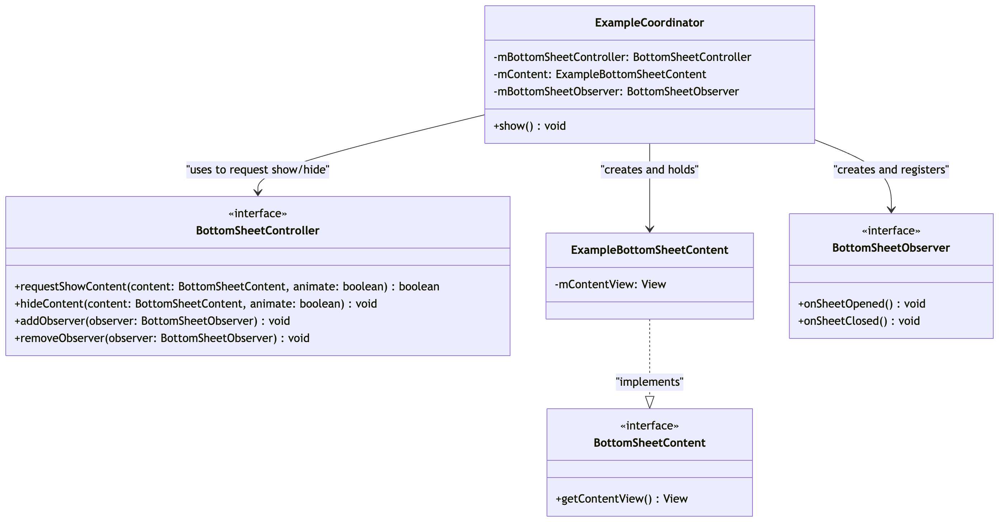

# Chrome Android Bottom Sheet MVC UI Architecture

The Bottom Sheet is a versatile UI component that slides up from the bottom of
the screen to display custom content defined by **BottomSheetContent**.

### Design

#### BottomSheetContent

**BottomSheetContent** is an interface defining content that can be displayed
inside the bottom sheet. Any custom view that is intended to be shown as the
bottom sheet must implement this interface.

```java
class ExampleBottomSheetContent implements BottomSheetContent {
   private final View mContentView;

   ExampleBottomSheetContent(View contentView) {
       mContentView = contentView;
   }

   @Override
   public View getContentView() {
       return mContentView;
   }

   // ...
}
```

#### BottomSheetController

**BottomSheetController** is an interface for a central manager that controls a
sheet. It is responsible for displaying a bottom sheet content (eg. calling
requestShowContent), managing state (eg. getSheetState), handling interactions
(eg. hideContent) etc.

#### BottomSheetObserver

**BottomSheetObserver** is the interface for listening events from
**BottomSheetController** (eg. onSheetOpened, onSheetClosed etc).

#### Architecture

The **Coordinator** manages the **BottomSheetController** and controls the
bottom sheet's visibility (e.g., by calling requestShowContent). The
**BottomSheetController** is not created directly inside the **Coordinator** but
is passed as a parameter in the constructor of the **Coordinator** by the parent
component. In the Chrome Android architecture, the parent component can
instantiate **BottomSheetController** using the **BottomSheetControllerFactory**
or retrieve from a `WindowAndroid` via the **BottomSheetControllerProvider**.
Specifically, a top-level activity UI component (like `RootUiCoordinator`)
instantiates the **BottomSheetController** using the
**BottomSheetControllerFactory** since it manages the root view hierarchy,
whereas individual feature components (such as
`AutofillSaveCardBottomSheetBridge` or `TouchToFillBridge`) retrieve the shared
controller from the `WindowAndroid` via the **BottomSheetControllerProvider**.

The **Coordinator** also creates and stores both the **BottomSheetContent** to
be displayed by the controller and a **BottomSheetObserver** to listen for sheet
events, registering the observer when content is shown and deregistering it when
dismissed.



```java
class ExampleCoordinator {
    private final ExampleBottomSheetContent mContent;
    private final BottomSheetController mBottomSheetController;

    private final BottomSheetObserver mBottomSheetObserver =
            new EmptyBottomSheetObserver() {
                @Override
                public void onSheetClosed(@BottomSheetController.StateChangeReason int reason) {
                    super.onSheetClosed(reason);
                    if (mBottomSheetController.getCurrentSheetContent() != null
                            && mBottomSheetController.getCurrentSheetContent() == mContent) {
                        onDismissed();
                    }
                }
            };

    ExampleCoordinator(Context context, BottomSheetController sheetController) {
        mBottomSheetController = sheetController;

        // ...

        mContent = new ExampleBottomSheetContent(view);
    }

    void show() {
        mBottomSheetController.addObserver(mBottomSheetObserver);
        if (!mBottomSheetController.requestShowContent(mContent, /* animate= */ true)) {
            onDismissed();
        }
    }

    private void onDismissed() {
        mBottomSheetController.removeObserver(mBottomSheetObserver);
    }
}
```
