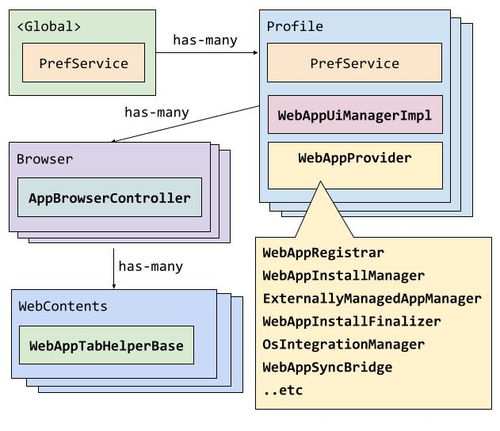

## Web Apps

Web apps are websites with app-like qualities or capabilities. Chromium supports 'installing' a web app (or any website), which is sometimes required for some of these capabilities to function (e.g. file handlers or window controls overlay).

See [useful concepts and definitions here][4].

### User entry points

**Desktop**: If a site has a manifest attached with a name, icon, start_url, and display field specified, an installation icon will appear in the omnibox. Users can also install any site they like via `Menu > More tools > Install Page as App`. Apps are visible on chrome://apps on non-CrOS desktop.
**Android**: An ML model is used to selectively show the blocking installation banner for users who are likely to install the app.  Otherwise installation is accessible via `3-dot menu > Add to Homescreen`.

### Developer interface

Sites customize how their installed site integrates at the OS level using a [web app manifest][2]. See developer guides for in depth overviews:

- https://web.dev/progressive-web-apps/
- https://web.dev/codelab-make-installable/

## Web Apps on Desktop

TODO(https://crbug.com/492285240): Move this desktop documentation to `/chrome/browser/web_applications`.

See [https://tinyurl.com/dpwa-architecture-public][3] for presentation slides about the WebAppProvider system architecture.

### Debugging

Use `chrome://web-app-internals` (generated [here][57]) to inspect internal web app state.
Test failures will print this information out automatically to help with debugging.

The codebase has a number of useful DVLOGs (like in `web_app_command_manager.cc` and `web_app_lock_manager.cc`). Use the normal vmodule command line args to see these (e.g. `--vmodule=web_app*=1`).

For developers wanting to test the behavior of the web app itself, Chrome DevTools Protocol can be used. See [Instruction of using PWA via CDP][59].

### Documentation Guidelines

- Markdown documentation (files like this):
  - Contains information that can't be documented in class-level documentation.
  - Answers questions like: What is the goal of a group of classes together? How does a group of classes work together?
  - Explains concepts that are used across different files.
  - Should be unlkely to become out-of-date.
    - Any source links should link to a codesearch 'search' page and not the specific line number.
    - Avoid implementation details.
- Class-level documentation (documentation in header files):
  - Answers questions like: Why does this class exist? What is the responsibility of this class? If this class involves a process with stages, what are those stages / steps?
  - Should be updated actively when that given file is changed.
- Documentation inside of methods should only be used to explain the "why" of code if it is not obvious.

### What makes up Chromium's implementation?

The task of turning websites into "apps" in the user's OS environment has many parts to it. Before going into the parts, here is where they live:

See the drawing source [here][7].

- The `WebAppProvider` core system lives on the `Profile` object.
- The `WebAppUiManagerImpl` also lives on the `Profile` object (to avoid deps issues).
- The `AppBrowserController` (typically `WebAppBrowserController` for our interests) lives on the `Browser` object.
- The `WebAppTabHelper` lives on the `WebContents` object.

While most on-disk storage is done in the [`WebAppSyncBridge`][8], the system also sometimes uses the `PrefService`. Most of these prefs live on the `Profile` (`profile->GetPrefs()`), but some prefs are in the global browser prefs (`g_browser_process->local_state()`).

Presentation: [https://tinyurl.com/dpwa-architecture-public][3]

Older presentation: [https://tinyurl.com/bmo-public][9]

### Architecture Philosophy

- Tests (especially browser tests / integration tests) should generally operate on the [public interface][48] as much as possible. Unit tests can touch internals where convenient to set up initial state, but generally still test the operations via the public interface.
- [External dependencies][49] should be behind fake-able interfaces, allowing unit & browser tests to swap these out. However, internal parts of our system should not be mocked out or faked - this tightly couples the internal implementation to our tests. If it is impossible to trigger a condition with the public interface, then that condition should be removed (or the public interface improved).
  - See [this presentation][44] about testing that might clarify our approach.

### Usage

The safest way to use the WebAppProvider system is using the `WebAppCommandScheduler` (via `WebAppProvider::scheduler()`), which serves as an entry point for operations on the system for safely reading or writing state. Unsafe state access is available via `WebAppProvider::registrar_unsafe()`, but this in not guaranteed to be consistent as an async operation could be occurring at any time (install, uninstall, update, etc).

For information about creating safe read/write operations on the system, see the [commands README.md](/chrome/browser/web_applications/commands/README.md).

### External Dependencies

The goal is to have all of these behind an abstraction that has a fake to allow easy unit testing of our system. Some of these dependencies are behind a nice fake-able interface, and some are not (yet).

- **Extensions** - Some of our code still talks to the extensions system,
  specifically the `PreinstalledWebAppManager`.
- **`content::WebContents`**: The WebAppProvider system interacts with
  `content::WebContents` for various tasks like loading URLs (via
  `WebAppUrlLoader`), retrieving web app manifest data and icons (via
  `WebAppDataRetriever` and `WebAppIconDownloader` respectively), and observing
  navigations and destruction. The `WebContentsManager` serves as a centralized
  point of dependency for these interactions and acts as a factory for these
  components, allowing for easier management and faking in tests via the `FakeWebContentsManager`.
- **OS Integration**: Each OS integration has fairly custom code on each OS to
  do the operation. The `OsIntegrationManger` and the respective sub-managers own this.
- **Sync system**: There is a tight coupling between our system and the sync
  system through the WebAppSyncBridge. Faking this is easy and is handled by
  the `FakeWebAppProvider`.
- **UI**: There are parts of the system that are coupled to UI, like showing
  dialogs, determining information about app windows, etc. These are put behind
  the `WebAppUiManager`, and faked by the `FakeWebAppUiManager`.
- **Policy**: Our code depends on the policy system setting its policies in
  appropriate prefs for us to read. Because we just look at prefs, we don't
  need a "fake" here.

### Databases / sources of truth

These store data for our system. Some of it is per-web-app, and some of it is global.

- **`WebAppRegistrar`**: This attempts to unify the reading of much of this data, and also holds an in-memory copy of the database data (in WebApp objects).
- **`WebAppDatabase`** / **`WebAppSyncBridge`**: This stores the web_app.proto object in a database, which is the preferred place to store information about a web app.
- **Icons on disk**: These are managed by the `WebAppIconManager` and stored on disk in the user's profile.
- **Prefs**: The `PrefService` is used to store information that is either global, or needs to persist after a web app is uninstalled. Most of these prefs live on the `Profile` (`profile->GetPrefs()`), but some prefs are in the global browser prefs (`g_browser_process->local_state()`). Some users of prefs:
  - AppShimRegistry
  - UserUninstalledPreinstalledWebAppPrefs
- **OS Integration**: Various OS integration requires storing state on the operating system. Sometimes we are able to read this state back, sometimes not.

Accessing any of this information without an applicable 'lock' on the system is considered unsafe.

### Relevant Classes & Managers

The **[`WebAppProvider`][/chrome/browser/web_applications/web_app_provider.h]** is the per-profile object housing most of the various web app subsystems, acting as the "main()" of the web app implementation where everything starts. Unit tests use the `FakeWebAppProvider` version which allows tests to swap out some managers with fakes (and does this by default for a few).

The objects that live on the WebAppProvider, often called 'Managers', are used to encapsulate common responsibilities or in-memory state that needs to be stored. See the respective header files for more detailed information:

- **`WebAppCommandManager` & `WebAppCommandScheduler`**: The entry point for performing asynchronous operations safely via locks.
- **`WebAppRegistrar`**: Provides a queryable in-memory view of all installed web apps.
- **`WebAppSyncBridge`**: Synchronizes the in-memory registrar with the on-disk database and Chrome Sync; faked with an in-memory database and sync disabled by default.
- **`WebAppInstallManager`**: Orchestrates the installation of web apps.
- **`ManifestUpdateManager`**: Monitors and applies updates to web app manifests.
- **`ExternallyManagedAppManager`**: Handles installations from external sources like policies or preinstalled configurations.
- **`WebAppPolicyManager`**: Manages apps installed via enterprise policy.
- **`PreinstalledWebAppManager`**: Manages the installation of default "preinstalled" web apps.
- **`WebAppIconManager`**: Manages the loading and storage of app icons on disk.
- **`OsIntegrationManager`**: Manages all integrations with the host operating system. `FakeOsIntegrationManager` is used by default in unit tests.
- **`WebAppUiManager`**: Interface for performing UI operations like showing dialogs. `FakeWebAppUiManager` is used by default in unit tests.
- **`WebContentsManager`**: Factory for WebContents-based dependencies, wrapping the WebContents / network dependency for the entire system. `FakeWebContentsManager` is used by default in unit tests.
- **`FileUtilsWrapper`**: Utility for file system access. `TestFileUtils` is used by default in unit tests.

Other relevant classes:

- **[`WebApp`][13]**: The representation of an installed web app in RAM, reflecting how a site configures its web app manifest plus internal bookkeeping. This does not include information like policy information, so usage of this class is often discouraged over the WebAppRegistrar, which combined multiple sources of truth holistically.
- **[`AppShimRegistry`][33]**: (Mac-only) Stores state in Chrome's "Local State" (global preferences) to reason about installed PWAs across all profiles without loading those profiles into memory.

## Deep Dives

- [/docs/webapps/installation_pipeline.md][34]
- [/docs/webapps/manifest_representations.md][35]
- [/docs/webapps/integration-testing-framework.md][11]
- [/docs/webapps/os_integration.md][50]
- [/docs/webapps/manifest_update_process.md][51]
- [/docs/webapps/isolated_web_apps.md][52]
- [/docs/webapps/webui_web_app.md][54]
- [/docs/webapps/why-is-this-test-failing.md][36]
- [/docs/webapps/how-to-create-webapp-integration-tests.md][37]

## Testing

Please see [testing.md][58].

[2]: https://www.w3.org/TR/appmanifest/
[3]: https://tinyurl.com/dpwa-architecture-public
[4]: concepts.md
[7]: https://docs.google.com/drawings/d/1TqUF2Pqh2S5qPGyA6njQWxOgSgKQBPePKPIH_srGeRk/edit?usp=sharing
[8]: #webappsyncbridge
[9]: https://tinyurl.com/bmo-public
[11]: integration-testing-framework.md
[13]: /chrome/browser/web_applications/web_app.h
[14]: /chrome/browser/web_applications/web_app_registrar.h
[16]: /chrome/browser/web_applications/web_app_sync_bridge.h
[18]: https://docs.google.com/presentation/d/e/2PACX-1vQxYZoCyhZ4xHS4pVuBC9YoE0O-QpW2Wj3scl6jtr3TEYheeod5Ch4b7OVEQEj_Hc6PM1RBGzovug3C/pub?start=false&loop=false&delayms=3000&slide=id.g59d9cb05b6_6_5
[19]: /chrome/browser/web_applications/externally_managed_app_manager.h
[20]: /chrome/browser/web_applications/preinstalled_web_app_manager.h
[21]: /chrome/browser/web_applications/policy/web_app_policy_manager.h
[22]: /chrome/browser/ash/system_web_apps/system_web_app_manager.h
[23]: /chrome/browser/web_applications/external_install_options.h
[24]: /chrome/browser/web_applications/web_app_install_finalizer.h
[25]: /chrome/browser/web_applications/web_app_database.h
[26]: /chrome/browser/web_applications/os_integration/web_app_shortcut.h
[27]: /chrome/browser/web_applications/os_integration/web_app_file_handler_manager.h
[28]: /chrome/browser/web_applications/os_integration/os_integration_manager.h
[29]: /chrome/browser/ui/web_applications/web_app_ui_manager_impl.h
[30]: /chrome/browser/web_applications/web_app_ui_manager.h
[31]: /chrome/browser/ui/web_applications/web_app_ui_manager_impl.h
[32]: https://source.chromium.org/search?q=WebAppUiManager::Create
[33]: /chrome/browser/web_applications/app_shim_registry_mac.h
[34]: installation_pipeline.md
[35]: manifest_representations.md
[36]: why-is-this-test-failing.md
[37]: how-to-create-webapp-integration-tests.md
[38]: /chrome/browser/ui/web_applications/web_app_browsertest.cc
[40]: /chrome/browser/web_applications/test/fake_web_app_provider.h
[41]: https://source.chromium.org/chromium/chromium/src/+/main:chrome/browser/web_applications/test/web_app_install_test_utils.cc;l=40?q=AwaitStartWebAppProviderAndSubsystems&ss=chromium
[44]: https://www.youtube.com/watch?v=EZ05e7EMOLM
[45]: /styleguide/styleguide.md
[47]: /styleguide/c++/c++-dos-and-donts.md
[48]: #public-interface
[49]: #external-dependencies
[50]: os_integration.md
[51]: manifest_update_process.md
[52]: isolated_web_apps.md
[54]: webui_web_app.md
[57]: https://source.chromium.org/search?q=WebAppInternalsHandler::BuildDebugInfo
[58]: testing.md
[59]: cdp-integration.md
