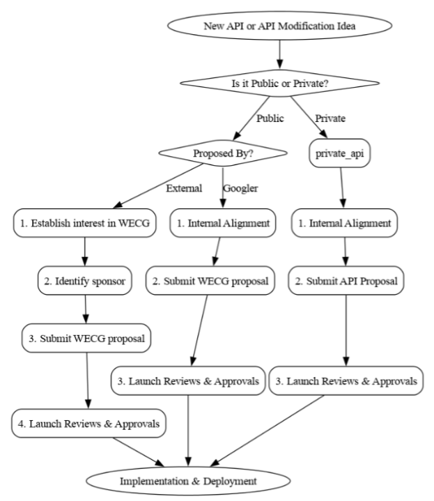

# New Extension and Platform App APIs

[TOC]

## Summary

Chrome exposes special capabilities to Extensions through different APIs.
Before implementing a new API, it has to go through an approval process.  This
approval process helps ensure that the API is well defined, does not introduce
any privacy, security, or performance concerns, and fits in with the overall
product vision.

## API Details

### Public or Private
__Default: Public__

Extension APIs can either be public (available for any extension to potentially
use, though frequently there are other constraints like requiring a permission)
or private (only available to extensions with a specific allowlisted ID).  In
general, private APIs should only be used for pieces of functionality internal
to Chromium/Chrome itself (e.g., the translation utility, printing, etc).
Public APIs should always be the default, in order to foster openness and
innovation.

Good reasons for a private API might be:
* __The API is needed by a core feature of Chrome/Chromium.__ Note that even
here, there can be exceptions, if the API could be reasonably implemented as
a way to benefit external extensions.

Bad reasons for a private API might be:
* __The API is only needed for a Google property (other than Chrome/Chromium).__
In the spirit of openness, we should, when possible, provide people with the
means to build alternatives.  Just because something is needed by a Google
property does not mean it wouldn't be useful to a third-party.
* __The API is needed by a Google property (other than Chrome/Chromium), and is
too powerful to expose to any third-party extension.__
Generally, if an API is too powerful to expose to a third-party extension, we
don't want to expose it to any kind of (non-component) extension, as it
increases Chrome's attack surface.  Typically, these security concerns can be
addressed by finding alternatives or tweaking the API surface.
* __This is just a quick-and-dirty API and we don't want to go through a long
process.__ Quick-and-dirty hacks have a nasty habit of staying around for years,
and often carry with them their own maintenance burdens.  It's very frequently
cheaper to design an API well and have it be stable than to have a quick
solution that has to be constantly fixed.

Unless there is a compelling reason to make an API private, it should default
to public.

### API Ownership
In general, __you__ (or rather, your team) will own the API you create.  The
Extensions team does not own every API, nor would it be possible for them to
maintain them all.  This means that your team will be responsible for
maintaining the API going forward.

### Platforms

__Default: All Desktop Platforms__

Extensions are supported on all desktop platforms (Windows, Mac, Linux,
ChromeOS, and desktop Android).  By default, an extension API will be exposed on
all these platforms, but this can be configured to only be exposed on a subset.
However, an API should only be restricted if there is strong reason to do so;
otherwise, platforms should have parity.

## Proposal Process

Starting the review process __early__ is encouraged, and if some of the
artifacts are missing or in progress, we're happy to work with you on it.  It's
better to have us review the API in principle to ensure it's something we're
comfortable adding to the platform, and then work out the details, than to
invest heavily only to find out that we don't want to add the API to the
platform.  Feel free to file a bug without everything ready, or to email
extension-api-reviews@chromium.org for advice and feedback!

Proposals and Approvals for new APIs should follow these paths based on the
applicability.

### Public API

#### Proposed by External (third-party contributor)

1. Establish interest in WECG -- File an issue or start a discussion in the
[WebExtensions Community Group (WECG) GitHub repository][wecg-repo] to gauge
community interest and collect feedback.
2. Identify a sponsoring browser -- Identify a "sponsoring browser" (a browser
vendor committed to implementing the API in the near future) prior to
submitting the proposal.
  * How to find a Chrome Sponsor: Reach out to
  extensions-api-reviews@chromium.org or tag known Chromium/Chrome Extension
  maintainers in your GitHub proposal to find an engineering advocate inside
  Google.
3. Submit Proposal in the WECG for API review -- Submit a formal
[API proposal][wecg-proposals] following the
[proposal template][wecg-proposal-template] to the WECG for review.  Secure
consensus and approval from relevant browser vendors, including Google Chrome.
4. Launch Reviews & Approvals -- Once WECG consensus is secured, your Google
Chrome sponsor will manage the internal review process.  Your sponsor will
submit the launch ticket and guide your API through cross-functional gates
(Security, Privacy, Legal, API Reviewer and DevRel).  Be prepared to assist your
sponsor with technical details if required.

#### Proposed by Googlers

_(Intended for Googlers working inside Google's Launch / Buganizer environment)_

1. Internal alignment -- Align internally with the Chrome Extensions team (reach
out to extension-api-reviews@chromium.org) and relevant stakeholders before
public submission.  It's recommended to create a draft version of the
[API proposal][wecg-proposals] following the
[proposal template][wecg-proposal-template] before submitting to WECG for
internal alignment.
2. Propose in the WECG for API review -- Submit a formal
[API proposal][wecg-propopsal] to the WECG for review.  Secure consensus and
approval from relevant browser vendors.
3. Launch Reviews & Approvals -- Once WECG consensus is secured, submit a launch
bug adhering to Google's launch standards to complete cross-functional reviews
and approvals (Security, Privacy, Legal, UX, Extensions team & DevRel).  Review
[Extensions API Launch Process][google-launch-process] for details regarding
launch workflow and requirements.

### Modifying an Existing API
Modifications to an existing API should go through a similar process as the new
[API proposal](#public-api) process.  Since modifications to these APIs are
frequently far-reaching, please do not skip the proposal process! However it
might be possible to skip or expedite it in certain specific cases.  In
particular:
* Small changes (like adding a new property to a method) to private APIs can
skip the launch review process unless //extensions OWNERS explicitly ask for it.
Small changes to non-private APIs are still required to go through this process
(via WECG proposal) but may not require a full design doc or API Overview doc.
* Medium-sized changes, like adding a single new method, are still required to
go through the launch review process.  Whether an API overview doc is required is
up to the discretion of the API reviewers but inclusion of any supporting
documentation is highly recommended.
* Larger changes, like adding multiple new methods and events, should still
submit a formal [API proposal][wecg-proposals] to the WECG for review (though
it may be condensed).

### Private API
1. Internal alignment -- Align internally within Google to establish the
necessity of a private API (e.g., core Chrome features or internal tools).
Contact Chrome Extensions team and relevant stakeholders before submission.
2. Draft API proposal -- Propose and document the API specification using
the [proposal template][wecg-proposal-template] in a document.
3. Launch Reviews & Approvals -- submit a launch bug adhering to Google's launch
standards to complete cross-functional reviews and approvals (Security,
Privacy, Legal, UX, Extensions team & DevRel).  Review
[Extensions API Launch Process][google-launch-process] for details regarding
launch workflow and requirements.

## FAQ
__Do I need an API review for a private API?__
Yes! Private APIs are not as scrutinized as public APIs because we don't need
to be as worried about API ergonomics, and we can be a little more lenient in
security.  However, we still need to review the API to make sure that:
* The API is secure.  Even though it runs in trusted extensions, it exposes
capabilities to a renderer process, and may also introduce vulnerabilities
elsewhere.
* The API meets privacy guidelines.  We hold ourselves to a strict standard in
regards to what data we can collect.
* The API should be a private API.  There are multiple alternatives, including a
public API, a web API, implementing code directly in C++, and others.  Private
APIs are not always the appropriate choice.

__How long does the API approval process usually take through Google's launch
process?__

Securing approvals from all cross-functional stakeholders (Security, Privacy,
Legal, DevRel, etc.) typically takes anywhere from 4 to 6 weeks.  Highly complex
APIs or APIs with broad privacy implications may take longer.  We recommend
submitting your proposal as early as possible to avoid delaying your launch.

__What does "API Ownership" actually mean in practice for my team?__
Ownership means your team acts as the primary maintainer of the API surface.
Responsibilities include triaging incoming bugs related to the API, tracking
security/vulnerability upgrades, maintaining test coverage in the Chromium
suite, and drafting future modifications.

## New API Proposal Process Workflow

[wecg-repo]: https://github.com/w3c/webextensions
[wecg-proposals]: https://github.com/w3c/webextensions/tree/main/proposals
[wecg-proposal-template]: https://github.com/w3c/webextensions/blob/main/proposals/proposal_template.md
[google-launch-process]: http://go/extension-api-launch-process
