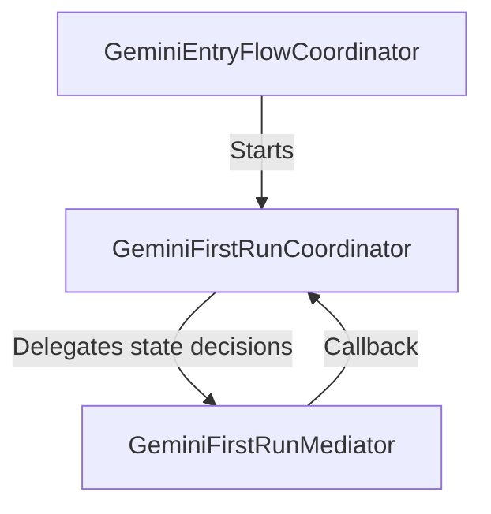

# Gemini Coordinator Layer
*Last updated: May 2026*

This directory contains components responsible for navigating, presenting, and orchestrating user flows for the **Gemini (BWG)** feature integration on iOS.

Following the strict Coordinator-Mediator separation pattern of Chrome for iOS, coordinators in this directory are responsible solely for view presentation, UI transitions, and scene handling, while delegating business logic decisions to their respective mediators.

## Components & Flow

### 1. Entry Flow Coordination
*   **[gemini_entry_flow_coordinator.h](./gemini_entry_flow_coordinator.h) & [gemini_entry_flow_coordinator.mm](./gemini_entry_flow_coordinator.mm)**:
    Manages the full startup and entry flow sequence for Gemini. It determines whether the user needs to sign in (presenting `SigninCoordinator` if unauthenticated), performs profile and enterprise eligibility checks via the `GeminiService`, and presents the `AccountMenuCoordinator` to allow account switching if Gemini is disabled/restricted for their active Google account.

### 2. First Run Experience (Consent & Onboarding)
*   **[gemini_first_run_coordinator.h](./gemini_first_run_coordinator.h) & [gemini_first_run_coordinator.mm](./gemini_first_run_coordinator.mm)**:
    Manages the presentation of the Gemini onboarding / First Run Experience (FRE) promo and consent sheets. Handles microphone permission checking for Gemini Live (via AVFoundation) and redirects users to iOS Settings if mic permission is denied. Also manages expanding/exiting fullscreen to avoid UI misalignment when showing in-product help (IPH) bubbles.
*   **[gemini_first_run_mediator.h](./gemini_first_run_mediator.h) & [gemini_first_run_mediator.mm](./gemini_first_run_mediator.mm)**:
    Handles the business logic of the onboarding flow. It evaluates preferences (e.g., page sharing consent), authentication services, and records telemetry. Conforms to the `GeminiConsentMutator` protocol to mutate consent states.
*   **[gemini_first_run_mediator_delegate.h](./gemini_first_run_mediator_delegate.h)**:
    Defines the delegate protocol (`GeminiFirstRunMediatorDelegate`) that allows the mediator to communicate UI events back to the coordinator layer (e.g., dismissing the consent screen, updating live mic settings, or dismissing the flow).

---

## File Index

| File | Description |
| :--- | :--- |
| `gemini_entry_flow_coordinator.h / .mm` | Orchestrates authentication and eligibility checks on startup. |
| `gemini_first_run_coordinator.h / .mm` | Presents promo/consent onboarding screens and prompts microphone access. |
| `gemini_first_run_mediator.h / .mm` | Implements onboarding logic, preference updates, and FET/IPH management. |
| `gemini_first_run_mediator_delegate.h` | Delegate interface for coordinator-mediator synchronization. |
| `gemini_first_run_coordinator_unittest.mm` | Unit tests verifying integration of coordinator-mediator states using mocked authentication services. |
| `BUILD.gn` | GN build file defining dependency targets for the coordinator module. |
| `DEPS` | Directory-specific dependency rules for coordinator sources. |
