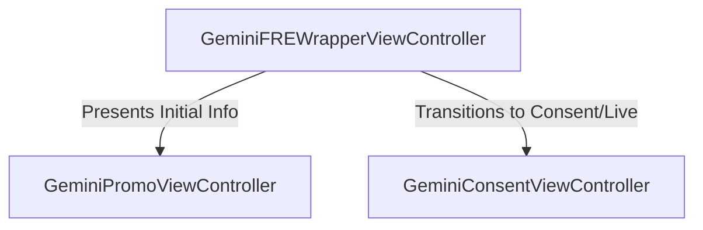

# Gemini UI Layer
*Last updated: May 2026*

This directory contains the user interface (UI) components for the **Gemini (BWG)** onboarding and First Run Experience (FRE) flows on Chrome for iOS.

Following iOS UI development guidelines and branded asset requirements, the controllers are designed for elegant sheet presentation, micro-animations, responsive dynamic layouts, and full localization (including South Korea compliance overrides).

## Onboarding (FRE) Presentation Flow

---

## Component Details

### 1. UI Wrapper & Orchestrator
*   **[gemini_fre_wrapper_view_controller.h](./gemini_fre_wrapper_view_controller.h) & [gemini_fre_wrapper_view_controller.mm](./gemini_fre_wrapper_view_controller.mm)**:
    A container `UIViewController` utilizing sheets presentation. It orchestrates transitions between the Promotional intro page (`GeminiPromoViewController`) and the main Consent/Permissions page (`GeminiConsentViewController`).
*   **[gemini_fre_view_controller_protocol.h](./gemini_fre_view_controller_protocol.h)**:
    Defines standard interface protocols for nested onboarding view controllers.

### 2. Promotional Intro
*   **[gemini_promo_view_controller.h](./gemini_promo_view_controller.h) & [gemini_promo_view_controller.mm](./gemini_promo_view_controller.mm)**:
    Renders the initial visual promotion card, welcoming users to the Gemini features and displaying high-level summaries of its capabilities.

### 3. Consent & Permission UI
*   **[gemini_consent_view_controller.h](./gemini_consent_view_controller.h) & [gemini_consent_view_controller.mm](./gemini_consent_view_controller.mm)**:
    Renders the main consent card stack. Features include:
    *   Adaptation for enterprise-managed accounts.
    *   South Korea compliance localized overrides (substituting custom terms and privacy notices).
    *   Permissions interface for **Gemini Live** (initiating microphone authorizations).
    *   Custom hyperlink interactions via `UITextViewDelegate` to safely open privacy links in new tabs without launching context menus.
*   **[gemini_consent_mutator.h](./gemini_consent_mutator.h)**:
    Defines mutator protocols for updating states and opening hyperlinks, bridging UI actions to the background mediator layer.

### 4. Helpers & Utilities
*   **[gemini_ui_utils.h](./gemini_ui_utils.h) & [gemini_ui_utils.mm](./gemini_ui_utils.mm)**:
    Internal utilities for layout math, safe areas, and visual component rendering.
*   **`resources/`**:
    Contains brand-compliant assets, custom logos, and color definitions used across Gemini screens.

---

## Testing

*   **Unit Tests**:
    *   `gemini_promo_view_controller_unittest.mm`
    *   `gemini_consent_view_controller_unittest.mm`
    *   `gemini_fre_wrapper_view_controller_unittest.mm`
    *   `gemini_ui_utils_unittest.mm`
*   **Integration Tests (EarlGrey 2)**:
    *   **[gemini_egtest.mm](./gemini_egtest.mm)**: Comprehensive EarlGrey integration test suite executing end-to-end simulator checks of the promotional screens, Korean localizations, managed accounts, and consent mutation pipelines.
