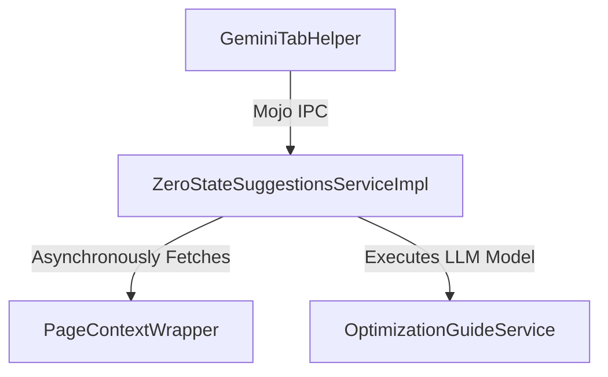
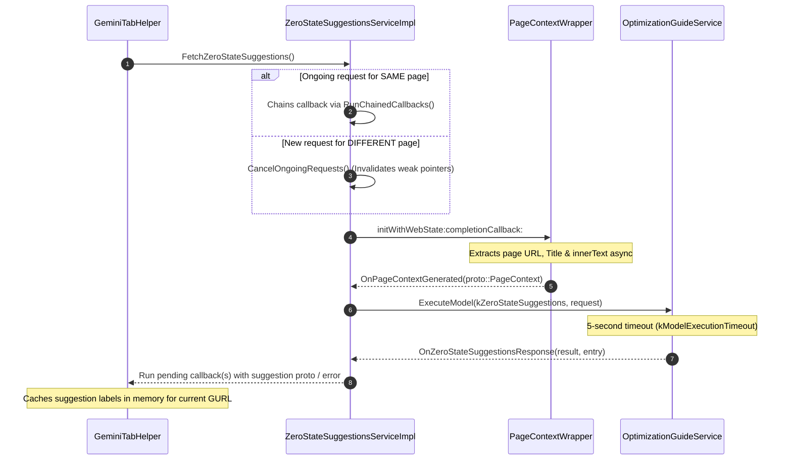

# Zero-State Suggestions Component

The **Zero-State Suggestions** module provides contextual prompt suggestions (such as query chips or Gemini command shortcuts) for a given web state in Chrome for iOS. It serves as an asynchronous bridge between iOS navigation events, Mojo IPC interfaces, and the Chromium Optimization Guide backend.

---

## Architectural Overview

When a page is eligible for suggestions, this component can be queried to fetch suggestions tailored specifically to the current page's context.

### Execution & Data Flow

Below is the sequence of operations triggered when suggestions are requested for the current page:

### Key Design Highlights
* **Mojo Interface Decoupling**: The service defines an IPC boundary so that suggestion fetching is decoupled from standard UI orchestration components.
* **Same-Page Concurrency**: If multiple clients trigger suggestions for the same URL simultaneously, the service chains the pending callbacks and runs a single request, distributing the parsed result to all subscribers upon model execution completion.
* **Automatic Navigation Safeguards**: To prevent stale suggestions from leaking, the tab helper invalidates all pending suggestion callbacks whenever a navigation occurs. Furthermore, if a new fetch request is subsequently initiated for a different page, the service instantly cancels any outstanding suggestions generation, resolving the caller's callback with empty suggestions and returning a mojom error.

---

## File Manifest & Responsibilities

Each file in the zero-state suggestions directory has a distinct, single responsibility:

### Production Implementations
* **[zero_state_suggestions_service_impl.h](ios/chrome/browser/intelligence/zero_state_suggestions/model/zero_state_suggestions_service_impl.h)**
  Declares the `ai::ZeroStateSuggestionsServiceImpl` class, which inherits from `ai::mojom::ZeroStateSuggestionsService`. It defines the service interface, public callbacks, Mojo receiver management, and weak pointer factories.
* **[zero_state_suggestions_service_impl.mm](ios/chrome/browser/intelligence/zero_state_suggestions/model/zero_state_suggestions_service_impl.mm)**
  Implements the core business logic for zero-state suggestions. It coordinates:
  1. Managing the lifecycle of Mojo connections.
  2. Asynchronously populating page context fields using `PageContextWrapper`.
  3. Dispatching requests to `OptimizationGuideService` with model execution timeout parameters (5 seconds).
  4. Handling same-page concurrency requests through callback chaining (`RunChainedCallbacks`).
  5. Marshalling/unmarshalling response metadata and handle cancellation events on page reload or navigation.

### Quality Assurance & Testing
* **[zero_state_suggestions_service_impl_unittest.mm](/ios/chrome/browser/intelligence/zero_state_suggestions/model/zero_state_suggestions_service_impl_unittest.mm)**
  Contains unit tests that validate the robustness and correctness of the service implementation. Highlights:
  * Utilizes **OCMock** to mock out and bypass the web state context generation process (`PageContextWrapper`).
  * Employs a `FakeOptimizationGuideService` to simulate successful model execution yields and error returns.
  * Validates edge-case behavior, such as immediately returning appropriate Mojo errors when the underlying `web::WebState` is destroyed before suggestions could be retrieved.
