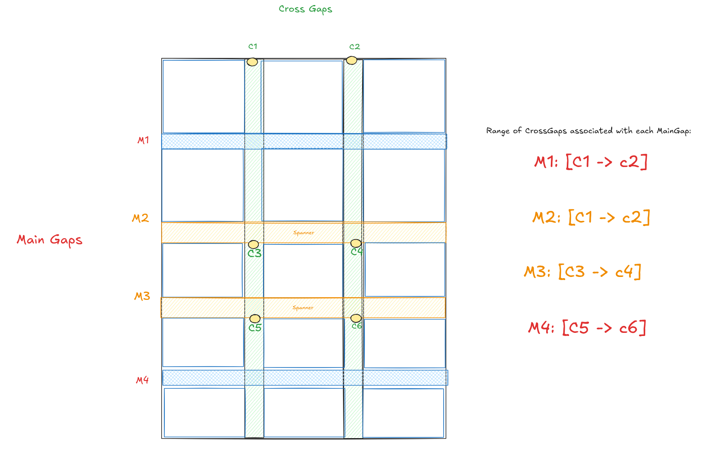

# Main-Cross (MC) Gap Geometry: Design for CSS Gap Decorations in Chromium
Main-Cross Gap Geometry defines a compact, somewhat layout-agnostic
geometry model for computing and painting CSS Gap Decorations without storing
all intersections or having a “naive” per-gap structure. The design favors
minimal storage and on-demand computation, trading simplicity for measurable
memory and performance wins.

---
## Goal
Paint decorations along gaps from intersection to intersection as required by
the [spec](https://www.w3.org/TR/css-gaps-1/#layout-painting), while minimizing
storage.

---

## Key Concepts
#### Two-Direction Model
We avoid “rows” and “columns” by using **Main Gaps** (the primary axis we’re
traversing) and **Cross Gaps** (the orthogonal axis that intersects
mains). Intersections are computed (not stored) based on container edges
plus the set of orthogonal gaps that intersect a given gap.

#### Intersection Point
This is where a gap intersects either the container’s content edge or a gap in
the orthogonal direction. Decorations can break at these points.

---

## Layout Types
#### Grid
- **Main Gap**: Gap in the primary direction. We pick the row direction as
the primary direction.
- **Cross Gap**: Gaps along the orthogonal/cross axis. We pick the column
direction as the cross axis.
- **Association rules**: In Grid, because rows and columns neatly align,
we can avoid duplication by storing cross gaps once and share them across
all main gaps. As a result, each main gap can be mapped to **all**
cross gaps.
- **Example**:
  - 

  - There are two **Main Gaps**: `A` and `B`
  - And two **Cross Gaps**: `0` and `1`
  - In Grid, all cross gaps are mapped to all main gaps due to
structured alignment.

#### Flex
- **Main Gap**:  Gap in the main axis. This will be the gap between
flex lines.
- **Cross Gap**: Gaps along the orthogonal/cross axis. This will be gap
between items.
- **Association rules**: Unlike Grid, each flex line will have independent
intersections introduced by the item flow. As such, we cannot share cross
axis gap intersections across gaps in the main axis. As a result, each
main gap is mapped to cross gaps that intersect it (i.e. falling
either before or after that main gap).
- **Example (Row-based flex container)**:
  - 

  - There are two **Main Gaps**: `A` and `B`
And six **Cross Gaps**: `0 - 5`. We keep track of the start coordinates
for these.

  - **Main Gap A**
    - Cross gaps before: `[0, 1]`
    - Cross gaps after: `[2, 4]`

  - **Main Gap B**
    - Cross gaps before: `[2, 4]`
    - Cross gaps after: `[5, 5]`

### Multicol
- **MainGap**: Row gap created by `column-wrap: wrap`.
  The presence of a spanner will add a new `MainGap`.
- **CrossGap**: Column gap. The presence of a spanner will add a new `CrossGap` for each
  column gap.
- **Association rules**: Similar to Grid, any row and column gaps will neatly align,
so we can avoid duplication by storing cross gaps once and share them across all main gaps.
However, if there is a spanner, we add a `CrossGap` that starts right after the spanner.
This is to support the current behavior of `column-rule` where we don't
paint behind spanners and where `rule-outset` rules don't apply.
- **Example: Multicol container with spanners and row gaps (blue) formed by
`column-wrap`.
  -

  - Two spanners (orange).
  - Four ***Main Gap*** (M1 to M4),similar to Grid and Flex, we keep track of just one offset
    (block offset) for each.
    - In the case of a `MainGap`created by a spanner, the block offset represents
      the block start of the spanner.
    - In the case of a `MainGap` created by `column-wrap: wrap`, the block offset represents
      the midpoint in the gap between one row and the next.
  - Six ***Cross Gaps*** (C1 to C6). We keep track of the coordinates (yellow) of where these start from.
  - We keep track of which `CrossGaps` are associated with each `MainGap` via a range [start, end] of
    cross gap indices. For each `MainGap` we say that the `CrossGaps` associated with it are any that start
    before that main gap (and after a spanner).
      - This information is needed by Paint to calculate the intersection points of row gaps and column gaps.

<!--
TODO(samomekarajr && javiercon): Complete this for masonry.
-->
---

### Calculating Intersections during Paint
#### General Pattern
- An Intersection could generally be segmented as:
   - Content-start-edge || Points of intersection between main and cross
gaps || Content-end-edge.

#### For Grid:
- Both Main and Cross Gaps use this segmenting pattern.
  - Start edge of the container || All orthogonal gaps ||
End edge of the container.

#### For Flex:
- Main Gaps use similar pattern:
  - Start edge of the container || All orthogonal(cross) gaps mapped
to this main gap in sorted order || End edge of the container.

- Cross Gaps use:
  - Cross gap block start || Empty List || Cross gap block start +
Flex line height.
  - All cross gaps for flex only have two intersection points. This is
because the cross gaps in flex are the gap between items, and they do not
ever span multiple flex lines.

---
## Resulting Gains
The previous implementation relied heavily on intersection points as its
foundation. For each gap in the grid, all possible intersection points were
stored. In an m × n grid, there are m - 1 row gaps and n - 1 column gaps,
totaling m + n - 2 gaps. Within each gap, the logic stored n + 1 or m + 1
intersection points, depending on the orientation. This approach resulted in
a 2D data structure with approximately m × n entries, leading to significant
memory usage.

With the introduction of MC Geometry, memory consumption has been drastically
reduced:
- **Flex**: > 50% reduction in memory consumption compared to the previous design.
- **Grid**: ~75% reduction in memory consumption compared to the previous design.

<!--
TODO(javiercon): Complete this for multicol.
TODO(samomekarajr && javiercon): Complete this for masonry.
-->
